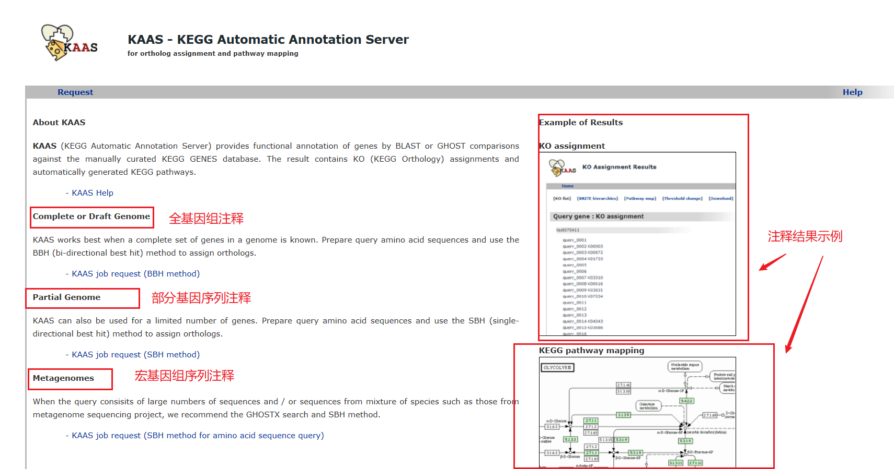
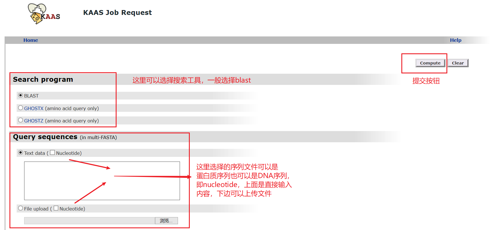
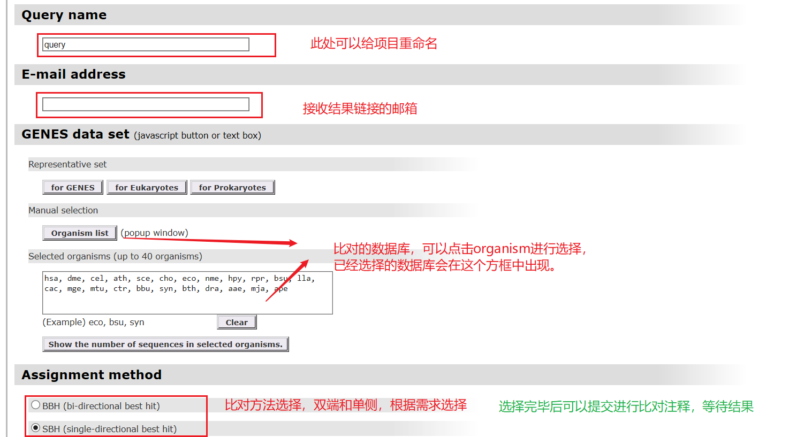
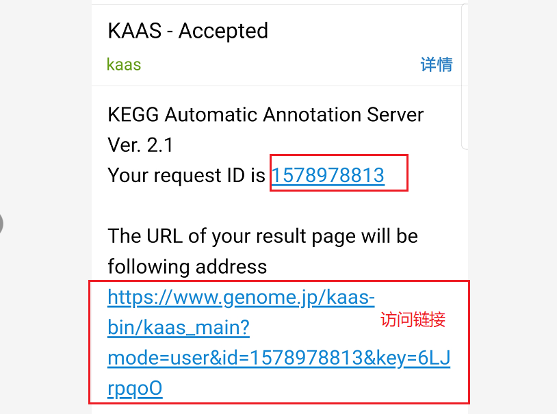
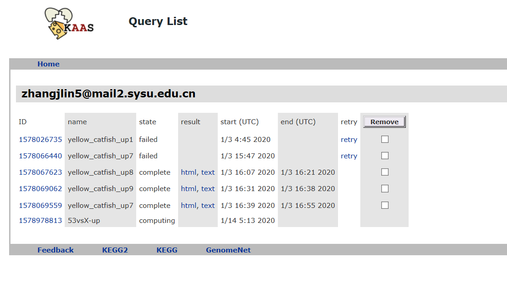

## 前言
在进行基因注释中，kegg通路注释是很重要的一部分，这里就是在kegg官网的工具进行注释，这个工具使用很方便，效率也相当不错，是个好工具，值得信赖，因此在此记录一下使用方法。

<!--more-->
## 开始注释
1. 进入官网，选择工具
网址链接：https://www.genome.jp/tools/kaas/

2. 填写request list

3. 提交request，email操作

4. 查看结果

## 总结
经过上面几步的操作就可以开始等待结果了，大概3000条序列需要20min，效率还是很不错的，最终会拿到KO序列号的注释结果，为进入下一步做好了铺垫。这个注释操作不复杂，而且上面的数据库比较齐全，如果要自己本地做的话还需要准备数据库，相对比较麻烦，但是也不是不可以为之，看需求情况。