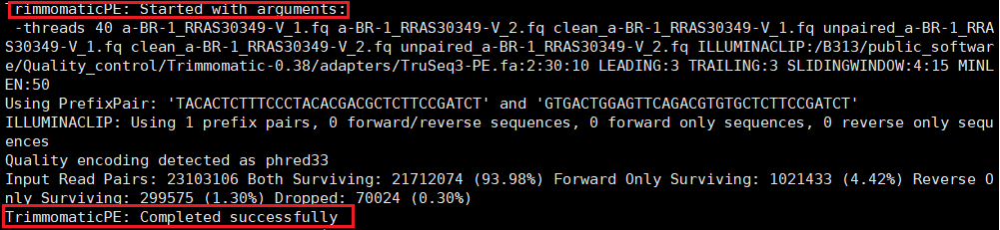

## 1. 前言
质量控制是在测序信息的分析开始之前的尤为重要的一步，因为后期的分析都是建立在这些数据的基础上的，所以前期数据的好坏直接影响了后期分析结果的质量高低、优良，因此做好质量控制非常重要。在二代测序中，测出来的片段都不长，而且还有一些PCR使用的接头也在其中，这些都会影响到后面的分析，因此我们要做的就是先把接头去掉，然后再筛选掉比较短的序列，比如使用Trinity进行拼接时，kmer的长度最小为50bp，小于这个阈值就无法拼接，因此在这个基础上，我们可以开始做质量控制了。
>二代测序数据的特点：大量的短序列（150-250bp）、双末端测序、末端质量较低。因此，在利用我们的测序数据进行分析之前，首先需要过滤掉低质量的碱基与序列，以确保分析结果的准确性。

<!--more-->
## 2. 二代测序一般质控步骤

1. 切除尾端碱基质量小于指定值（一般为20）的碱基。可以简单的单碱基修剪，也即从末端开始进行删除，直到读取碱基质量高于20；也可以进行滑窗修剪，也即从末端开始以指定碱基数目的滑窗开始修剪，直到滑窗内碱基平均质量高于20。

2. 去除末端修剪后长度小于指定值的reads。不同项目指定值不同，一般宏基因组去掉小于50bp的reads（50bp已不够产生k-mer），而扩增子测序则根据raw reads长度和PCR插入片段的长度来确定，例如V4区大概260bp，那么可以去掉双末端reads之和小于280bp的（否则不足以拼接）。

3. 其他一些要求，例如去除含有N（即无法读取位点）过多的reads、去除完全重复的reads等。

## 3. trimmomatic介绍
trimmomatic是一款用来处理illumina测序数据的工具，可以是单条的single reads，也可以是成对的pairend reads。支持压缩格式数据。功能和其他数据处理的程序都差不多，主要包括，
1. 去除adapter序列以及测序中其他特殊序列；
2. 采用滑动窗口的方法，切除或者删除低质量碱基
3. 去除头部低质量以及N碱基过多的reads；
4. 去除尾部低质量以及N碱基过多的reads；
5. 截取固定长度的reads；
6. 丢掉小于一定长度的reads；
7. Phred 质量值转换
>Trimmomatic 发表的文章至今已被引用了 2810 次，是一个广受欢迎的 Illumina 平台数据过滤工具。其他平台的数据例如 Iron torrent ，PGM 测序数据可以用 fastx_toolkit 、NGSQC toolkit 来过滤。<br>
Trimmomatic 支持多线程，处理数据速度快，主要用来去除 Illumina 平台的 Fastq 序列中的接头，并根据碱基质量值对 Fastq 进行修剪。软件有两种过滤模式，分别对应 SE 和 PE 测序数据，同时支持 gzip 和 bzip2 压缩文件。<br>
另外也支持 phred-33 和 phred-64 格式互相转化，现在之所以会出现 phred-33 和 phred-64 格式的困惑，都是 Illumina 公司的锅（damn you, Illumina!），不过现在绝大部分 Illumina 平台的产出数据也都转为使用 phred-33 格式了。

## 4. trimmomatic使用
1. 简单使用
```
java-jar trimmomatic-0.30.jar PE -threads 20 -phred33 R1.fq R2.fq clean.R1.fq unpaired.R1.fq clean.R2.fq unpaired.R2.fq ILLUMINACLIP:TruSeq3-PE.fa:2:30:10 LEADING:3 TRAILING:3 SLIDINGWINDOW:4:15 MINLEN:36
```
**参数解释**
|参数|解释|
|:----|:----|
|PE|选择测序数据的类型，是单端（SE）还是双端（PE）|
|-threads|线程数量，并发计算，提高效率|
|-phred33|一种数据格式，illumina测序数据的格式，也有-phred64，可以不选|
|ILLUMINACLIP:TruSeq3-PE.fa:2:30:10|切除adapter序列。参数后面分别接adapter序列的fasta文件：允许的最大mismatch数：palindrome模式下匹配碱基数阈值：simple模式下的匹配碱基数阈值。|
|LEADING|切除首端质量不足n的碱基（n由自己设定）|
|TRAILING|切除尾端质量不足n的碱基（n由自己设定）|
|SLIDINGWINDOW:4:15|滑窗修剪，一个Windows的size是4个碱基，其平均碱基质量小于15，则切除。|
|MINLEN|最小reads长度，筛去过短序列|
|CROP: |保留reads到指定的长度|
|HEADCROP: |在reads的首端切除指定的长度|
|TOPHRED33 |将碱基质量转换为pred33格式|
|TOPHRED64 |将碱基质量转换为pred64格式|

2. 实操
>nohup java -jar /B313/public_software/Quality_control/Trimmomatic-0.38/trimmomatic-0.38.jar PE -threads 40 a-BR-1_RRAS30349-V_1.fq a-BR-1_RRAS30349-V_2.fq clean_a-BR-1_RRAS30349-V_1.fq unpaired_a-BR-1_RRAS30349-V_1.fq clean_a-BR-1_RRAS30349-V_2.fq unpaired_a-BR-1_RRAS30349-V_2.fq ILLUMINACLIP:/B313/public_software/Quality_control/Trimmomatic-0.38/adapters/TruSeq3-PE.fa:2:30:10 LEADING:3 TRAILING:3 SLIDINGWINDOW:4:15 MINLEN:50 &

>nohup java -jar /B313/public_software/Quality_control/Trimmomatic-0.38/trimmomatic-0.38.jar PE -threads 40 a-BR-1_RRAS30349-V_1.fq a-BR-1_RRAS30349-V_2.fq clean_a-BR-1_RRAS30349-V_1.fq unpaired_a-BR-1_RRAS30349-V_1.fq clean_a-BR-1_RRAS30349-V_2.fq unpaired_a-BR-1_RRAS30349-V_2.fq ILLUMINACLIP:/B313/public_software/Quality_control/Trimmomatic-0.38/adapters/TruSeq3-PE.fa:2:30:10 LEADING:3 TRAILING:3 SLIDINGWINDOW:4:15 MINLEN:110 &

* 日志输出


* 结果输出


* 结果分析
>由上图可以看出，最终输出的是4个文件，两个大文件是质控之后clean的数据，而另外两个小文件是被clean out的data，两者组合起来就是原来的数据。

*剩余数据记录*

>nohup java -jar /B313/public_software/Quality_control/Trimmomatic-0.38/trimmomatic-0.38.jar PE -threads 40 b-BR_RRAS27375-V_1.fq b-BR_RRAS27375-V_2.fq clean_b-BR_RRAS27375-V_1.fq unpaired_b-BR_RRAS27375-V_1.fq clean_b-BR_RRAS27375-V_2.fq unpaired_b-BR_RRAS27375-V_2.fq  ILLUMINACLIP:/B313/public_software/Quality_control/Trimmomatic-0.38/adapters/TruSeq3-PE.fa:2:30:10 LEADING:3 TRAILING:3 SLIDINGWINDOW:4:15 MINLEN:110 &

>nohup java -jar /B313/public_software/Quality_control/Trimmomatic-0.38/trimmomatic-0.38.jar PE -threads 40 c-BR-1_RRAS30350-V_1.fq c-BR-1_RRAS30350-V_2.fq clean_c-BR-1_RRAS30350-V_1.fq unpaired_c-BR-1_RRAS30350-V_1.fq clean_c-BR-1_RRAS30350-V_2.fq unpaired_c-BR-1_RRAS30350-V_2.fq  ILLUMINACLIP:/B313/public_software/Quality_control/Trimmomatic-0.38/adapters/TruSeq3-PE.fa:2:30:10 LEADING:3 TRAILING:3 SLIDINGWINDOW:4:15 MINLEN:110 &

>nohup java -jar /B313/public_software/Quality_control/Trimmomatic-0.38/trimmomatic-0.38.jar PE -threads 40 d-BR_RRAS30433-V_1.fq d-BR_RRAS30433-V_2.fq clean_d-BR_RRAS30433-V_1.fq unpaired_d-BR_RRAS30433-V_1.fq clean_d-BR_RRAS30433-V_2.fq unpaired_d-BR_RRAS30433-V_2.fq ILLUMINACLIP:/B313/public_software/Quality_control/Trimmomatic-0.38/adapters/TruSeq3-PE.fa:2:30:10 LEADING:3 TRAILING:3 SLIDINGWINDOW:4:15 MINLEN:110 &

>nohup java -jar /B313/public_software/Quality_control/Trimmomatic-0.38/trimmomatic-0.38.jar PE -threads 40 e-BR_RRAS30435-V_1.fq e-BR_RRAS30435-V_2.fq clean_e-BR_RRAS30435-V_1.fq unpaired_e-BR_RRAS30435-V_1.fq clean_e-BR_RRAS30435-V_2.fq unpaired_e-BR_RRAS30435-V_2.fq ILLUMINACLIP:/B313/public_software/Quality_control/Trimmomatic-0.38/adapters/TruSeq3-PE.fa:2:30:10 LEADING:3 TRAILING:3 SLIDINGWINDOW:4:15 MINLEN:110 &

>nohup java -jar /B313/public_software/Quality_control/Trimmomatic-0.38/trimmomatic-0.38.jar PE -threads 40 o-3-HD_RRAS47919-V_1.fq o-3-HD_RRAS47919-V_2.fq clean_o-3-HD_RRAS47919-V_1.fq unpaired_o-3-HD_RRAS47919-V_1.fq clean_o-3-HD_RRAS47919-V_2.fq unpaired_o-3-HD_RRAS47919-V_2.fq ILLUMINACLIP:/B313/public_software/Quality_control/Trimmomatic-0.38/adapters/TruSeq3-PE.fa:2:30:10 LEADING:3 TRAILING:3 SLIDINGWINDOW:4:15 MINLEN:110 &


## 备注：在做完了质控之后要进行质量评价，先使用fastqc，然后使用multiqc进行整合，命令如下：
>fastqc [-o output dir] [--(no)extract] [-f fastq|bam|sam] 
           [-c contaminant file] seqfile1 .. seqfileN

>multiqc /B313/Zjunlin/raw_data/fastqc_1/ -o /B313/Zjunlin/raw_data/multi_qcraw/


## 5. 总结
Trimmomatic是一个专门的软件，用于进行质量控制，对于illumina的测序数据尤为有效。其实一般情况下我们是通过编程手动进行质控的，但是得益于广大生信开发工作者的努力，我们才有了这么方便的分析工具可以使用，让我们能够更加专注于生物数据的意义的分析，因此我们应该心怀感恩，和所有工作人员一起努力，为生物科学的发展贡献一份力量。

## 参考资料：
[1. https://bio.biocoder.cn/book/15/content/5/](https://bio.biocoder.cn/book/15/content/5/)

[2. https://www.jianshu.com/p/21ad76e5577c](https://www.jianshu.com/p/21ad76e5577c)

[3. http://www.360doc.com/content/18/0111/12/19913717_721031558.shtml](http://www.360doc.com/content/18/0111/12/19913717_721031558.shtml)


