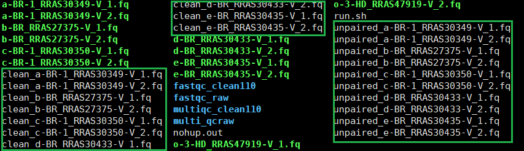
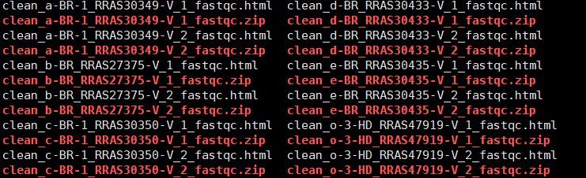
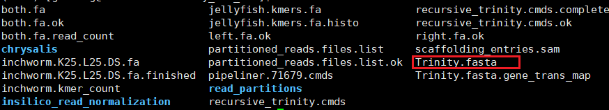
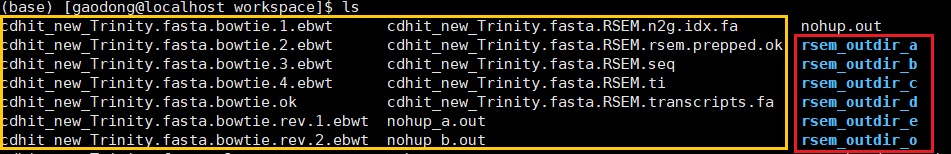

## 前言
这是实验室的一个新项目，探讨的是Yellowseabream在生长发育中雄转雌现象的调控基因，这个项目有两个部分，取的样品有脑组织和普通组织，普通组织部分的分析结果已经完成，我负责完成脑组织转录组的分析。因此我将在这篇博客中记录下我在整个项目的过程中的操作，方便以后进行结果整理以及纠错。
<!--more-->
## 1. trimmomatic质控
在拿到测序数据之后，公司的给的data中有raw data也有clean data，但是为了更好的掌控分析，质控还是自己做比较好。这里选择的质控软件是trimmomatic。

commands:
>nohup java -jar /B313/public_software/Quality_control/Trimmomatic-0.38/trimmomatic-0.38.jar PE -threads 40 a-BR-1_RRAS30349-V_1.fq a-BR-1_RRAS30349-V_2.fq clean_a-BR-1_RRAS30349-V_1.fq unpaired_a-BR-1_RRAS30349-V_1.fq clean_a-BR-1_RRAS30349-V_2.fq unpaired_a-BR-1_RRAS30349-V_2.fq ILLUMINACLIP:/B313/public_software/Quality_control/Trimmomatic-0.38/adapters/TruSeq3-PE.fa:2:30:10 LEADING:3 TRAILING:3 SLIDINGWINDOW:4:15 MINLEN:50 &

*tips:这里指令较长，且需要对每一组进行质控，每次重复输入非常麻烦，因此在第一次输完命令之后可以把命令整理到一个bash脚本中，下次需要重跑时只需要运行bash脚本即可，修改参数可以用Linux文件处理软件sub进行替换修改。*

结果文件列表:



**输出结果有两种类型文件，一种是clean文件，另一种是unpaired文件。其中clean文件就是质控之后的data，用于下一步分析，unpaired文件是被清理出来的data，只是起一个记录作用。**

### 1.2 fastqc质控可视化
在做质控之前和做完质控之后，要进行数据质量的可视化，用于直观判断质控的效果好坏以及测序数据本身质量的高低。这里采用的是fastqc进行这步工作。

`fastqc [-o output dir] [--(no)extract] [-f fastq|bam|sam] [-c contaminant file] seqfile1 .. seqfileN`

commands:
>nohup fastqc -o ./fastqc_70/ -f fastq clean_* &

output file:



**这里输出结果有html和zip文件，只需要查看html文件就可以知道data的质量的统计结果了，但是这里文件众多，一个个查看很麻烦，且不方便进行横向比较，因此可以采用multiqc进行fastqc的结果整合，方便查看。**

### 1.3 multiqc可视化结果整合

commands:
>multiqc /B313/Zjunlin/raw_data/fastqc_70/ -o /B313/Zjunlin/raw_data/multi_qcraw/

output file:


**这里输出结果是一个html文件和一个data的文件夹，文件夹里面有相关的数据，如果需要自己重新作图的话可以利用这些数据作图。要查看整合的结果只需要把html下载到本地电脑中用浏览器打开查看即可，图片结果的解读在另一篇博客[fastqc_multiqc结果解读](https://genening.github.io/2020/04/16/Bioinformatics/fastqc-multiqc%E7%BB%93%E6%9E%9C%E8%A7%A3%E8%AF%BB/)，可以自行查看**

## 2. Trinity拼接（Trinity-v2.8.4）
Trinity是一款非常成熟的拼接软件，非常受大家欢迎，Trinity的使用方法查看[无参转录组分析](https://genening.github.io/2019/10/04/Bioinformatics/%E6%97%A0%E5%8F%82%E8%BD%AC%E5%BD%95%E7%BB%84%E5%88%86%E6%9E%90/#more)。

`Trinity --seqType fq --left reads_1.fq --right reads_2.fq --CPU 6 --max_memory 20G`

commands:
>nohup Trinity –seqType fq –max_memory 100G –min_glue 10 –full_cleanup –output trinity_out_dir –left clean_a-BR-1_RRAS30349-V_1.fq clean_b-BR_RRAS27375-V_1.fq clean_c-BR-1_RRAS30350-V_1.fq clean_d-BR_RRAS30433-V_1.fq clean_e-BR_RRAS30435-V_1.fq clean_o-3-HD_RRAS47919-V_1.fq  –right clean_a-BR-1_RRAS30349-V_2.fq clean_b-BR_RRAS27375-V_2.fq clean_c-BR-1_RRAS30350-V_2.fq clean_d-BR_RRAS30433-V_2.fq clean_e-BR_RRAS30435-V_2.fq clean_o-3-HD_RRAS47919-V_2.fq  –CPU 30 –min_kmer_cov 2 &

**这里需要等待比较长的计算时间，并且在结果出来之后要进行统计，要是统计结果不太好则要重新调整参数重跑。所以还是把质量写进脚本run_trinity.sh比较方便。**

output files:

>输出的结果包括了三部分，分别是Trinity当中三部分程序的独立结果。在所有结果中最为重要的是Trinity.fasta文件，这就是我们要的最终的拼接结果的文件，后续分析以此为基础，我们需要先评估拼接的质量高低，满足要求就开始下一步定量分析。

### 2.1 TrinityStats.pl结果统计

`/B313/public_software/trinityrnaseq-Trinity-v2.8.4/util/TrinityStats.pl <result_fasta_file>`

commands:
>/B313/public_software/trinityrnaseq-Trinity-v2.8.4/util/TrinityStats.pl ./Trinity.fasta

output:


|total genes|total transcripts|Contig N50|Percent GC|
|:----:|:----:|:----:|:----:|
|265295|319932|2913|46.50|

>由上结果来看，拼接出来的转录本数量有点多，这样对于在时候做差异分析时不利，下一回可以考虑在指控的时候把minlen参数设高一些，这样子对于后期的分析比较有利。这里拼接的N50是2913，还不错。

### 2.2 cd-hit去冗余
commands:
>cd-hit-est -i input.fasta -o output.fasta -c 0.90 -n 8 -T 40

output:


### 2.3 corset聚类去冗余

commands:
>corset [options] bowtie.bam

* 注意使用python2.7环境

## 3. RSEM_bowtie2定量分析与mapping
commands:
```
nohup /B313/public_software/trinityrnaseq-Trinity-v2.8.4/util/align_and_estimate_abundance.pl --transcripts cdhit_new_Trinity.fasta --seqType fq --est_method RSEM --aln_method bowtie --trinity_mode --prep_reference --output_dir rsem_outdir_a --left clean_a-BR-1_RRAS30349-V_1.fq --right clean_a-BR-1_RRAS30349-V_2.fq >nohup_a.out 2>&1 &

nohup /B313/public_software/trinityrnaseq-Trinity-v2.8.4/util/align_and_estimate_abundance.pl --transcripts cdhit_new_Trinity.fasta --seqType fq --est_method RSEM --aln_method bowtie --trinity_mode --prep_reference --output_dir rsem_outdir_b --left clean_b-BR_RRAS27375-V_1.fq --right clean_b-BR_RRAS27375-V_2.fq >nohup_b.out 2>&1 &

nohup /B313/public_software/trinityrnaseq-Trinity-v2.8.4/util/align_and_estimate_abundance.pl --transcripts cdhit_new_Trinity.fasta --seqType fq --est_method RSEM --aln_method bowtie --trinity_mode --prep_reference --output_dir rsem_outdir_c --left clean_c-BR-1_RRAS30350-V_1.fq --right clean_c-BR-1_RRAS30350-V_2.fq >nohup_c.out 2>&1 &

nohup /B313/public_software/trinityrnaseq-Trinity-v2.8.4/util/align_and_estimate_abundance.pl --transcripts cdhit_new_Trinity.fasta --seqType fq --est_method RSEM --aln_method bowtie --trinity_mode --prep_reference --output_dir rsem_outdir_d --left clean_d-BR_RRAS30433-V_1.fq --right clean_d-BR_RRAS30433-V_2.fq >nohup_d.out 2>&1 &

nohup /B313/public_software/trinityrnaseq-Trinity-v2.8.4/util/align_and_estimate_abundance.pl --transcripts cdhit_new_Trinity.fasta --seqType fq --est_method RSEM --aln_method bowtie --trinity_mode --prep_reference --output_dir rsem_outdir_e --left clean_e-BR_RRAS30435-V_1.fq --right clean_e-BR_RRAS30435-V_2.fq >nohup_e.out 2>&1 &

nohup /B313/public_software/trinityrnaseq-Trinity-v2.8.4/util/align_and_estimate_abundance.pl --transcripts cdhit_new_Trinity.fasta --seqType fq --est_method RSEM --aln_method bowtie --trinity_mode --prep_reference --output_dir rsem_outdir_o --left clean_o-3-HD_RRAS47919-V_1.fq --right clean_o-3-HD_RRAS47919-V_2.fq >nohup_o.out 2>&1 &
```


*tips: Each group needs to align independently.*

results:


**黄色框中是RSEM定量的一些中间文件，红色框中是结果输出文件夹**


**genes.results和isoforms.results分别是基于基因和转录本水平的定量结果，这两者的区别可以在下面两幅图中看出来。isoforms.results中包含了转录本ID，基因ID，转录本长度，有效长度，expected_count，TPM，FPKM和IsoPct（该转录本表达量占基因总表达量的百分比）。genes.results中的内容与之类似，只是少了IsoPct。**
>接下来我们可以将FPKM提取出来，然后进行聚类分析，查看一下现有的各组样品之间的一个相关性，这类可以采用clustermap来展示。


## 4. edgeR差异分析

## 5. blastx比对

## 6. GO_KEGG注释

## 7. stem趋势分析

## 8. 结果整理与解读

## 9. 后记
