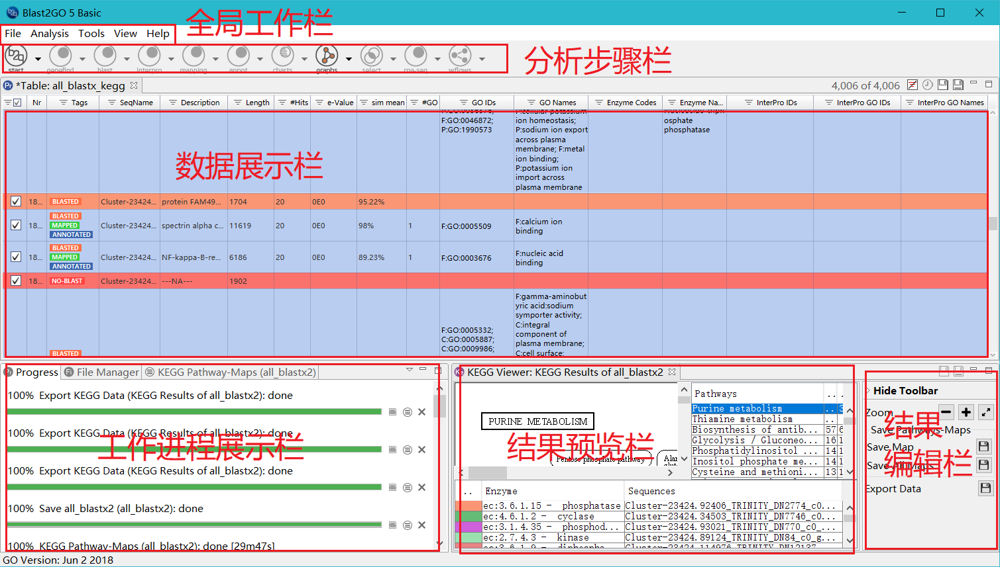
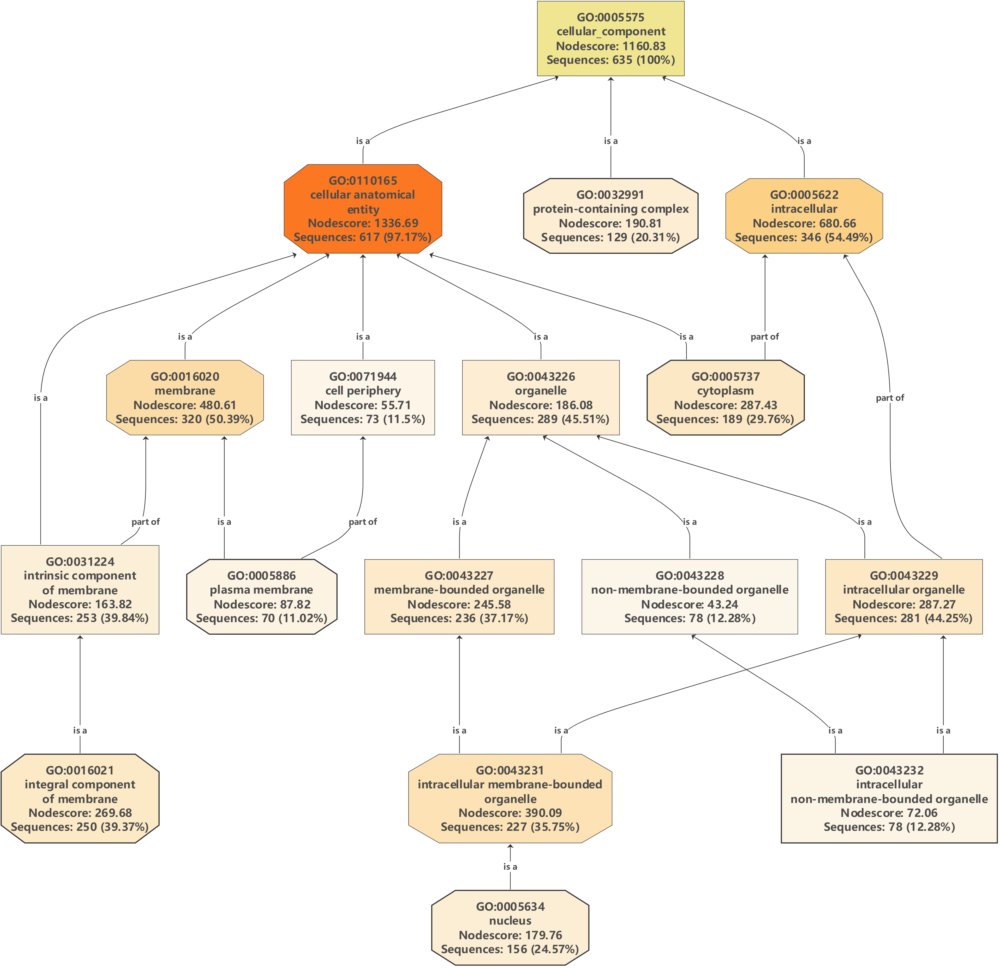
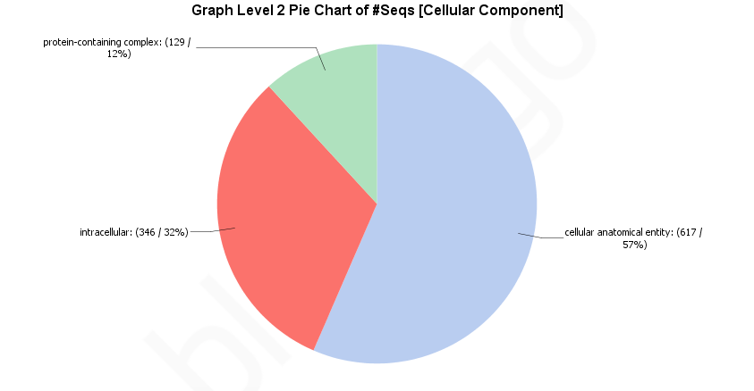
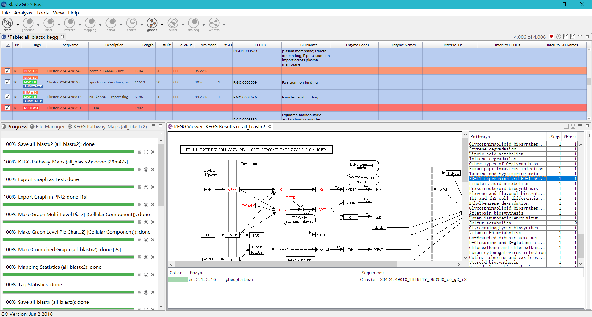
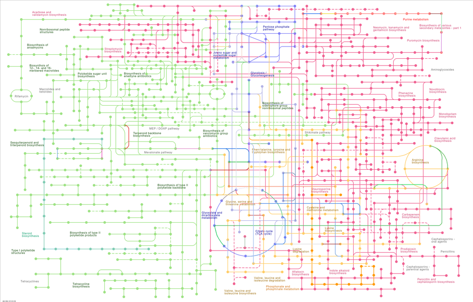

## 前言
在转录组的下游分析中，GO和KEGG注释是非常常规的分析，也是基础工作。blast2go这个软件则是一个可视化的工具，可以帮助我们做好这两个分析，不过这也有些可惜，那便是会受制于人，因为这个软件是一个商业软件，所以最好不要过分依赖这种工具，不过这一次分析是初次，而且稍微时间比较紧，所以暂且用一下，如果后续有时间，一定要学习一下如何利用编程，自己完成这些工作。
<!--more-->
## 1. 初识blast2go
软件界面介绍如下：

## 2. 使用blast2go
1. 导入数据：可以在file中点击load file或者打开file，可以自选
2. 选择数据：可以全选数据或者部分
3. 选择工作：选择需要进行的分析，点击运行，但是这里一般是有顺序的，如下：

当逐步分析以后就可以看到一些结果，注意保存数据文件，在**结果编辑栏**中可以找到导出数据。

## 3. 分析结果示例

1. GO结果

2. KEGG结果

3. 导出数据

## 4. 总结
经过一次使用，blast2go的总体使用体验还是很不错的，确实很方便、很直观，但是确实也有一些限制，自主性不是很高，如果是为了方便快捷得到一个基本结论，那么可以选择使用这个软件，虽然在mapping分析的时候稍微比较慢，但是如果想选择更高的自主性，那么还是建议使用编程，自己分析。

