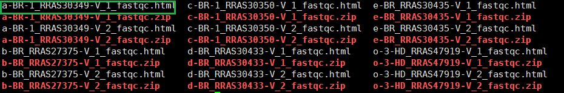
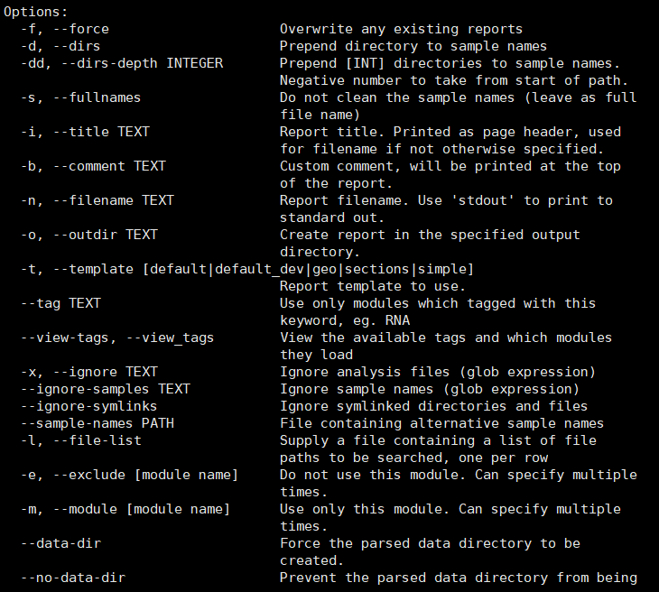
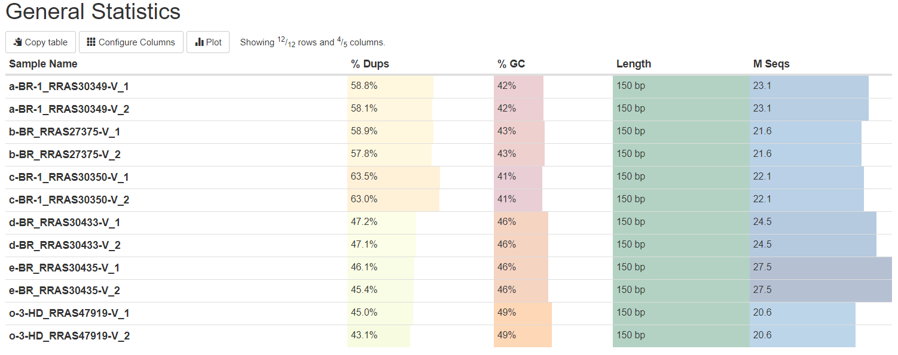
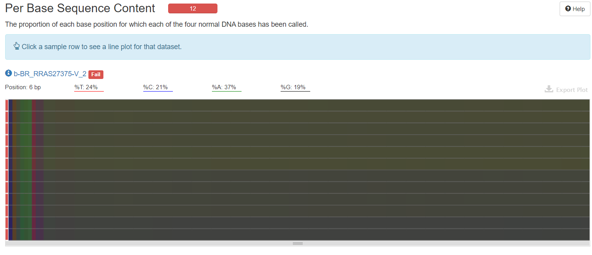
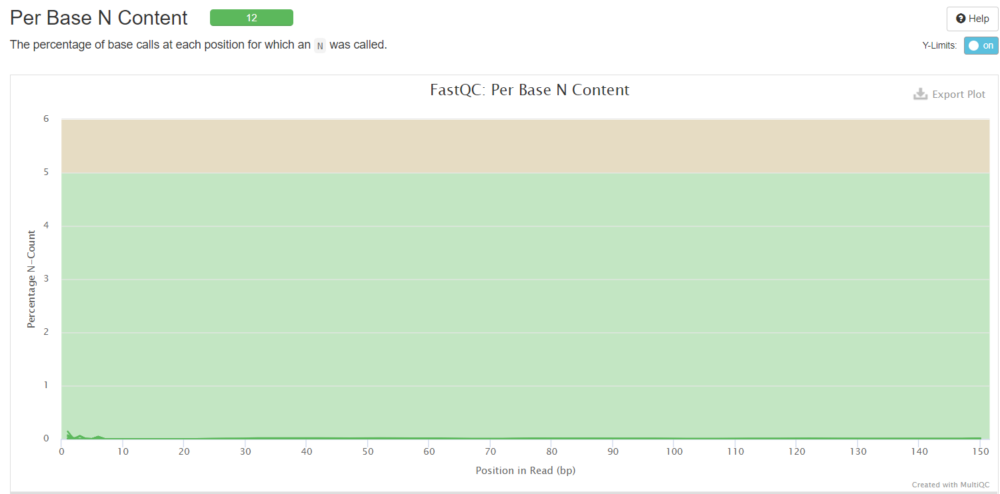

## 1. 前言
在得到了测序结果之后，我们需要评估一下测序的质量，因此我们需要对测序的数据进行统计评价，这里采用的软件组合就是fastqc和multiqc，fastqc用于对每一组的测序结果进行评价并且输出html结果文件，但是当同时有比较多组的测序数据时，一份份html文件去翻阅是非常麻烦的，此时multiqc就派上用场了，multiqc可以对这些结果进行整合，生成一份html文件，方便查阅。
>为什么要进行质量评价呢？因为我们后期的所有分析都是基于测序数据展开的，测序数据质量的高低直接影响了我们分析的结果，因此在所有分析步骤之前，我们必须要对测序的数据的质量进行评价，只有达到我们的要求的测序数据才能用于下一步分析。
<!--more-->

## 2. fastqc使用
fastqc是用于统计评估测序数据质量的常用软件，使用命令如下：

`fastqc [-o output dir] [--(no)extract] [-f fastq|bam|sam] [-c contaminant file] seqfile1 .. seqfileN`
>nohup fastqc -o ./fastqc_70/ -f fastq clean_* &

参数解释：
|parameters|explanation|
|:----|:----|
|-o|output dir，选择输入结果的文件夹|
|-f|输入文件的格式，支持bam/sam/bam_mapped/sam_mapped/fastq|
|-h|帮助文档，查看参数和使用方式|
>还有很多参数未一一列出

结果输出：

输出结果每组都有两个文件，一个是html，一个是zip文件。

## 3. multiqc使用
命令如下：
`multiqc /B313/Zjunlin/raw_data/fastqc_70/ -o /B313/Zjunlin/raw_data/multi_qcraw/`

参数如下：

结果输出：

## 4. multiqc结果解读
>fastqc的结果解读参数与multiqc一致，所以解读一份就好了。

### 4.1. General Statistics：所有样本数据基本情况统计

*%Dups*——重复reads的比例

*%GC*——GC含量占总碱基的比例，比例越小越好

*Length*——测序长度

*M Seqs*——总测序量（单位：millions）

### 4.2. Sequence Counts：序列数量统计

*横坐标*——序列的数量

*纵坐标*——样本

*unique reads*——蓝色

*Duplicate reads*——黑色

**由图可以看出测序中的一些重复水平，这个重复水平和测序深度以及序列本身的表达情况有关。**

### 4.3. Sequence Quality Histograms：每个read各位置碱基的平均测序质量
*横坐标*——碱基的位置

*纵坐标*——质量分数

*质量分数*=-10log10p（p代表错误率），所以当质量分数为40的时候，p就是0.0001。此时说明测序质量非常好。

*绿色区间*——质量很好；

*橙色区间*——质量合理；

*红色区间*——质量不好。

>可以看到在下面的图中，所有的样本的quality scores都在绿色区间，所以质量很好。

### 4.4. Per Sequence Quality Scores：具有平均质量分数的reads的数量

*横坐标*——平均序列质量分数

*纵坐标*——reads数

*绿色区间*——质量很好

*橙色区间*——质量合理

*红色区间*——质量不好

*当峰值小于27时*——warning

*当峰值小于20时*——fail

>由此图中可以看出低质量reads占整体reads的比例（估算各颜色区域曲线下面积）。如下图中，几乎所有数值都在绿色区间，所以质量非常好，但是如果存在50%的counts在红色区间，则表示测序结果很差，不可用。

### 4.5. Per Base Sequence Content：每个read各位置碱基ATCG的比列
对所有reads的每一个位置，统计ATCG四种碱基的分布，

*横坐标*——碱基位置，

*纵坐标*——样本。

*%A*——绿色

*%G*——紫色

*%C*——蓝色

*%T*——红色

*如果ATGC在任何位置的差值大于10%*——warning

*如果ATGC在任何位置的差值大于20%*——fail

>reads每个位置的颜色显示由4种颜色的比例混合而成，哪一个碱基的比例大，则趋近于这个碱基所代表的颜色。正常情况下每个位置每种碱基出现的概率是相近的。如果ATGC在任何位置的差值大于10%—则warning（橙色），如果ATGC在任何位置的差值大于20%则fail（红色）。在图中可以看出，大概在前9bp的部分，颜色非常不均匀，也就是表示存在AGCT四种碱基的比例差异巨大的地方，这可能有过表达的序列的污染，所以12个样本都是fail。

### 4.6. Per Sequence GC Content：reads的平均GC含量

*横坐标*——GC含量百分比

*纵坐标*——数量

**正常的样本的GC含量曲线会趋近于正态分布曲线，曲线形状的偏差往往是由于文库的污染或是部分reads构成的子集有偏差（overrepresented reads）。形状接近正态但偏离理论分布的情况提示我们可能有系统偏差。**

*偏离理论分布的reads超过15%时*——warning

*偏离理论分布的reads超过30%时*——fail

>由下图可以看出，有6个样本与理论分布偏离超过了15%，有2个偏离超过了30%，有4个在合理的偏离度内。

### 4.7. Per Base N Content：每条reads各位置N碱基含量比例

**当测序仪器不能辨别某条reads的某个位置到底是什么碱基时，就会产生“N”，统计N的比率。正常情况下，N值非常小。**

*横坐标*——read中的位置

*纵坐标*——N的数量比

*当任意位置的N的比例超过5%*——warning

*当任意位置的N的比例超过20%*——fail

>由图可以看出，所有的样本在所有的位置都是属于绿色区间且数值比例非常小，可以看出测序的质量很高。这应该和现在测序仪工艺的进步，电脑处理能力的提升有着很大的关系，现在的测序仪能够高质量的完成测序。

### 4.8. Sequence Length Distribution：序列样本长度的分布情况

*横坐标*——序列长度

*纵坐标*——数量

*reads长度不一致时*——warning

*reads有0长度时*——fail

>在这里可以看出测序的读长，也能够分析得出所有的小片段的长度分布情况，依据此我们可以判断测序效果的高低。在这里的结果呈现中，所有的结果都是在150bp，这也是二代测序的特点，测序的读长段，但是片段非常多，也就是通过将基因序列高度片段化分别同时测序，由此提高测序速度。

### 4.9. Sequence Duplication Levels：每个序列的相对重复水平
*横坐标*——每个序列的相对重复水平

*纵坐标*——在文库中的比例

*当非unique的reads占总数的比例大于20%时*——warning

*当非unique的reads占总数的比例大于50%时*——fail

**测序深度越高，越容易产生一定程度的duplication，这是正常的现象，但如果duplication的程度很高，就提示我们可能有bias的存在。**

### 4.10. Overrepresented sequences：文库中过表达序列的比例
*横坐标*——过表达序列的比例

*纵坐标*——样本

*过表达序列的比例>0.1%*——warning

*过表达序列的比例>1%*——warning

 **一条序列的重复数，因为一个转录组中有非常多的转录本，一条序列再怎么多也不太会占整个转录组的一小部分（比如1%），如果出现这种情况，不是这种转录本巨量表达，就是样品被污染。这个模块列出来大于全部转录组1%的reads序列，但是因为用的是前100,000条reads，所以其实参考意义不大。**

### 4.11.Adapter Content：接头含量

*横坐标*——碱基位置

*纵坐标*——占序列的百分比

*百分比>5%*——warning

*百分比>10%*——fail

>由图可以看出，所有的样本的接头含量均低于5%，因此结果还算比较良好。

## 参考资料
[https://www.jianshu.com/p/85da4dcc6020](https://www.jianshu.com/p/85da4dcc6020)