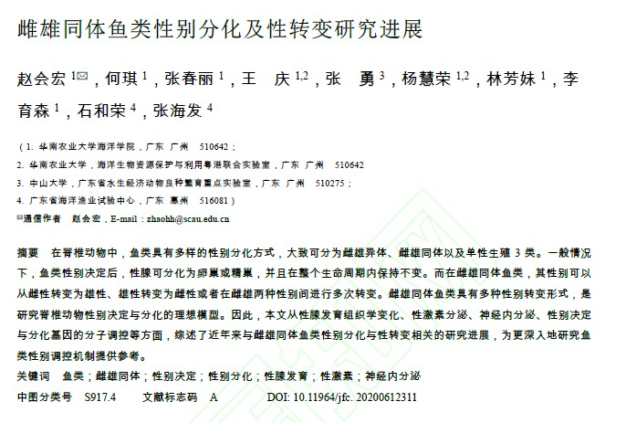
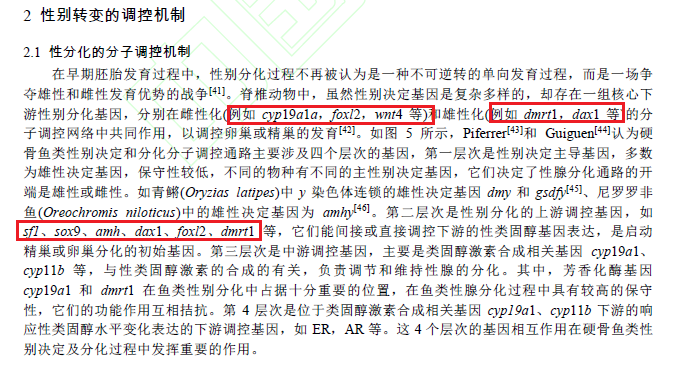
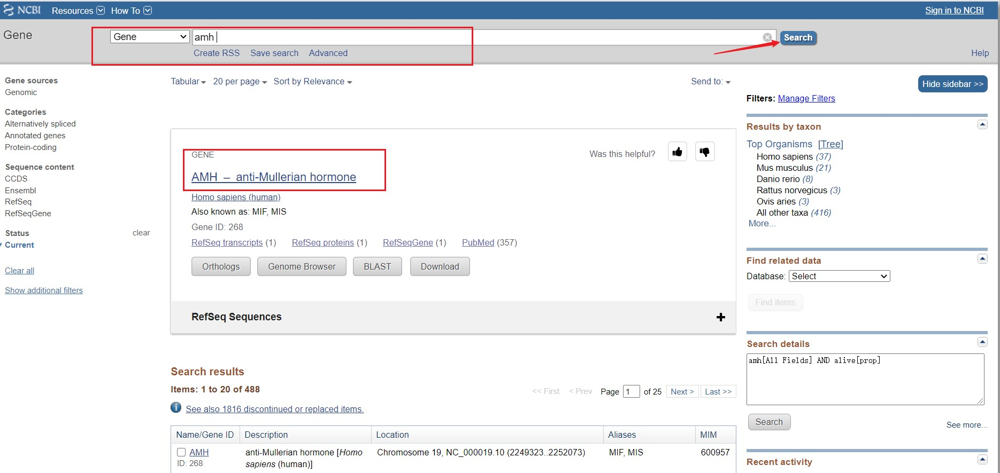
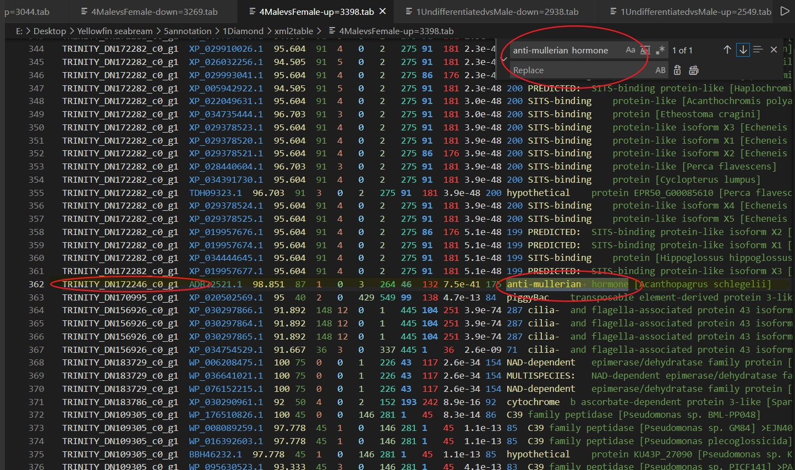
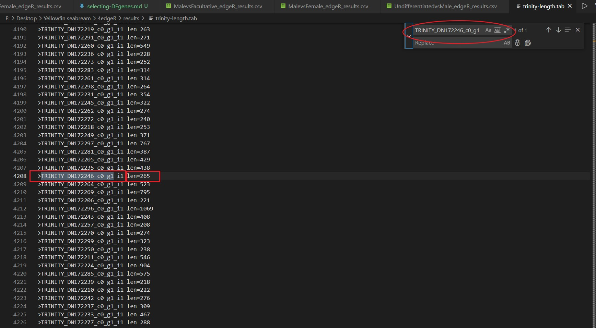

## 前言
最近在做毕设内容，也是转录组的基因数据挖掘工作。这个项目题目是：*“黄鳍鲷脑组织转录组性别相关功能基因的数据挖掘”*。在前面的分析中，我们已经得到了黄鳍鲷的样本的RNA数据，并进行了无参转录组的组装，salmon的定量mapping，R中edgeR的差异分析，得到了差异基因的table文件，并且将这些差异基因进行了blastx到nr数据库的注释工作，得到了nr注释的table文件，有了这些文件后，我们就可以着手筛选我们的目标基因了。当然，另一个工作是对nr的注释结果进行GO、KEGG的注释与富集分析，这个是从整体层面上来了解我们差异分析得到的差异基因的总体情况，与我们现在进行的特定功能的基因的筛选关联性并不密切。

<!--more-->

## 1. 筛选过程

筛选基因的过程中，我们需要得知的基因的相关信息有：基因序列编号、注释信息、Log2(FC)值、p值、调控属性。这些属性处于不同的文件中，我们需要手动的去不同的文件中进行检索。其中这里就不得不提一下vscode的强大的搜索功能，我们只需要用vscode打开我们的相关文献，按ctrl+H快捷键打开搜索选项，输入相关内容便可以进行快速的搜索了。

筛选的过程可以分为以下几个步骤：

1. 确定主题，搜索相关文献
2. 选定文献，确定目标基因
3. NCBI搜索目标基因，了解详情
4. 利用详情搜索nr的table结果
5. 记录nr搜索得出的结果，确定基因序列
6. 搜索edgeR的table结果，确定目标序列的相关参数
7. 搜索Trinity.fasta提取出的len_table，确定序列length
8. 汇总基因序列表
9. 分析了解筛选出的目标基因，分析整理

### 1.1 阅读文献

首先，明确我们的目标：与性别相关的功能基因。在明确了这个目标后，我们开始进行文献的阅读，从相关文献中查找前人做过的分析，得知一些常见的性别相关的功能基因。选定一篇文献，如图：

然后，仔细阅读文献，锁定具体内容，如图：

### 1.2 NCBI搜索基因详情

我们最终共选定了12个性别相关的功能基因，对每个基因到ncbi官网上搜索基因的详情，了解情况。此处以amh基因为例，如图：

从ncbi上我们得知了基因的详情，包括基因的全称、别名、功能等信息，这些信息对我们进一步的分析都有用处。

### 1.3 nr的table文件搜索

我们首先利用的信息是基因的全称，因为nr数据库的注释结果一般为基因的全称，所以利用这个信息我们可以在table文件中搜索，我们的实验样本的注释中是否注释出了这个基因，如图，我们以amh基因（全称为：anti-mullerian hormone)为例：

从这个搜索结果中，我们得知了目标基因的注释情况，包括基因序列编号、基因具体注释信息等内容，我们将这个记录下来，以便后续的分析，如图：

此处最好记得编号，方便我们自己的阅读。在nr的table搜索结果中可能有不止一条的匹配信息，要注意选择进行记录。

### 1.4 搜索edgeR的table

在上一步中，我们记录了目标的基因的相关信息，在这一步中，我们要利用基因序列编号这个信息进行进一步的搜索，同样还是以amh为例，如图：

通过这一步的搜索，我们可以得到目标基因的Log2(FC)值、p值、调控属性等参数，同时我们可以搜索Trinity.fasta提取出的len_table文件，以期获得目标基因的序列长度，如图：

这一步搜索我们可以得知目标基因的序列长度信息。

### 1.5 汇总基因序列表

通过上面的步骤，我们已经成功的获取了目标基因的相关信息：基因序列编号、注释信息、Log2(FC)值、p值、调控属性，有了这些信息，我们就可以对目标基因进行进一步的分析了，对这些基因汇总如下：

到此为止，我们就已经得到了我们的期望结果了，下一步就是对目标功能基因的进一步阐释，并且进行整理、撰写分析报告了。

## 结语

到这一步为止，所有的转录组的技术分析内容我们就已经完成了，从转录组数据的获取，到送测，拿到RNA数据，接着质控、拼接、mapping、差异分析、nr注释、GO注释、KEGG注释、富集分析、基因筛选，这一套分析流程下来，学习到了很多内容。

转录组是现在发展非常成熟的组学，对于科学研究有着重要的作用。这个操作虽然成熟，但是从头开始自己完成一遍也并不轻松，当然这只是第一次全程而已，自然有些磕磕绊绊，不过经过这一次的实践，假使日后仍需做转录组分析，那么便可以驾轻就熟了。能够完成这个项目，也确实挺有成就感的。