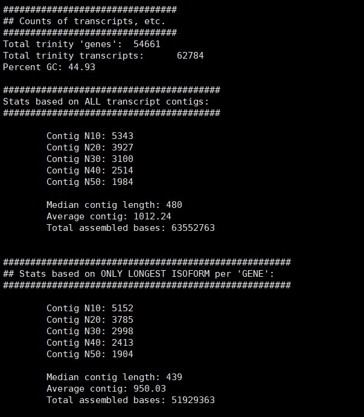
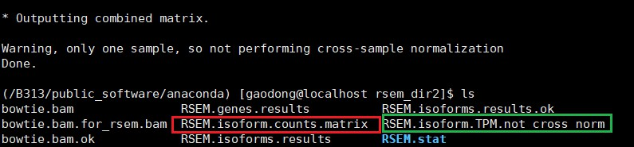
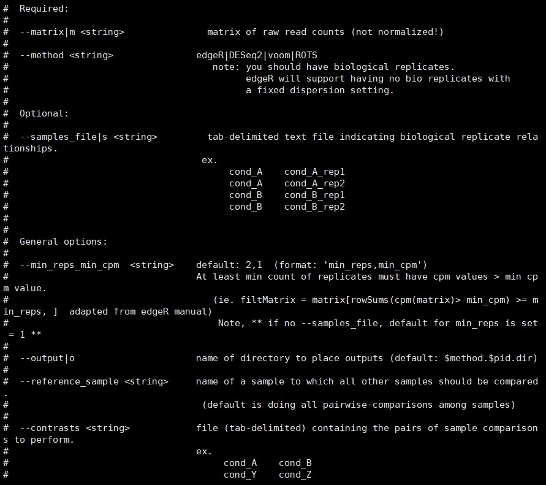

>这是来自实验室的数据，开始做无参转录组第一次尝试，在此记录过程。这个记录会详尽的记录在时间过程中遇到的问题以及一些学习的细节，但是为了避免文章过于冗长，采用了Markdown中插入HTML标签的方式进行折叠，需要查看即点击查看即可。
<!--more-->
## 前情提要：分析流程


# 目录
1. 序列拼接
2. 去冗余 cd-hit-est
3. 拼接结果参数统计 TrinityStats.pl
4. 表达水平评估 align_and_estimate_abundance.pl
5. 生成数量矩阵 abundance_estimates_to_matrix.pl
6. [下游分析](#downstream)
   * 差异表达分析 run_DE_analysis.pl
   * 提取最长链
   * 提取蛋白编码区 transcripts_to_best_scoring_ORFs.pl
   * 功能注释
7. 生成报告
8. [数据可视化](#visualization)
----

## **1. 拼接序列**  Trinity
>Trinity  --seqType fq --max_memory 50G --output trinity_out_dir3 --left LJG-134_TTAGGC_L008_R1_001.fastq_trimmed,LJG-144_TGACCA_L008_R1_001.fastq_trimmed LJG-155_ACAGTG_L008_R1_001.fastq_trimmed,LJG-531_GCCAAT_L008_R1_001.fastq_trimmed,LJG-543new_CAGATC_L008_R1_001.fastq_trimmed,LJG-556_ACTTGA_L008_R1_001.fastq_trimmed,LJG-B1_CGATGT_L008_R1_001.fastq_trimmed,LJG-Xnew_GATCAG_L008_R1_001.fastq_trimmed,LJG-Y1_ATCACG_L008_R1_001.fastq_trimmed --right LJG-134_TTAGGC_L008_R2_001.fastq_trimmed,LJG-144_TGACCA_L008_R2_001.fastq_trimmed,LJG-155_ACAGTG_L008_R2_001.fastq_trimmed,LJG-531_GCCAAT_L008_R2_001.fastq_trimmed,LJG-543new_CAGATC_L008_R2_001.fastq_trimmed,LJG-556_ACTTGA_L008_R2_001.fastq_trimmed,LJG-B1_CGATGT_L008_R2_001.fastq_trimmed,LJG-Xnew_GATCAG_L008_R2_001.fastq_trimmed,LJG-Y1_ATCACG_L008_R2_001.fastq_trimmed --CPU 25 --min_kmer_cov 2+

> nohup Trinity --seqType fq --max_memory 100G --min_glue 10 --full_cleanup --output trinity_out_dir --left LJG-134_TTAGGC_L008_R1_001.fastq_trimmed,LJG-144_TGACCA_L008_R1_001.fastq_trimmed,LJG-155_ACAGTG_L008_R1_001.fastq_trimmed,LJG-531_GCCAAT_L008_R1_001.fastq_trimmed,LJG-543all_CAGATC_L008_R1_001.fastq_trimmed,LJG-556_ACTTGA_L008_R1_001.fastq_trimmed,LJG-B1_CGATGT_L008_R1_001.fastq_trimmed,LJG-Xall_GATCAG_L008_R1_001.fastq_trimmed,LJG-Y1_ATCACG_L008_R1_001.fastq_trimmed --right LJG-134_TTAGGC_L008_R2_001.fastq_trimmed,LJG-144_TGACCA_L008_R2_001.fastq_trimmed,LJG-155_ACAGTG_L008_R2_001.fastq_trimmed,LJG-531_GCCAAT_L008_R2_001.fastq_trimmed,LJG-543all_CAGATC_L008_R2_001.fastq_trimmed,LJG-556_ACTTGA_L008_R2_001.fastq_trimmed,LJG-B1_CGATGT_L008_R2_001.fastq_trimmed,LJG-Xall_GATCAG_L008_R2_001.fastq_trimmed,LJG-Y1_ATCACG_L008_R2_001.fastq_trimmed --CPU 30 --min_kmer_cov 2 &

# 补充：Trinity --show_full_usage_info    可以查看Trinity所有参数
*  --min_glue 5  # a small trick to get a better output

输出文件：trinity_out_dir/
<!--more-->
**反馈如下**

<details><summary>展开查看</summary><pre>


**（1）实测失败，报错如下**
>Error, not recognizing read name formatting: [GWZHISEQ02:77:C3VBWACXX:8:1203:2388:]
><br>If your data come from SRA, be sure to dump the fastq file like so:
>
>	SRA_TOOLKIT/fastq-dump --defline-seq '@$sn[_$rn]/$ri' --split-files file.sra 
>
><br>Thread 2 terminated abnormally: Error, cmd: seqtk-trinity seq -A /home/gaodong/Zhangjlin/LJG-144_TGACCA_L008_R2_001.fastq >> right.fa died with ret 512 at /B313/public_software/trinityrnaseq-Trinity-v2.8.4/util/insilico_read_normalization.pl line 762.
Error, conversion thread failed at /B313/public_software/trinityrnaseq-Trinity-v2.8.4/util/insilico_read_normalization.pl line 333.
Error, cmd: /B313/public_software/trinityrnaseq-Trinity-v2.8.4/util/insilico_read_normalization.pl 

**已解决**
>通过 *df -h*查看到系统中内存不足，切换到新的文件夹后可以运行，同时将.fastq文件替换成了.fastq_trimed

新反馈如下


### 补充：Linux技巧
>考虑到在运行过程中可能会突然断网，在运行程序是切换到后台运行，有两种方法，第一种是*nohub*，第二种是*screen*，具体的操作方法可以使用-h参数查看

**（2）报错如下**
>Trinity run failed. Must investigate error above.
> There is insufficient memory for the Java Runtime Environment to continue.
> Cannot create GC thread. Out of system resources.
> An error report file with more information is saved as:
> /B313/gaodong/Zhangjlin/trinity_out_dir/read_partitions/Fb_0/CBin_23/c2318.trinity.reads.fa.out/hs_err_pid142493.log
warning, cmd: /B313/public_software/trinityrnaseq-Trinity-v2.8.4/util/support_scripts/../../Trinity --single "/B313/gaodong/Zhangjlin/trinity_out_dir/read_partitions/Fb_0/CBin_163/c16382.trinity.reads.fa" --output "/B313/gaodong/Zhangjlin/trinity_out_dir/read_partitions/Fb_0/CBin_163/c16382.trinity.reads.fa.out" --CPU 1 --max_memory 1G --run_as_paired --seqType fa --trinity_complete --full_cleanup --min_kmer_cov 2   failed with ret: 65280, going to retry.

**（3）报错如下**
>Thursday, October 24, 2019: 00:40:07    CMD: /B313/public_software/trinityrnaseq-Trinity-v2.8.4/trinity-plugins/BIN/ParaFly -c recursive_trinity.cmds -CPU 30 -v -shuffle 
Number of Commands: 38759
succeeded(1)   0.00258005% completed.    Error occurred during initialization of VM

(4)**报错如下**
>Error encountered::  <!----
CMD: /B313/public_software/trinityrnaseq-Trinity-v2.8.4/trinity-plugins/BIN/ParaFly -c /B313/gaodong/Zhangjlin/trinity_out_dir/read_partitions/Fb_0/CBin_163/c16382.trinity.reads.fa.out/chrysalis/butterfly_commands -shuffle -CPU 1 -failed_cmds failed_butterfly_commands.138858.txt  2>tmp.138858.1571848809.stderr
</pre></details>
### **拼接结果**


## 2.1 去冗余 cd-hit-est
命令如下
>cd-hit-est -i input.fasta -o output.fasta -c 0.90 -n 8 -T 12 

输出文件：output.fasta

反馈如下

<details><summary>展开查看</summary><pre>


**参数注释**
|参数|参数注释|
|:----:|:----:|
| **-i**|input filename in fasta format, required, can be in .gz format|
| **-o**|output filename, required|
|-c|sequence identity threshold, default 0.9<br>this is the default cd-hit's "global sequence identity" calculated as:<br>number of identical amino acids or bases in alignment<br>divided by the full length of the shorter sequence|
|-G|use global sequence identity, default 1<br>if set to 0, then use local sequence identity, calculated as :<br>number of identical amino acids or bases in alignment<br>divided by the length of the alignment<br>NOTE!!! don't use -G 0 unless you use alignment coverage controls<br>see options -aL, -AL, -aS, -AS|
|-b|band_width of alignment, default 20|
|-M|memory limit (in MB) for the program, default 800; 0 for unlimitted;|
|-T|number of threads, default 1; with 0, all CPUs will be used|
|-n|word_length, default 5, see user's guide for choosing it|
|-l|length of throw_away_sequences, default 10|
|-t|tolerance for redundance, default 2|
|-d|length of description in .clstr file, default 20|
|if|set to 0, it takes the fasta defline and stops at first space|
|-s|length difference cutoff, default 0.0<br>|if set to 0.9, the shorter sequences need to be<br>at least 90% length of the representative of the cluster|
|-S|length difference cutoff in amino acid, default 999999<br>if set to 60, the length difference between the shorter sequences<br>and the representative of the cluster can not be bigger than 60|
|-aL|alignment coverage for the longer sequence, default 0.0,if set to 0.9, the alignment must covers 90% of the sequence|
|-AL|alignment coverage control for the longer sequence, default 99999999<br>if set to 60, and the length of the sequence is 400,then the alignment must be >= 340 (400-60) residues|
|-aS|alignment coverage for the shorter sequence, default 0.0, if set to 0.9, the alignment must covers 90% of the sequence|
|-AS|alignment coverage control for the shorter sequence, default 99999999, if set to 60, and the length of the sequence is 400,then the alignment must be >= 340 (400-60) residues|
|-A|minimal alignment coverage control for the both sequences, default 0, alignment must cover >= this value for both sequences|
|-uL|maximum unmatched percentage for the longer sequence, default 1.0, if set to 0.1, the unmatched region (excluding leading and tailing gaps), must not be more than 10% of the sequence|
|-uS|maximum unmatched percentage for the shorter sequence, default 1.0, if set to 0.1, the unmatched region (excluding leading and tailing gaps), must not be more than 10% of the sequence|
|-U|maximum unmatched length, default 99999999, if set to 10, the unmatched region (excluding leading and tailing gaps), must not be more than 10 bases|
|-B|1 or 0, default 0, by default, sequences are stored in RAM, if set to 1, sequence are stored on hard drive !! No longer supported !!|
|-p|1 or 0, default 0, if set to 1, print alignment overlap in .clstr file|
|-g|1 or 0, default 0, by cd-hit's default algorithm, a sequence is clustered to the first cluster that meet the threshold (fast cluster). If set to 1, the program will cluster it into the most similar cluster that meet the threshold(accurate but slow mode), but either 1 or 0 won't change the representatives of final clusters|
|-sc|sort clusters by size (number of sequences), default 0, output clusters by decreasing length, if set to 1, output clusters by decreasing size|
|-sf|sort fasta/fastq by cluster size (number of sequences), default 0, no sorting, if set to 1, output sequences by decreasing cluster size, this can be very slow if the input is in .gz format|
|-bak|write backup cluster file (1 or 0, default 0)|
|-h| print this help|

</pre></details>

再做一次结果统计
>/B313/public_software/trinityrnaseq-Trinity-v2.8.4/util/TrinityStats.pl /B313/gaodong/Zhangjlin/trinity_out_dir/Trinity90.fasta

结果如下：


## 2.2 corset 聚类去冗余

### 2.2.1 bowtie多序列比对得到.bam文件
Step1：
>nohup bowtie2-build Trinity.fasta Trinity >bow-nohup.out 2>&1 &    #建立索引
>bowtie2 -p 10 -x Trinity -1 input_1.fq -2 input_2.fq | samtools sort -O bam -@ 10 -o - > 134.bam #开始比对，-p是线程数，-x是索引文件，-1 -2是双端比对的左右端，使用通配符把结果输入给samtools转换为.bam文件格式

### 2.2.2 corset使用
>corset [options] bowtie.bam

需要在表达丰度定量操作中得到的bowtie.bam文件来进行下一步的操作，最终得到counts.txt和clusters.txt两个文件，可以进行下一步的拼接和差异表达分析。

### 补充
通过counts.txt clusters.txt文件反向提取fasta文件
>nohup python /home/gaodong/software_private/corset-1.09-linux64/Corset-tools-master/fetchClusterSeqs.py -i Trinity.fasta -t interest_cluster.csv -o Trinity-corset.fasta -c clusters.txt >cluster-nohup.out 2>&1 & # 说明：Trinity.fasta文件是转录本文件，interest_cluster.csv是一个cluster_id的单列数据，clusters.txt是corset输入的结果文件，最终输出文件为Trinity-corset.fasta文件，再重新进行表达丰度评估，接着做表达差异分析

* 注意：进入Python2.7环境运行

>nohup corset -l ../rsem_outdir134/bowtie.bam ../rsem_outdir144/bowtie.bam ../rsem_outdir155/bowtie.bam ../rsem_outdir531/bowtie.bam ../rsem_outdir543all/bowtie.bam ../rsem_outdir556/bowtie.bam ../rsem_outdirB1/bowtie.bam ../rsem_outdirXall/bowtie.bam ../rsem_outdirY1/bowtie.bam >corset-nohup.out 2>&1 &

## 3. 拼接结果参数统计 TrinityStats.pl
>统计结果包括统计在文件里面，各种长度的contig的数量，然后进行筛选。在筛选Contig的时候可以采用225作为一个阈值，这相当于是75个氨基酸的长度，这是针对于整个基因组寻找一些经典基因而采用的经验阈值，当然，也可以根据具体的分析目的进行设计。<br>要熟悉在Linux中例如像Excel中常用的一些数据处理的指令。

<!-- cat TPM|awk '{sum+=$1} END {print "Average = ", sum/NR}' > average2
awk '{print $6}' RSEM.isoforms.results > TPM -->

命令如下
>/B313/public_software/trinityrnaseq-Trinity-v2.8.4/util/TrinityStats.pl Trinity.fasta

结果反馈如下：

<details><summary>展开查看</summary><pre>


</pre></details>

数据处理：
>perl /home/gaodong/length_calculate.pl Trinity90.fasta > Trinity90_counts  #读取Trinity90.fasta文件中的length参数进行统计，并输出到Trinity90_counts中

>awk '$4>225' Trinity90_counts > Trinity90_counts_225   # 使用awk处理文件，筛选其中长度大于225的行

>awk '{print $2}' Trinity90_counts_225 > Trinity90_counts_lens   # 使用awk处理文件，筛选第二行

>awk -F '[=]' '{print $NF}' Trinity90_counts_lens > Trinity90_counts_list   #使用awk处理文件，处理第二行中的字符串，输出所有数据到list里

>sort -n -r number.txt -o number.txt  #按照数值（-n）进行倒序（-r）排序，输出文件（-o）

参数如下：

<details><summary>展开查看</summary><pre>

-f：忽略大小写；<br>
-b：忽略每行前面的空白部分；<br>
-n：以数值型进行排序，默认使用字符串排序；<br>
-r：反向排序；<br>
-u：删除重复行。就是 uniq 命令；<br> 
-t：指定分隔符，默认分隔符是制表符；<br>
-k [n,m]：按照指定的字段范围排序。从第 n 个字段开始，到第 m 个字（默认到行尾）；<br>

</pre></details>


## 补充：提取最长链  get_longest_isoform_seq_per_trinity_gene.pl
>perl /B313/public_software/trinityrnaseq-Trinity-v2.8.4/util/misc/get_longest_isoform_seq_per_trinity_gene.pl Trinity90.fasta > longest_transcript.fasta

输出文件：longest_transcript.fasta

>坑：这里输入的文件第一行是统计数据，第二行是序列，两列一组，然后由长到短排序，如果要提取某一行序列数据，则设置提取偶数行即可。


## 4. 表达水平评估 align_and_estimate_abundance.pl
命令如下：
*注意：每一对reads要单独mapping*

>nohup /B313/public_software/trinityrnaseq-Trinity-v2.8.4/util/align_and_estimate_abundance.pl --transcripts ./glue5-trinity_out_dir/Trinity-corset.fasta --seqType fq --est_method RSEM --aln_method bowtie --trinity_mode --prep_reference --output_dir rsem_outdirY1 --left LJG-Y1_ATCACG_L008_R1_001.fastq_trimmed --right LJG-Y1_ATCACG_L008_R2_001.fastq_trimmed >nohupY1.out 2>&1 &

>nohup /B313/public_software/trinityrnaseq-Trinity-v2.8.4/util/align_and_estimate_abundance.pl --transcripts ./glue5-trinity_out_dir/Trinity-corset.fasta  --seqType fq --est_method RSEM --aln_method bowtie --trinity_mode --prep_reference --output_dir rsem_outdirXall --left LJG-Xall_GATCAG_L008_R1_001.fastq_trimmed --right LJG-Xall_GATCAG_L008_R2_001.fastq_trimmed >nohupXnew.out 2>&1 &

>nohup /B313/public_software/trinityrnaseq-Trinity-v2.8.4/util/align_and_estimate_abundance.pl --transcripts ./glue5-trinity_out_dir/Trinity-corset.fasta --seqType fq --est_method RSEM --aln_method bowtie --trinity_mode --prep_reference --output_dir rsem_outdirB1 --left LJG-B1_CGATGT_L008_R1_001.fastq_trimmed --right LJG-B1_CGATGT_L008_R2_001.fastq_trimmed >nohupB1.out 2>&1 &

>nohup /B313/public_software/trinityrnaseq-Trinity-v2.8.4/util/align_and_estimate_abundance.pl --transcripts ./glue5-trinity_out_dir/Trinity-corset.fasta --seqType fq --est_method RSEM --aln_method bowtie --trinity_mode --prep_reference --output_dir rsem_outdir556 --left LJG-556_ACTTGA_L008_R1_001.fastq_trimmed --right LJG-556_ACTTGA_L008_R2_001.fastq_trimmed >nohup556.out 2>&1 & 

>nohup /B313/public_software/trinityrnaseq-Trinity-v2.8.4/util/align_and_estimate_abundance.pl --transcripts ./glue5-trinity_out_dir/Trinity-corset.fasta --seqType fq --est_method RSEM --aln_method bowtie --trinity_mode --prep_reference --output_dir rsem_outdir543all --left LJG-543all_CAGATC_L008_R1_001.fastq_trimmed --right LJG-543all_CAGATC_L008_R2_001.fastq_trimmed >nohup543all.out 2>&1 &

>nohup /B313/public_software/trinityrnaseq-Trinity-v2.8.4/util/align_and_estimate_abundance.pl --transcripts ./glue5-trinity_out_dir/Trinity-corset.fasta --seqType fq --est_method RSEM --aln_method bowtie --trinity_mode --prep_reference --output_dir rsem_outdir531 --left LJG-531_GCCAAT_L008_R1_001.fastq_trimmed --right LJG-531_GCCAAT_L008_R2_001.fastq_trimmed >nohup531.out 2>&1 &

>nohup /B313/public_software/trinityrnaseq-Trinity-v2.8.4/util/align_and_estimate_abundance.pl --transcripts ./glue5-trinity_out_dir/Trinity-corset.fasta --seqType fq --est_method RSEM --aln_method bowtie --trinity_mode --prep_reference --output_dir rsem_outdir155 --left LJG-155_ACAGTG_L008_R1_001.fastq_trimmed --right LJG-155_ACAGTG_L008_R2_001.fastq_trimmed >nohup155.out 2>&1 &

>nohup /B313/public_software/trinityrnaseq-Trinity-v2.8.4/util/align_and_estimate_abundance.pl --transcripts ./glue5-trinity_out_dir/Trinity-corset.fasta --seqType fq --est_method RSEM --aln_method bowtie --trinity_mode --prep_reference --output_dir rsem_outdir144 --left LJG-144_TGACCA_L008_R1_001.fastq_trimmed --right LJG-144_TGACCA_L008_R2_001.fastq_trimmed >nohup144.out 2>&1 &

>nohup /B313/public_software/trinityrnaseq-Trinity-v2.8.4/util/align_and_estimate_abundance.pl --transcripts ./glue5-trinity_out_dir/Trinity-corset.fasta --seqType fq --est_method RSEM --aln_method bowtie --trinity_mode --prep_reference --output_dir rsem_outdir134 --left LJG-134_TTAGGC_L008_R1_001.fastq_trimmed --right LJG-134_TTAGGC_L008_R2_001.fastq_trimmed >nohup134.out 2>&1 &


输出文件如下


## 4.1 根据表达量（如FPKM）筛选
将RSEM的结果中的FPKM提取出来组成新矩阵，根据平均值大于0.5的标准筛选出表达量高的转录本，在筛选完后，要根据这些高表达的转录本的id回到原来的RSEM结果文件中把这些转录本的信息提取出来，这里可以使用如下指令`cat trans_id |while read line;do grep $line ../glue5-trinity_out_dir/Trinity-corset.fasta >> transcripts;done`，这个指令可以按行读取trans_id中的id，然后在Trinity-corset.fasta文件中搜索这个id，再将结果追加写入transcript文件中，好处是使用Linux自带的命令工具，效率比较高。

## 5. 生成数量矩阵  abundance_estimates_to_matrix.pl
命令如下：
>/B313/public_software/trinityrnaseq-Trinity-v2.8.4/util/abundance_estimates_to_matrix.pl --est_method RSEM --gene_trans_map none RSEM.isoforms.results

### 翻车提示：这里转换后，id对不上原来的id，这里是怎么回事？在进行匹配提取序列的时候失败，blast无法进行-----标注：这里没有翻车，对得上，尝试手动搜索后能够匹配上

结果如下(自动输出文件到当前目录)


相关参数

<details><summary>展开查看</summary><pre>

>Usage:  ./abundance_estimates_to_matrix.pl --est_method <method> sample1.results sample2.results ... <br>
or 如下<br>
./abundance_estimates_to_matrix.pl --est_method <method> --quant_files file.listing_target_files.txt<br>
 Note, if only a single input file is given, it's expected to contain
 the paths to all the target abundance estimation files.

Required:
<br>--est_method <string>           RSEM|eXpress|kallisto|salmon  (needs to know what format to expect)
<br>--gene_trans_map <string>           the gene-to-transcript mapping file. (if you don't want gene estimates, indicate 'none'.

Options:
<br>--cross_sample_norm <string>      TMM|UpperQuartile|none   (default: TMM)
<br>--name_sample_by_basedir      name sample column by dirname instead of filename
<br>--basedir_index <int>         default(-2)
<br>--out_prefix <string>         default: value for --est_method
<br>--quant_files <string>        file containing a list of all the target files.

</pre></details>

<span id = "downstream">

## 6. 下游分析

</span>

### 6.1 差异表达分析   run_DE_analysis.pl
*注意，这一步需要第5步中输出文件**RSEM.isoform.counts.matrix***
命令如下：
>/B313/public_software/trinityrnaseq-Trinity-v2.8.4/Analysis/DifferentialExpression/run_DE_analysis.pl --matrix RSEM.isoform.counts.matrix --method edgeR --output edgeR_results

实际使用：
>nohup /B313/public_software/trinityrnaseq-Trinity-v2.8.4/Analysis/DifferentialExpression/run_DE_analysis.pl --matrix rsem_outdir134/0.5-134RSEM.isoform.counts.matrix rsem_outdir531/0.5-531RSEM.isoform.counts.matrix  --method edgeR --output 13vs53-edgeR_results &

参数如下：

<details><summary>展开查看</summary><pre>



</pre></details>

<!-- ### 6.2 提取蛋白编码区
命令如下：
>trinity-plugins/transdecoder/transcripts_to_best_scoring_ORFs.pl -t transcripts.fasta -m 100 -->

## 补充
>根据得到的上下调基因的id提取出对应的序列，应用的脚本是fetchClusterSeqs.py

命令如下：
>nohup python fetchClusterSeqs.py -i Trinity90.fasta -t upgenes.csv -o upgenes.fasta &
>nohup python fetchClusterSeqs.py -i Trinity90.fasta -t downgenes.csv -o downgenes.fasta >nohup2.out 2>&1 &


### 6.2 提取最长链  get_longest_isoform_seq_per_trinity_gene.pl
>perl /B313/public_software/trinityrnaseq-Trinity-v2.8.4/util/misc/get_longest_isoform_seq_per_trinity_gene.pl Trinity90.fasta > longest_transcript.fasta  # 这里输出的是一个排序好的文件，最长链排在最前面，需要使用awk提取一下才是真正的最长链

输出文件：longest_transcript.fasta

>坑：这里输入的文件第一行是统计数据，第二行是序列，两列一组，然后由长到短排序，如果要提取某一行序列数据，则设置提取偶数行即可。

### 7. 功能注释
下载的软件：Trinotate、Trinity、sqlite、NCBI Blast、HMMER、signalP v4、tmhmm v2、RNAMMER

比对数据库：SwissProt、Uniref90、Pfam domains 

1. 标准化数据：
```
makeblastdb -in uniprot_sprot.fasta -dbtype prot
makeblastdb -in uniref90.fasta -dbtype prot
hmmpress Pfam-A.hmm
```
2. blast比对（比对的数据库可以换成nr/Uniref90）
```
# search Trinity transcripts
blastx -query Trinity.fasta -db uniprot_sprot.fasta -num_threads 8 -max_target_seqs 1 -outfmt 6 -evalue 1e-5 > blastx.outfmt6

# search Transdecoder-predicted proteins
blastp -query transdecoder.pep -db uniprot_sprot.fasta -num_threads 8 -max_target_seqs 1 -outfmt 6 -evalue 1e-5 > blastp.outfmt6
```
3. 功能域
```
hmmscan --cpu 8 --domtblout TrinotatePFAM.out Pfam-A.hmm transdecoder.pep > pfam.log
```
4. 信号肽
```
tmhmm --short < transdecoder.pep > tmhmm.out
```
5. 识别rRNA
```
/TRINOTATE_HOME/util/rnammer_support/RnammerTranscriptome.pl --transcriptome Trinity.fasta  --path_to_rnammer /usr/bin/software/rnammer_v1.2/rnammer

# 输出：Trinity.fasta.rnammer.gff
```

#### Tips：功能富集分析工具


## 7. Load transcripts and coding regions

## 8. Output an Annotation Report

<span id = "visualization">

## 9. 数据可视化（见下一篇）
</span>


