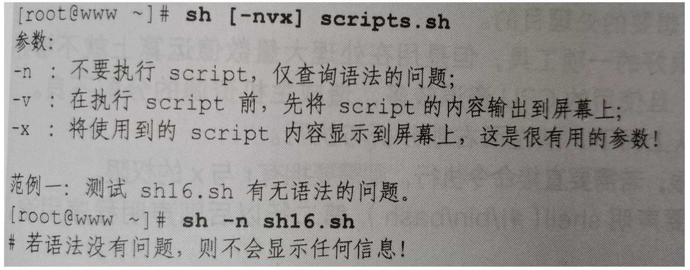

## 前言
shell是一种专门用于和计算机内核通信并控制内核工作的窗口程序，因此，要想真正的掌握Linux的使用，学习使用shell是必不可少的。bash是Linux中默认的shell，使用者众，同时还有很多其他shell，如csh/tsh/bsh/ash等，这些都是shell，shell script可以在一般的like Unix系统上运行。个人感悟是shell script还是非常高效方便的，因为我可以直接在脚本里使用我在命令行里使用的工具，就像是把所有指令写到一起，但是又能够采用编程的方式进行组织，工作效率plus，接下来就让我们学习一下shell script吧。
<!--more-->
## 1. 一个简单的shell script
```
#!/bin/bash
# author: Genening
# date: 2019/12/16
# version: 1.0
# describe: This is a shell script that help you to get the full information from the the original RSEM files by your interest_trans_id. This script need three parameter, Just follow the guidance.


id=$1
target=$2
output=$3

cat ${id}|while read line
do
if [ $output == "" ];then
        grep ${line} ${target} >> output.txt
else
        grep ${line} ${target} >> ${output}
fi
done
echo "Your file is successfully extract from the target file!"
```
上面是一个简单的shell script，用于通过id从另一个文件中提取出这些id及其完整信息，这在我做转录组分析的过程中是很重要的一个工具，而且效率还行。现在我们来分析一下这个脚本。

首先，我们可以看到的是，整个脚本大体分为两个部分。第一部分是上面的注释，`#!/bin/bash`这一行不是注释，而是声明，声明这个shell是采用bash这个shell来运行的，这一行很重要，这是脚本能够运行的基础，其余的几行就是注释了，这是一种个人习惯，记录一下相关信息，这个倒不一定一定要有，只不过有这个会比较规范，在后期如果需要重写或者其他人使用你的脚本的时候能够更明确，这里一般会记录作者、日期、版本、描述，还可以加上使用的环境变量、系统语系，这些都是挺重要的信息，如果能记上会更好。

接下来我们来看第二部分。第二部分就是脚本的正文了，在这里就有点类似我们普通的编程了，但是这里写的可以直接运行的命令，这个脚本不用经过编译就可以执行，这也是shell script和一般编程的最大区别，这个更像是以前的批处理命令，不过shell script又有更强大的一点，那就是shell script提供了循环、判断、选择、数组等这些结构供我们使用，让我们能够编辑出功能更为复杂的script来实现我们的功能。在上面的这个脚本中，首先是我们通过$1 $2 $3这3个指令获取到了从命令行里输入的3个参数，然后分别赋给了3个变量。接下来我们进入逻辑处理部分，在这部分里我们首先通过cat命令按行读取文件输出到标准输出，再使用管道符把这些行输出变成行输入进入while循环，通过read把输入赋给line这个变量，这样我们就可以按行处理文件了。再紧接着我们采用了一个判断语句，判断有没有“输出文件名”这个输入，如果是空那就执行第一个grep匹配命令，数据流重定向追加写入到output.txt这个文件中，如果不是空，那就执行第二个grep匹配命令，数据重定向到用户指定的文件名中，最后工作完成后就打印输出"Your file is successfully extract from the target file!"，提示用户任务完成。

通过这个简单的例子我们就可以一窥shell script的全貌了，一个shell script需要具备的有以下几部分：
1. #!/bin/bash shell的声明，保证shell的正常运行
2. 相关必要的注释，保证用户方便使用，注释信息可以包括作者、日期、版本、联系方式、描述、环境变量、系统语系等信息
3. 用户变量输入或变量定义
4. 逻辑结构，包括循环、条件判断、选择等逻辑关系
5. 处理语句，这里是使用Linux中可以直接使用的命令来完成

上面列举的几部分就是一个shell script应该有的基本框架了，在刚开始学习的时候就要养成良好的编程习惯，虽然这算不上真正的编程语言，但是也要像其他编程一样，规范写代码，追求高效简约。

## 2. 创建一个shell script
在Linux环境中创建一个shell script是很简单的，就是新建一个文件，命名以.sh结尾即可。（*其实在Linux中后缀不是很必要的一个东西，因为运行的软件一般都是你使用的指令，但是这个后缀只是为了让你自己更加好分别这个文件的性质，所以一般还是写上，但是不写也不会影响脚本的运行，但是在windows中这个后缀就很重要了，因为Windows中用户一般都不是特别了解自己的电脑，电脑是通过后缀自动选择默认运行的软件的，所以没有后缀在Windows中是不能直接运行的。*），创建的指令是`touch name.sh`，新建完了后，就可以进入文件进行编辑了，在Linux中有自带的文本编辑软件vim、vi，一般使用vim就可以了，这个对于编程会更加友好，因为这个编辑器会根据编程内容采用不同颜色标注，方便我们的编写、阅读。命令是`vim name.sh`，接下来就是编写部分了。

## 3. 变量
在shell script中有默认的变量，比如$0、$1、$2....等等，这里分别对应的是如下的关系：

这意味着，我们可以通过这些变量名从命令行里获得参数，分别可以按照位置获得。
## 4. 逻辑结构
### 4.1 条件判断
这里有基础语法和高级语法使用，如下：
```
# 基本语法
if [条件判断];then
    command
fi

# 两判断
if [条件判断];then
    command
else
    command
fi

# 多判断
if [条件判断];then
    command
elseif [条件判断];then
    command
else
    command
fi
```
其中多判断是可以一直扩展的，但是一直扩展下去，这个就有点太繁杂了，很是麻烦，所以还有下面这种多判断的方式：
```
case $variable in
    var1)
        command
    ;;
    var2)
        command
    ;;
    var3)
        command
    ;;
    var4)
        command
    ;;
    *) #这里表示其他所有值
        exit 1
    ;;
esac
```
此处可以套娃，只要你有需要，这里的case可以一直写。另外，这里有意思的是，shell script里面表示一个判断逻辑结束的方式是把单词倒过来写。

### 4.2 function
这里的function是利用了复用的思想设计的，在我们编写shell script的过程中，因为有可能有些部分要重复写，当写的太多了的时候，一个是非常烦扰，另一个是代码会变得非常的冗长，所以这里可以采用编写成function的方法，编写在script开头，在接下来调用就可以了，格式如下：
```
function func_name(){
    command
}
```
接下来只要调用func_name就可以了，这个格式倒是和c以及JavaScript的function有点像，anyway，应该还是挺好用的。

### 4.3 循环
这里的循环也是分为不定循环和固定循环，有几种写法，如下：
```
# 不定循环1
while [condition]
do
    command
done

# 不定循环2
until [condition]
do 
    command
done

# 固定循环1
for var in con1 con2 con3...
do
    command
done

# 固定循环2
for var in $(seq 1 n) #这里seq是sequence，指1到n的整数序列
do
    command
done
```

### 4.4 语法纠错
一种不运行script就可以检查语法的方法，这个应该可以挺实用的，虽然我没有用过，如下：


## 5. 调用bash命令
这一部分是shell script里面最cool的地方了，那就是常用的bash工具可以直接使用，比如我们的文本三大件——grep、sed、awk，这个用起来相当的酸爽，还有cat、wc、|这些都可以直接使用，这个简直太棒了，这样子就可以强强联手极大提高工作效率了，下面列举一些常用的bash的工具
* grep——查询、搜索匹配
* sed——插入、删除、替换
* awk——提取整列、合并文件
* wc——统计数量
* cat——按行查看文件
* ls——按行列举目录下文件
* sort——排序
* uniq——统计、去重
* join——合并文件中相同部分的行，可选左、右、全连接3种连接方式
* paste——合并文件
* split——拆分文件
* expand——把文件中的tab转换成空格，unexpand把空格转换成tab
* tee——把标准输出写入批量文件
* tr——查询然后全局替换，有点像Word中的替换功能
* col——将说明文本转化为纯文本，方便阅读(eg. man col|col -b> file)

## One more thing
在这里介绍一个有趣的shell script
```
conda () 
{ 
    if [ "$#" -lt 1 ]; then
        "$CONDA_EXE" $_CE_M $_CE_CONDA;
    else
        \local cmd="$1";
        shift;
        case "$cmd" in 
            activate | deactivate)
                __conda_activate "$cmd" "$@"
            ;;
            install | update | upgrade | remove | uninstall)
                OLDPATH="${PATH}";
                __add_sys_prefix_to_path;
                "$CONDA_EXE" $_CE_M $_CE_CONDA "$cmd" "$@";
                \local t1=$?;
                PATH="${OLDPATH}";
                if [ $t1 = 0 ]; then
                    __conda_reactivate;
                else
                    return $t1;
                fi
            ;;
            *)
                OLDPATH="${PATH}";
                __add_sys_prefix_to_path;
                "$CONDA_EXE" $_CE_M $_CE_CONDA "$cmd" "$@";
                \local t1=$?;
                PATH="${OLDPATH}";
                return $t1
            ;;
        esac;
    fi
}
```
仔细阅读以下这个shell script的代码，应该不难发现，这个就是我们现在常用的conda的命令运行的脚本了，平常我们使用conda进行install/upgrade/update/uninstall的时候，调用的应该就是这个脚本，现在我们能一窥conda的内部运行脚本，是不是非常cool，另外这些信息是通过`set`这个命令展示出来的。anyway，好好学习，天天向上！

