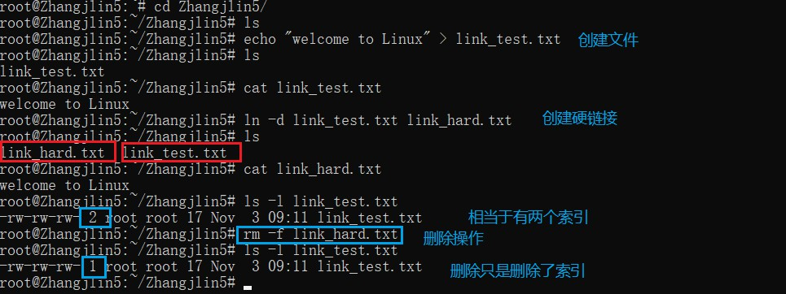
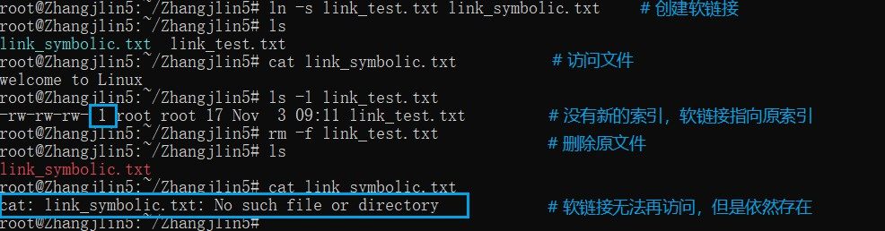

>在Linux的应用当中，掌握软硬链接的方法很重要，学会软硬链接可以让我们更方便的使用Linux系统中的文件，特别是以项目的方式去管理文件时，可以在单个项目之内创建软硬链接，而在其他的项目当中也可以创建同样的软硬链接指向同样的脚本、软件等，这样子可以实现文件个高效复用，既能便捷实用，又能避免重复造轮子。
<!--more-->
### 1. 硬链接 hard link
创建方法：
```
ln -d dir1/source_file dir2/hard-link_file
```
**理解**：
* 在Linux系统之中，文件储存在某一些储存空间上，删除文件的方式其实就是把对应的索引链接都删除就可以了，那么这一片空间就没有索引来访问了，那么这样就相当于是删除了文件，下次写文件的时候就会新建对应的索引链接，然后直接开始写入文件到储存空间，实现覆盖。
* 对于硬链接来说，就是创建一个新的索引，和原来文件的索引同级（原文件索引即原文件的名字），相当于是给文件创建了一个新的名字，但是没有创建新的文件，当原文件的索引被删除时，不会影响到硬链接，仍然可以通过硬链接访问文件，并且进行编辑。
* 如果需要彻底删除文件，那就意味着必须把所有的硬链接都删除掉，这样才是真正的删除，系统文件才无法找到这片空间中的原文件。
* 硬链接有点像是到一座小岛上的另一座桥，和原来通往这座岛的桥一样，都连接着同样的一个小岛，所以并没有创建新的文件，但是却多了一个保障，一旦原来的桥塌了（误删），仍然可以通过这座桥登上小岛。而不管通过哪座桥登上小岛进行建设规划，都会直接改动小岛真实的面目。

### 2. 软连接 symbolic link
创建方法：
```
ln -s dir1/souce_file dir2/symbolic_link
```
**理解**
* 软连接是真正的快捷方式既视感。软连接是一个文件，这个文件的内容是原文件的储存路径之类的，但是也只有这些，并没有原文件的具体内容，所以只是一个快捷方式，通过这个快捷方式可以快速的访问到文件，并进行使用。
* 因此，当在删除了原文件后，软连接就失效了，无法再访问原文件。
* 同样是用小岛来打比方，软连接就像是路标，指明了哪里有桥可以上岛，对于具体的小岛来说，软连接就指向了原来那座桥所在的方位，所以可以很快的找到桥然后上岛。所以拆掉路标不会影响桥的存在，但是一旦把桥拆了，那么路标也就没有用了，小岛已经再也上不去了，相当于在世界上消失了。

### 3. 软硬链接的区别
|硬链接 hard link|软链接 symbolic link|
|:----|:----|
|不能给目录创建硬链接|可以给目录创建软链接|
|不能跨文件系统创建链接|可以跨文件系统创建软链接|
|文件的新索引，和原文件名互为别名|新文件，保存原文件路径，相当于快捷方式|
|不能给不存在的文件创建硬链接，<br>因为硬链接存在即表示原文件存在，<br>而不存在的文件就表示没有文件，<br>也就没有链接可言。|可以给不存在的文件创建链接，<br>因为路标可以随便建，有没有效<br>无所谓，反正可以建。|

### 4. ln 命令
使用方法：" ln [options] 目标 "
* 参数如下
* >-b 删除，覆盖以前建立的链接<br>
-d 允许超级用户制作目录的硬链接<br>
-f 强制执行<br>
-i 交互模式，文件存在则提示用户是否覆盖<br>
-n 把符号链接视为一般目录<br>
-s 软链接(符号链接)<br>
-v 显示详细的处理过程<br>

### 5. 实践
1. 硬链接 hard link

2. 软链接 symbolic link


