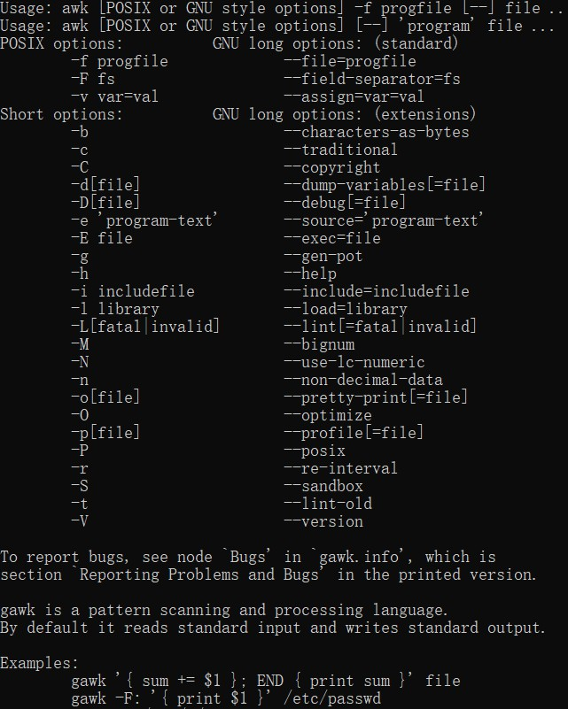
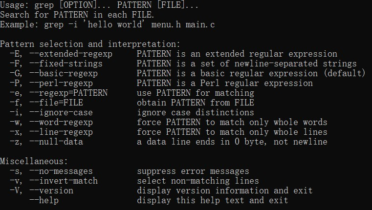

>在Linux中，有着处理文本的三大常用的、非常强大的工具——**awk**/**grep**/**sed**，其中awk是报告生成工具，适合处理列数据；grep是文本过滤搜索工具；sed是文本编辑工具，完成一般的编辑工作。接下来我将学习如何使用这3个工具。PS：这三个工具操作的文本都可以通过重定向的方式输出到新文件中保存下来。
<!--more-->
## 1. 预备内容
>在正式学习这三个工具之前，先来了解一下Linux中的正则表达式。

在Linux中可以通过正则的方式对文本进行匹配处理，这就相当于是一个通用模板，**awk**、**grep**和**sed**都可以识别这套模板，相当于正则表达式可以成为这3个工具的拓展模板，通过结合正则，让这3个工具更加强大。 

### 1.1. 正则的组成
|元字符|功能|意思|
|:----:|:----|:----|
|^|匹配行首|表示以某个字符开头|
|$ |匹配行尾|表示以某个字符结尾|
|^$|空行的意思|表示空行的意思|
|.|匹配任意单个字符|表示任意一个字符|
|*|字符* 匹配0或多个此字符|示重复的任意多个字|
|\|屏蔽一个元字符的特殊含义|表示去掉有意义的元字符的含
|[]|匹配中括号内的字符|表示过滤括号内的字符|
|.*|代表任意多个字符|就是代表任意多个字符|

>以上就是常见的元字符，正则还有一些其他字符，如下图

## 2. awk使用
*使用文档如下：*

## 3. grep使用
*使用文档如下：*

## 4. sed使用
*使用文档如下：*
