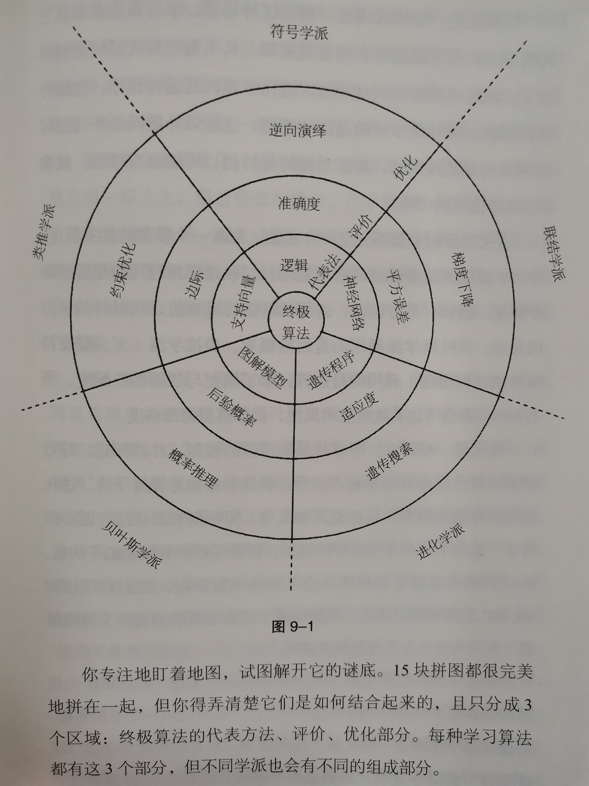

## 前言
最近在阅读美国华盛顿大学计算机科学教授佩德罗·多明戈斯（Pedro Domingos）的书籍《终极算法》（The Master Algorithm）。多明戈斯教授深入浅出的介绍了现在在人工智能和机器学习领域的学派和常见算法，并且以生动形象的例子阐述了各种学派与算法的优缺点与应用领域，是一本非常好的人工智能科普读物，阅读之后颇有收获，可以让人有种一览机器学习全貌之感，可以非常好的把握现在的人工智能及机器学习的发展概况。如果以后想从事相关领域的学习与工作，非常推荐一读。

<!--more-->

## 1. 终极算法
说到智能算法，从算法的角度去观察自然世界和人类社会是一个非常有意思的事情。有没有想过人类的身体本身就是依靠着各种生物学的算法而生存的，世界上有非常多的顶尖科学家穷尽一生在追逐智能算法，但是即使是现在最好的智能算法、最精密的设备也比不过生命体本身的神奇瑰丽。在人类身体的分子层面，从DNA到蛋白质，各个分子紧密合作，控制着一整个人类身体正常运转，数以亿计、兆亿的分子和细胞，如此庞大的一个体系能够运转的有条不紊，难道这不是一个奇迹吗？而能够指导这些正常运转的算法才是物理世界最神奇的算法。

多明戈斯教授讲述的终极算法的概念是指“所有知识，无论是过去的、现在的还是未来的，都有可能通过单个通用学习算法来从数据中获得，而这个通用的学习算法就是终极算法。”，从这个观点可以看出，如果按照多明戈斯教授的说法，我们所生存的整个空间时间都是数据源，有一个算法可以从所有提供的数据中挖掘出模式与知识，那确实这个算法就是非常终极了，因为这意味着这个算法可以学会任何事情，包括人类现在会的，和人来未来会的。

这个算法到底是否存在呢？多明戈斯教授列举了多个方面的例子来进行论证。这些论证有来自神经科学的，来自进化论的，来自物理学的，来自统计学的，这些角度中都有着通用的东西。比如神经科学发现的大脑皮层的通用性，进化论发现的基因的通用性，物理学中物理规律的通用性（比如熵增定理），在统计学中的数据统计分析论调等。看起来似乎真的有这么一个终极算法可以追求。

## 2. 机器学习的五个学派
根据多明戈斯教授的介绍，当今的机器学习领域可以分为5个不同的学派，各个学派以自己独有的角度出发去探索人工智能的实现方式，这些不同的角度派生出不同的算法，这些算法各显神通，在不同的领域有着各自的一片天地。

这5个学派分别是：符号学派、联结学派、进化学派、贝叶斯学派、类推学派，这些学派的学科支撑有所不同，因而学派之间也各有特色。

**符号学派将学习看做逆向演绎，并从哲学、心理学、逻辑学中寻求洞见；联结学派对大脑进行逆向分析，灵感源于神经科学和物理学；进化学派在计算机上模拟进化，并利用遗传学和进化生物学知识；贝叶斯学派认为学习是一种概率推理形式，理论根基在于统计学；类推学派通过对相对性判断的外推来进行学习，并受心理学和数学最优化的影响。**

在构建机器学习的目标推动下，多明戈斯教授带领我们将回顾过去的100年的思想史，并以新的观点来看待这段历史。

|学派|学科支撑|主算法|
|:----|:----|:----|
|符号学派|哲学、心理学、逻辑学|逆向演绎|
|联结学派|神经科学、物理学|反向传播|
|进化学派|遗传学、进化生物学|遗传编程|
|贝叶斯学派|统计学|贝叶斯推理|
|类推学派|心理学、数学最优化理论|支持向量机|

## 3. 建立在机器学习之上的世界
人类的未来会与计算机有更加深入的交融，现在人们的生活已经被算法包围，未来只会更有甚者。计算机可以算是人类创造的硅基生物，随着时间的推移，计算机的能力将不断提升，在我们的生活中的重要性也不断提升，计算机已经是我们生活中不可或缺的一部分了。所以顺应这个潮流，学会利用计算机而不是被计算机抛弃成为了我们最好的选择。所以现在这个阶段不能够懒惰，要多动脑思考，培养创造性思维，只会繁琐的简单重复工作，未来智能面临淘汰。

最后，附上一张机器学习的学派地图：

