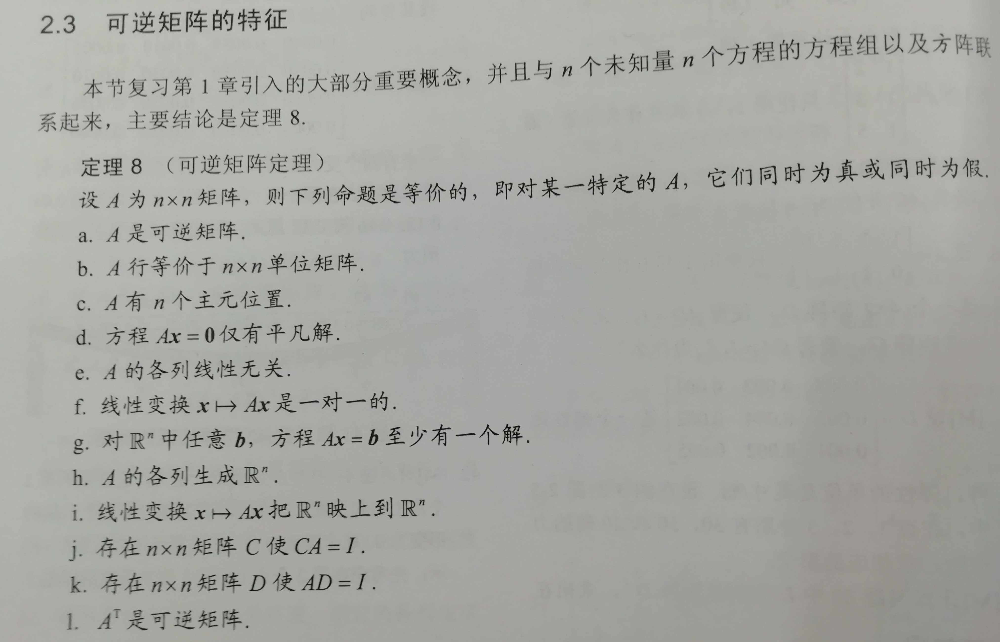

>I am going to share some experiences in the process that I study the linear Algebra, it is really excited that I just find a super nice textbook named *Linear Algebra and the Applications*. I really recommend it if you are going to study the linear algebra especially when you are mindless in which book that you should read. 
>>Life tips: Never judge others by your value, learn to accept the diversity, this is what the world looks like. Respect each other!

<!--more-->
## Chapter 1 线性方程组
content: 
* 1.1. 线性方程组
* 1.2. 行化简与阶梯型矩阵
* 1.3. 向量方程
* 1.4. 矩阵方程 Ax=b
* 1.5. 线性方程组的解集
* 1.6. 线性方程组的应用
* 1.7. 线性无关
* 1.8. 线性变换介绍
* 1.9. 线性变换的矩阵
* 1.10. 商业、科学和工程中的线性模型

