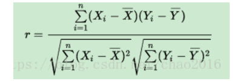
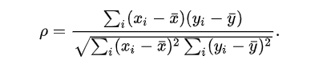

## 前言
常见的相关系数有三种：pearson、spearman、kendall。皮尔森（pearson）相关系数、斯皮尔曼（spearman）相关系数和肯德尔（kendall）相关系数并称为统计学三大相关系数。其中，spearman和kendall属于等级相关系数亦称为“秩相关系数”，是反映等级相关程度的统计分析指标。pearson是用来反应俩变量之间相似程度的统计量，在机器学习中可以用来计算特征与类别间的相似度，即可判断所提取到的特征和类别是正相关、负相关还是没有相关程度。
三种相关系数各有特点，但是相同的是，三种相关系数都是计算变量之间的相关性，接下来我们一一介绍：

<!--more-->

## 1. pearson相关系数
pearson相关系数衡量的是线性相关关系 ，是最常用的一种相关系数，记为r。若r=0，只能说x与y之间无线性相关关系，不能说无相关关系。相关系数的绝对值越大，相关性越强：相关系数越接近于1或-1，相关度越强，相关系数越接近于0，相关度越弱。

定义： 两个变量X、Y之间的协方差和两者标准差乘积的比值

代入样本的协方差和标准差可得计算公式：

公式推导过程：

## 2. spearman相关系数
斯皮尔曼相关性系数，通常也叫斯皮尔曼秩相关系数。“秩”，可以理解成就是一种顺序或者排序，那么它就是根据原始数据的排序位置进行求解，这种表征形式就没有了求皮尔森相关性系数时那些限制。

计算公式：

斯皮尔曼相关系数表明X(独立变量)和Y(依赖变量)的相关方向。如果当X增加时，Y趋向于增加，斯皮尔曼相关系数则为正。如果当X增加时，Y趋向于减少，斯皮尔曼相关系数则为负。斯皮尔曼相关系数为零表明当X增加时Y没有任何趋向性。当X和Y越来越接近完全的单调相关时，斯皮尔曼相关系数会在绝对值上增加。当X和Y完全单调相关时，斯皮尔曼相关系数的绝对值为1。

斯皮尔曼相关系数经常被称作"非参数"的。这里有两层含义。首先，当X和Y的关系是由任意单调函数描述的，则它们是完全皮尔逊相关的。与此相应的，皮尔逊相关系数只能给出由线性方程描述的X和Y的相关性。其次，斯皮尔曼不需要先验知识(也就是说，知道其参数)便可以准确获取XandY的采样概率分布。

一般地，斯皮尔曼相关系数在有三个或更多条件的情况下是有用的。并且，它预测观测数据有一个特定的顺序。 例如，在同一任务中，一系列的个体会被尝试多次，并预测在多次尝试过程中，性能会得到提升。在这种情况下，对条件间趋势的显著性检验由E. B. Page发展了，并通常称为给定序列下的Page趋势测验。

## 3. kendall相关系数

肯德尔相关性系数，又称肯德尔秩相关系数，它也是一种秩相关系数，不过它所计算的对象是分类变量。
分类变量可以理解成有类别的变量，可以分为
无序的，比如性别（男、女）、血型（A、B、O、AB）；
有序的，比如肥胖等级（重度肥胖，中度肥胖、轻度肥胖、不肥胖）。
通常需要求相关性系数的都是有序分类变量。

n个同类的统计对象按特定属性排序，其他属性通常是乱序的。同序对（concordant pairs）和异序对（discordant pairs）之差与总对数（n*(n-1)/2)的比值定义为Kendall(肯德尔)系数。

肯德尔相关系数是一个用来测量两个随机变量相关性的统计值。一个肯德尔检验是一个无参数假设检验，它使用计算而得的相关系数去检验两个随机变量的统计依赖性。肯德尔相关系数的取值范围在-1到1之间，当τ为1时，表示两个随机变量拥有一致的等级相关性；当τ为-1时，表示两个随机变量拥有完全相反的等级相关性；当τ为0时，表示两个随机变量是相互独立的。

## 4. 结语
三种相关性系数的使用场景不尽相同，因此我们可以根据实际的使用场景来选择使用哪一种相关系数。

This is test for a new vscode widget, which named *Markdown Preview Enhance*, it can substitute the old preview widget inside the vscode. It provides a white background of the editor, which is more closely to the real appearance of the render html page. 
