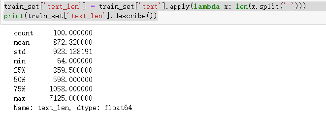
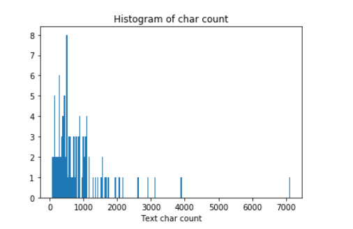
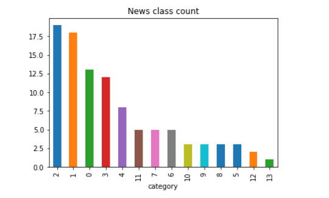

## 前言
昨天我们了解了比赛的基本内容以及一些思路，下载了比赛的数据，今天我们就来探索一下我们现有的数据。
<!--more-->
## 1. 数据概况
通过网站的链接，我们下载到了三个数据——train_set/test_a/test_a_sample这三个数据的csv文件，接下来我们来看看这三个数据长啥样。

```
# 导入工具包
import pandas as pd

train_set = pd.read_csv('./train_set.csv', sep='\t', encoding='utf-8')

# 查看基本统计结果
train_set.describe()
# 查看具体信息
train_set.info
# 查看前5行数据
train_set.head(5)
```
结果如下：


## 2. 简单探索
1. 文本长度统计
```
train_set['text_len'] = train_set['text'].apply(lambda x: len(x.split(' ')))
print(train_set['text_len'].describe())
```


2. 文本长度直方图
```
%matplotlib inline
import matplotlib.pyplot as plt 

_ = plt.hist(train_set['text_len'], bins=200)
plt.xlabel('Text char count')
plt.title("Histogram of char count")
```


3. 类别统计
```
train_set['label'].value_counts().plot(kind='bar')
plt.title('News class count')
plt.xlabel("category")
```


4. 字符统计
```
from collections import Counter
all_lines = ' '.join(list(train_set['text']))
word_count = Counter(all_lines.split(" "))
word_count = sorted(word_count.items(), key=lambda d:d[1], reverse = True)

print(len(word_count))

print(word_count[0])

print(word_count[-1])

# 输出结果
2405
('3750', 3702)
('5034', 1)
```

```
from collections import Counter
train_set['text_unique'] = train_set['text'].apply(lambda x: ' '.join(list(set(x.split(' ')))))
all_lines = ' '.join(list(train_set['text_unique']))
word_count = Counter(all_lines.split(" "))
word_count = sorted(word_count.items(), key=lambda d:int(d[1]), reverse = True)

print(word_count[0])

print(word_count[1])

print(word_count[2])

# 输出结果
('3750', 99)
('900', 99)
('648', 96)
```

### **数据分析的结论**

通过上述分析我们可以得出以下结论：

1. 赛题中每个新闻包含的字符个数平均为1000个，还有一些新闻字符较长；
2. 赛题中新闻类别分布不均匀，科技类新闻样本量接近4w，星座类新闻样本量不到1k；
3. 赛题总共包括7000-8000个字符；

通过数据分析，我们还可以得出以下结论：

1. 每个新闻平均字符个数较多，可能需要截断；

2. 由于类别不均衡，会严重影响模型的精度；