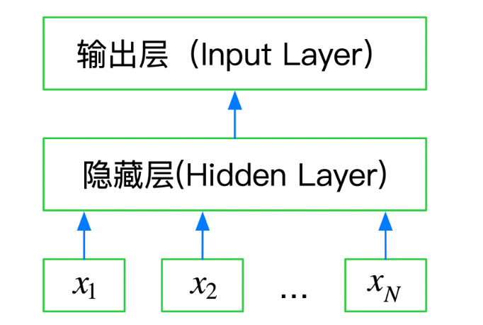

## 前言
与传统机器学习不同，深度学习既提供特征提取功能，也可以完成分类的功能。从本章开始我们将学习如何使用深度学习来完成文本表示。

<!--more-->
## **文本表示方法 Part2**

在上一章节，我们介绍几种文本表示方法：

- One-hot
- Bag of Words
- N-gram
- TF-IDF

也通过sklean进行了相应的实践，有了初步的认知。但上述方法都或多或少存在一定的问题：转换得到的**向量维度很高**，需要较长的训练实践；**没有考虑单词与单词之间的关系**，只是进行了统计。

与这些表示方法不同，深度学习也可以用于文本表示，还可以将其映射到一个低纬空间。其中比较典型的例子有：*FastText*、*Word2Vec*和*Bert*。在本章我们将介绍FastText，将在后面的内容介绍Word2Vec和Bert。

## **FastText**
FastText是一种典型的深度学习词向量的表示方法，它非常简单，通过Embedding层将单词映射到稠密空间，然后将句子中所有的单词在Embedding空间中进行平均，进而完成分类操作。**所以FastText是一个三层的神经网络，输入层、隐含层和输出层。**



## **基于FastText的文本分类**

FastText可以快速的在CPU上进行训练，最好的实践方法就是官方开源的版本：
https://github.com/facebookresearch/fastText/tree/master/python

### 安装fasttext

- pip安装

```
pip install fasttext
```

- 源码安装

```
git clone https://github.com/facebookresearch/fastText.git
cd fastText
sudo pip install .
```
>在Windows上安装fasttext时会出现一定的报错，这个时候解决比较繁琐，于是干脆采用第三方python库手动下载好fasttext的wheels文件，手动安装就好。[进入python第三方库](https://www.lfd.uci.edu/~gohlke/pythonlibs/)，按`ctrl+f`查找我们要的package（即fasttext），然后选择和自己电脑合适的版本，点击下载，下载完毕后，进入下载目录，命令行运行 `pip install ./<fasttext_version_file>.wheel`

### 代码构建
```
import pandas as pd
from sklearn.metrics import f1_score

# 转换为FastText需要的格式
train_df = pd.read_csv('./train_set.csv', sep='\t', nrows=15000)
train_df['label_ft'] = '__label__' + train_df['label'].astype(str)
train_df[['text','label_ft']].iloc[:-2500].to_csv('train.csv', index=None, header=None, sep='\t')

import fasttext
model = fasttext.train_supervised('./train_set.csv', lr=1.0, wordNgrams=2, 
                                  verbose=2, minCount=1, epoch=25, loss="hs")

val_pred = [model.predict(x)[0][0].split('__')[-1] for x in train_df.iloc[-2500:]['text']]
print(f1_score(train_df['label'].values[-2500:].astype(str), val_pred, average='macro'))
```

## 调参提升
在这个模型当中存在一些超参数，合理的调整这些参数可以让我们的模型更加准确，但是该怎么调整这些参数呢？可以采用验证集进行调参。
- 通过阅读文档，要弄清楚这些参数的大致含义，那些参数会增加模型的复杂度
- 通过在验证集上进行验证模型精度，找到模型在是否过拟合还是欠拟合

首先对数据集进行分组，接下来进行交叉验证，选择最后一次验证的验证集的结果来配合调整参数，采用反馈调节——先调整参数，然后观察验证结果，根据结果进行下一次调整。


## 总结
fasttext最大的有点就是快，相较于传统的机器学习算法，fasttext映射出来的向量维度更低，有着更快的训练速度，同时在加大训练量时，也能够达到不错的训练结果，能够适应一定场景下的应用。后面还会接着学习word2vec和bert模型，很期待这两种方法能够带来怎样的惊喜。