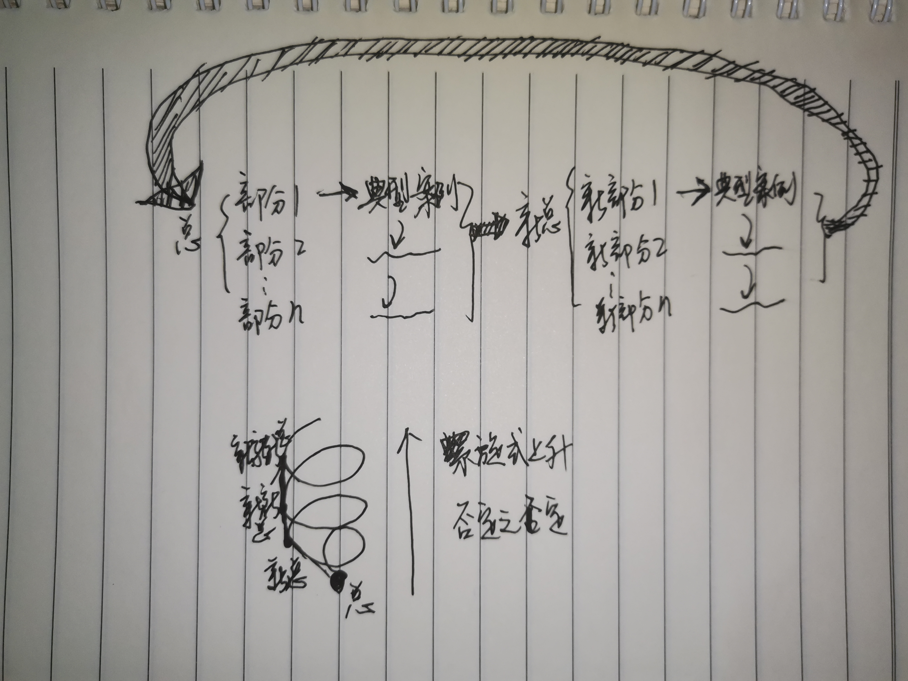

### 前言
这是对最近学习新感悟地总结，现在这个总结已经相对完善，值得好好凝练记录，为之后地学习打好基础。

<!--more-->

### 1. 学习模式
最近在学习的过程中，好像发现了些学习的通用模式。我们在学习一项新的技能或学科知识的时候，总是想一上来就全体框架细致掌握，这对于我们开展学习非常有帮助，不过这种方式也存在局限性，那就是浅尝辄止，总是在初有成效的时候就容易以为已经深刻理解，实际上，这还只是很表层的知识，因此还必须结合细节方面的深入学习，这个学习的框架才能够完善。这是我之前遵循的学习模式，但是最近的学习思考中，我发现，这个模式好像还少了点什么，这让我想起了在我学习书法/街舞/吉他的过程中所经历的过程，我总是想一上来就成为高手，于是乎对于某些基础的针对性练习不以为然，比如，练习书法，为什么要总是重复写一句话呢？难道我不能单纯通过学习笔画练习，而最终每一个字都写得很好看呢？练习舞蹈，为什么要学习成品舞呢？为什么我不能通过学习舞蹈的基础练习动作，最终达到可以跳出无数舞蹈的目标呢？学习吉他，为什么我要反复练习某一首曲子呢？为什么我不能通过苦练和弦，最终达到弹奏无数取子的目标呢？

事实上，这些目标并没有问题，或者说也是我们学习的终极目标，那就是在某一个领域达到技能通用性，这样是最省事的方式不是么。但是，这种目标只存在理想条件中，因为在实际的领域中，环境是动态变化的，未来的变量因素不可预知，因此，想要用一个通用模型解决所有问题，这个想法是不切实际的。我们只能够去尽量接近这个通用模型的状态，但是无法到达。就像收敛函数与收敛极限的关系，只能趋近，不能达到。而且，通用性解决方案还有一个问题，那就是效率问题，因为问题是特殊的，而解决方案如果采用通用模式，就意味着，解决方案并没有考虑问题的特殊性，那么模型适用的过程中可能有所出入，而这些出入影响了模型使用的效率和准确性。所以，真正的解决方案应该是，达到一定程度的通用性，比如通用主体框架/思路，在这个基础上，练习特殊性，通过不同个案的不断练习，磨练自己的针对性能力，在这个基础上，通过不断提高针对性问题的处理能力，慢慢提高自己的通用性能力，然后在新的通用性基础上又继续练习针对性，这样循环往复，不断趋近终极目标。

应该说，以上的学习模式是一个相对完善/不错的学习模式了。这个模式的一个关键点在于动态迭代，也就是这个学习模式本身包含的动态性，让这个模式能够具有更旺盛的生命力，也就是在面对不同的学习任务时，这个学习模式都能够具有不错的实践效果。

最终，简单凝练一下就是：**总体——>部分——>典型案例——>下一个部分——>下一个典型案例——>新总体——>新部分——>……**，迭代往复。面临一个学习任务的时候，先进行总体情况调研，通过综述型学习资料了解背景（论文/书籍/博客/笔记等），然后搭建起这个学习任务的总体框架，接着分解框架，结合自身情况，开始框架细节学习，填充框架内容，最终在一个部分中达到一定水平后，开始泛化框架的其他部分，这里注意一点，那就是不要急于覆盖框架的各个部分，而应该时在一个部分中深耕到一定的水平/境界后再去扩展其他部分，因为这种积累本身可以帮助我们更好的掌握其他部分，但如果我们急于求成，一下跨越各个部分的话，这就只是总体框架学习了，并不是进一步的深度了解，因此最终还是只能游离在知识的表层，这种时候记住，“慢即是快，快即是慢”，我们的学习曲线也是一开始速率缓慢，积累到一定程度后学习速率不断提升的过程。

### 结语
当我们总结出这个学习模式的时候，我们会惊喜地发现，这个模式和马克思哲学中总结地事物发展规律（螺旋式上升/否定之否定）不谋而合。果然，马哲还是厉害。

这个总结相对于之前地总结，添加了“典型案例学习”这个部分，这是我之前一直忽略的重要部分，现在添加进来后，学习模型就完善了，并且形成了一个学习迭代闭环，通过动态迭代的方式提升效果。

有了这个方法之后，我们就可以在之后的自学过程中充分利用这套方法论，以帮助我们完成学习任务。比如，最近在学习英语，那么我已经有了总体的框架知识，而且各个部分也有了一定的积累，现在到了典型案例学些积累的过程，这个过程需要扩展阅读，通过典型案例去汲取更多的知识，进一步提升能力。（当然，这个学习任务和学习托福的过程也是相契合的，互相促进。）