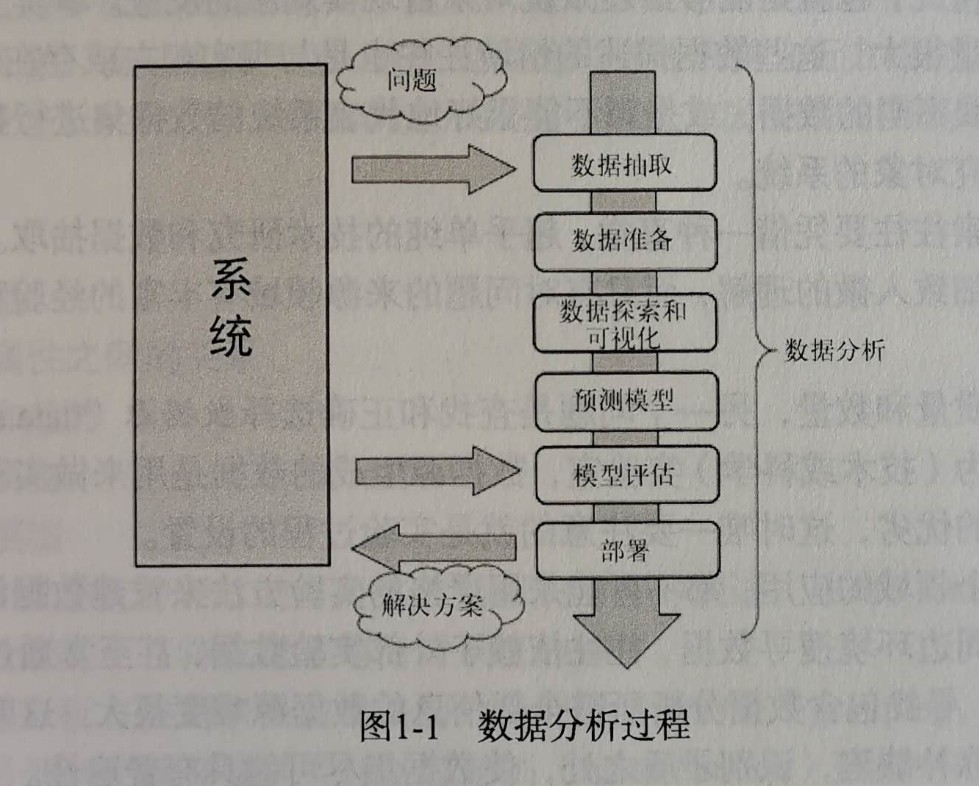

## 前言
自从进入信息时代以来，数据分析变得越来越重要，现在数据分析工作已经融合到了各个行业和领域，是我们了解领域、行业、公司、组织、个人的发展现状及趋势的必要工具，借助数据分析，我们可以更好的了解事件本身的内在规律和发展趋势，因此学习并掌握数据分析技能对于提升个人的竞争力非常有意义。

<!--more-->
## 什么是数据分析？
数据分析是从原始数据中提取信息的过程。在理解这个定义之前，我们要先明确一个观点：信息不等同于数据。信息一般指的是具有一定含义、可以直接理解，可以用于其他场合的结论；数据则是一种抽象的概念，现代生活中有着各种各样的传感器，可以收集各种各样的数据，这些数据的格式各异，内容各异，一般难以直接通过简单观察得出相关结论，只有对这些数据进行分析、提炼、概括，才能获取一些有效的信息，而这个过程就是数据分析。

数据分析的目的是抽取不易推断的信息，而一旦理解了这些信息，就能够对产生数据的系统的运行机制进行研究，从而对系统可能的响应和演变做出预测。数据分析的意义不止于数据建模，更重要的在于对于给定系统输入时对系统输出的预测。

## 数据分析内涵
数据分析是一个综合概念，是一系列操作的概述。数据分析包括了从问题的定义，到数据的收集获取、整理清洗，再到数据的解析理解、可视化、数学建模、预测分析、模型测试、部署的一系列工作。简单来说就是数据分析是包含了从数据的收集到应用的全部操作过程。学习数据分析需要我们熟练的掌握计算机技术，能够通过编程进行数据分析、展示，同时还需要我们能够有较敏锐的统计学嗅觉，能够采用恰当的统计学方法分析数据，得出我们需要的数据特征。另外，根据解析出来的数据特征进行阐释也是非常重要一项工作，这需要我们对于对应的领域有一定的了解，这考验我们的综合能力，需要再平常是生活中多进行积累工作。

## 通用分析过程

1. 问题定义
    > 问题的定义指的是最开始问题的提出的过程，提问也是需要技巧的，提问要能够切中要害，接下来的分析结果才能够带来最有效的帮助。好的问题能给我们带来事半功倍的效果。
2. 数据获取
    > 在完成问题的定义之后，在分析数据之前，首先要做的就是获取数据。所采集的数据全面性、完整性、真实性非常重要，因为数据是我们进行分析的根本所在，如果数据本身存在着较大的偏差，那么后面的分析以及结果将毫无意义。因此在数据获取这一步必须要严谨。
3. 数据准备（预处理）
    > 在获取到数据之后，我们需要对这些数据进行规范化处理。我们获取的数据可能是从多个渠道获取的，那么这就很可能会导致我们数据的格式、表现方式不一致，这些问题会阻碍我们对数据的分析研究。这一步的内容也就是数据的预处理，包括数据规范化、清洗、去重、补缺等工作。
4. 数据探索和可视化
    > 探索数据本质上是指从图形或统计数字中搜寻数据，以发现数据中的模式、联系和关系。数据可视化是突出显示可能的模式的最佳工具。数据可视化发展迅猛，已经成为了一门真正的学科。数据探索包括初步的检验数据，这对于理解采集到的数据的类型和含义很重要。再结合问题定义阶段所获得的信息，确定数据类型，这决定着选用哪种数据分析方法最合适。探索过程大概包括以下内容。
    * *总结数据* -- 了解数据的大体性质，包括数据量的大小、存储格式、数据类型、变量数等内容
    * *数据分组* -- 在了解了数据的基本性质之后，对于数据进行进一步的了解、探索，通过分组的方法，探究数据之间的关系（相关性），从而得出一些中间结论
    * *探索不同属性之间的关系* -- 通过聚类的手段，对数据进行归并，划入不同的group，方便我们提炼信息 
    * *识别模式和趋势* -- 数据分析的一个重要步骤就是**识别（identification）**数据中的关系、趋势和异常现象。这一一般需要对数据进行统计处理，然后对统计所得的数据进行可视化处理，通过直观的观察提炼相关的信息。
    * 建立回归模型
    * 建立分类模型
    >其他的数据挖掘方法，如决策树和关联规则挖掘，以及机器学习算法，则是自动从数据中抽取重要的事实或规则，这些方法可以配合数据可视化配合使用，以便发现数据之间存在的各种关系。
5. 预测模型
    > 这个阶段是要创建或选择合适的统计模型来预测某一个结果的概念，比较常用的有聚类模型、回归模型、贝叶斯分析、马尔代夫链等模型，因此对于统计学能力有较高的要求。一般来说模型的功能一般是两种，一种是给定一个值预测系统的输出，这种需要回归模型来处理；另一种是对所掌握的数据进行分类、聚类，这需要采用聚类模型来处理，例如猫、狗识别模型，可以对输入的数据（图片）进行归类，到底是狗还是猫。
6. 模型评估
    > 在我们得到了模型之后，这个模型到底好不好呢？这就需要对模型进行评估，一般是评估模型的准确性、稳健性等性质，从而判断模型好不好。一般我们会对数据进行分组，一部分划分为训练集，一部分划分为测试集，这是一种可行的方法，帮助我们判断模型。不过现在有更好的办法，能够提高对数据的利用率，这就是**交叉验证**，这种方法是把数据分成若干份，然后轮流选取其中一份作为测试集，其余数据为训练集，训练模型，然后直至每一份数据都充分使用之后，对所得到的结果进行整合，从而得到更好的效果，其实这就是集成学习，这种方法现在被广泛使用，比如XGboot等方法。
7. 部署
    > 在评估模型之后，保留好的模型，把好的模型部署到实际的应用场景中，这是最后一步，也是非常重要的一步，只有完成这一步之后，才能够让我们做的工作真正的产生价值。一般模型的部署都属于传统的开发工作，这些工作需要我们有扎实的传统开发技能，所以平常我们不能疏忽了这方面的积累和锻炼。

## 总结
在现在这个时代，信息就是价值，虽然互联网抹平了很多信息鸿沟，让信息变得比较对称，但是深层次的信息依然需要专门的挖掘才能够获得，这也是比较有价值的信息。掌握数据分析能力是我们提升个人能力，解构世界、了解社会的利器，因此有必要好好学习。

数据就是宝藏，信息就是财富。

