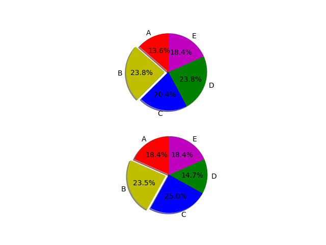
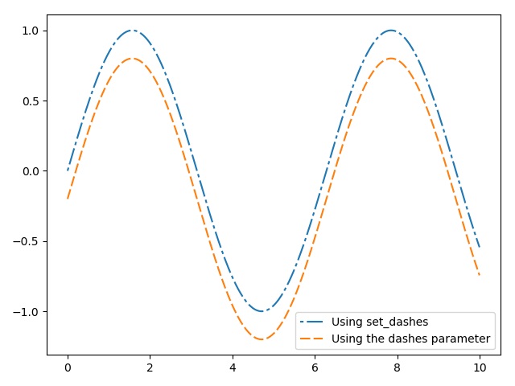

>开始学习数据可视化，在此记录，目前主要是先学Python中的matplotlib这个包，这个包和MATLAB中的作图很相似，具有很高的自定义性，等到这个学习的比较深入后再考虑了解拓展其他工具的作图。附上学习链接：https://matplotlib.org/gallery/index.html  <br>
>直接到官网学习是最方便的，**文档详细**，**demo生动**。

# 补充
>这是新发现的一张思维导图，非常清晰的展示了matplotlib的结构，非常helpful。


# 目录
* ### 1. 基础画图
* ### 2. 画图进阶

### 第一部分：基础画图
<!--more-->
#### 1. 通用画图步骤

```
① 引包：import matplotlib.pyplot as plt；
② 创建画布：fig = plt.figure()；
③ 添加分区：ax = fig.add_subplot(311)   # 3个数字分别代表 行、列 及 本图所处位置；
④ ax.axis([-5,5,0,1])    # 设置x轴最小、最大值，y轴最小、最大值；
⑤ ax.scatter(xcord1,ycord1, s=30, c='red', marker='s')  # 用于画散点图；
⑥ ax.plot(x, y)                     # 用于画线图；
⑦ plt.title(“this is a title”)      # 图形添加标题；
⑧ plt.xlabel('x')、plt.ylabel('y')  # 分别对坐标轴添加标题
⑨ plt.savefig("/path_way/img_name.jpg")  #调整好后，保存图片
⑩ plt.show()                        # 显示图形；
——————————————————————————————————————————————————————————

# 第一步：导入工具包——matplotlib、numpy、matplotlib.pyplot
import matplotlib
import matplotlib.pyplot as plt
import numpy as np

# 第二步：数据准备——将数据处理成对应图片所需的格式
labels = ['G1', 'G2', 'G3', 'G4', 'G5']
men_means = [20, 34, 30, 35, 27]
women_means = [25, 32, 34, 20, 25]

x = np.arange(len(labels))  # the label locations


# 第三步：图片通用设置
# Add some text for labels, title and custom x-axis tick labels, etc.
ax.set_ylabel('Scores')
ax.set_title('Scores by group and gender')
ax.set_xticks(x)
ax.set_xticklabels(labels)
ax.legend()

# 第四步：作图
fig, ax = plt.subplots()
rects1 = ax.bar(x - width/2, men_means, width, label='Men')
rects2 = ax.bar(x + width/2, women_means, width, label='Women')

width = 0.35  # the width of the bars


def autolabel(rects):
    """Attach a text label above each bar in *rects*, displaying its height."""
    for rect in rects:
        height = rect.get_height()
        ax.annotate('{}'.format(height),
                    xy=(rect.get_x() + rect.get_width() / 2, height),
                    xytext=(0, 3),  # 3 points vertical offset
                    textcoords="offset points",
                    ha='center', va='bottom')


autolabel(rects1)
autolabel(rects2)

fig.tight_layout()

# 第六步：确认完成后，以img_name.jpg文件名保存到目标路径下
plt.savefig("D:/TECHENICLEARNING/Data_visualization/img_name.jpg") # 导入.savefig()方法，添加路径，将图片保存到目标路径下
### 这一步必须放在show之前，可以考虑先注释掉这一步，等到图片调整好后再取消注释保存图片！！！

# 第五步：展示图片
plt.show() # 调用.show()方法展示图片，以便修改


```
示例图片如下：


>图中的绿色圈为后来添加上的，圈出的地方表示可以自定义
<!-- 例子如下：
 -->

#### 2. 散点图与折线图
代码如下：
```
# 导入工具包
import matplotlib
import matplotlib.pyplot as plt
import numpy as np

# 数据准备
labels = ['G1', 'G2', 'G3', 'G4', 'G5']
x = [20, 34, 30, 35, 27]
y = [25, 32, 34, 20, 25]
z = [[20,26],[34, 32],[30, 34],[35, 20],[27, 25]]

# 初始化，全局标题
fig = plt.figure()
plt.title("plot and scatter")

# 第1幅散点图
ax = fig.add_subplot(2, 2, 1)
ax.scatter(x,y, s=30, c='red', marker='s')

# 第2幅折线图
ax2 = fig.add_subplot(2, 2, 2)
ax2.plot(x)
ax2.plot(y)

# 第3幅折线图
ax3 = fig.add_subplot(2, 2, 3)
ax3.plot(z)

# 第4幅折线与散点图
ax4 = fig.add_subplot(2, 2, 4)
ax4.scatter([1,2,3,4,5],y)
ax4.plot([1,2,3,4,5],x)

# 保存图片
plt.savefig("D:/TECHENICLEARNING/Data_visualization/plot-scatter.jpg")

# 图片展示，会将上面所有的图都展示出来
plt.show()
```
输出图片：


>感悟：在这里是直接使用matplotlib自动画的折线图和散点图，做好的关键在与数据的准备，如果准备的数据好的话，可以直接调用.plot()输入一个变量画折线图，默认横轴为数组的序数；如果采用scatter画图的话，需要传入两个参数，第一个是x，一般是横轴，第二个是y，一般是因变量的值，需要注意这一点，参数数量要对。另外还有其他能够自定义图片的地方，后续会进一步介绍。

### 3. 柱状图
代码如下：
```
import matplotlib
import matplotlib.pyplot as plt
import numpy as np


plt.figure(3)
x_index = np.arange(5)   #柱的索引
x_data = ('A', 'B', 'C', 'D', 'E')
y1_data = (20, 35, 30, 35, 27)
y2_data = (25, 32, 34, 20, 25)

bar_width = 0.35   #定义一个数字代表每个独立柱的宽度
rects1 = plt.bar(x_index, y1_data, width=bar_width,alpha=0.4, color='b',label='legend1')
#参数：左偏移、高度、柱宽、透明度、颜色、图例
rects2 = plt.bar(x_index + bar_width, y2_data, width=bar_width,alpha=0.5,color='g',label='legend2')
#参数：左偏移、高度、柱宽、透明度、颜色、图例
#关于左偏移，不用关心每根柱的中心不中心，因为只要把刻度线设置在柱的中间就可以了

plt.xticks(x_index + bar_width/2, x_data)   #x轴刻度线
plt.legend()    #显示图例
plt.title("bar")
plt.tight_layout()  #自动控制图像外部边缘，此方法不能够很好的控制图像间的间隔

plt.savefig("E:/Desktop/bar.png")  #格式采用.jpg或者.png都可以，注意的是，save图片需要再show之前，不然输出的图片为空白，可能原因是在show之后图片数据就清空了，所以保存后为空白

plt.show()
```
图片输出：


>感悟：在这里最好指定bar的宽度，否则默认的宽度画图非常奇怪，另外，如果要同时画多个柱形图在一个刻度上，需要指定好偏移度，避免bar相互重合，具体的参数可以看上面的设置。
### 4. 饼图
代码如下：
```
import matplotlib
import matplotlib.pyplot as plt
import numpy as np

x_data = ('A', 'B', 'C', 'D', 'E')
y1_data = (20, 35, 30, 35, 27)
y2_data = (25, 32, 34, 20, 25)
colors = 'r','y','b','g','m'
explode = (0, 0.1, 0, 0,0)  # only "explode" the 2nd slice (i.e. 'E')

fig = plt.figure()
# plt.title("pie")
pie1 = fig.add_subplot(2,1,1)
pie1.pie(y1_data, colors=colors,shadow=True, startangle=90, explode=explode, labels=x_data, autopct='%1.1f%%')
pie1.axis('equal')  # set the pie to be a circle.

pie2 = fig.add_subplot(2,1,2)
pie2.pie(y2_data, colors=colors,shadow=True, startangle=90, explode=explode, autopct='%1.1f%%', labels=x_data)
pie2.axis('equal')  # set the pie to be a circle.

fig.savefig("pie.png")
plt.show()

```
图片输出：



>感悟：这个饼状图是真的丑，颜色的透明度没有办法设置，而且默认不是圆形的，看起来实在难看，可以考虑有没有替代的方案。>有.axis('equal')这个参数可以设置为圆形。

### 补充
1. 线条标记种类：


2. 图片中颜色


>如果这些颜色不够用的话，还可以这么做：<br>（1）通过十六进制字符串 color=’#123456’指定或者使用合法的HTML颜色名字（’red’,’chartreuse’等）。<br>
(2)传入一个归一化到[0,1]的RGB元组，如color=(0.3,0.3,0.4)

# 第二部分：画图进阶

## 1. 数学函数图像
命令如下：
```
import matplotlib
import matplotlib.pyplot as plt
import numpy as np

# Data for plotting
t = np.arange(-2.0, 2.0, 0.01)
x = np.arange(-2.0, 2.0, 0.01)
x2 = np.arange(0.1, 2.0, 0.1)

s = np.sin(2 * np.pi * t)
S = np.cos(2 * np.pi * t)
y = 2*x*x
z = np.log10(x2) + 1
a = 4*x*x*x + x*x + x

fig, ax = plt.subplots()
ax.axis([-2, 2, -2, 4])
ax.plot(t, s, label='y = sinx')
ax.plot(t, S, label='y = cosx')
ax.plot(x, y, label='y = x^2')
ax.plot(x2, z, label='y = log10(x) + 1')
ax.plot(x, a, label='y = 4x^3 + x^2 + x')

ax.legend()   # 显示图例，不调用默认不显示
ax.set(xlabel='x axis', ylabel='y axis',
       title='About as simple as it gets, folks') # 通用设置
ax.grid()

fig.savefig("test.png")
plt.show()
```
输出图片：


>Be careful about that, in python, if you want to draw a image with mathmatics functions, you should import the pakage named numpy.

## 2. 虚线
代码如下：
```
import matplotlib
import matplotlib.pyplot as plt
import numpy as np


x = np.linspace(0, 10, 500)
y = np.sin(x)

fig, ax = plt.subplots()

# Using set_dashes() to modify dashing of an existing line
line1, = ax.plot(x, y, label='Usinghahahha')
line1.set_dashes([2, 2, 10, 2])  # 2pt line, 2pt break, 10pt line, 2pt break

# Using plot(..., dashes=...) to set the dashing when creating a line
line2, = ax.plot(x, y - 0.2, dashes=[6, 2], label='Using the dashes parameter')

ax.legend()
plt.show()
```
图片输出：



## 3. 引入ggplot style
code:
```
import numpy as np
import matplotlib.pyplot as plt

plt.style.use('ggplot')   # use the line of code to import the ggplot style

# Fixing random state for reproducibility
np.random.seed(19680801)

fig, axes = plt.subplots(ncols=2, nrows=2)
ax1, ax2, ax3, ax4 = axes.ravel()

# scatter plot (Note: `plt.scatter` doesn't use default colors)
x, y = np.random.normal(size=(2, 200))
ax1.plot(x, y, 'o')

# sinusoidal lines with colors from default color cycle
L = 2*np.pi
x = np.linspace(0, L)
ncolors = len(plt.rcParams['axes.prop_cycle'])
shift = np.linspace(0, L, ncolors, endpoint=False)
for s in shift:
    ax2.plot(x, np.sin(x + s), '-')
ax2.margins(0)

# bar graphs
x = np.arange(5)
y1, y2 = np.random.randint(1, 25, size=(2, 5))
width = 0.25
ax3.bar(x, y1, width)
ax3.bar(x + width, y2, width,
        color=list(plt.rcParams['axes.prop_cycle'])[2]['color'])
ax3.set_xticks(x + width)
ax3.set_xticklabels(['a', 'b', 'c', 'd', 'e'])

# circles with colors from default color cycle
for i, color in enumerate(plt.rcParams['axes.prop_cycle']):
    xy = np.random.normal(size=2)
    ax4.add_patch(plt.Circle(xy, radius=0.3, color=color['color']))
ax4.axis('equal')
ax4.margins(0)  # control the elements to be on the right place.

plt.show()
```
图片输出


>图片一下子的就精美多了，当然主要是替换了图片的通用设置，图片中元素的颜色还是需要自己搭配的。