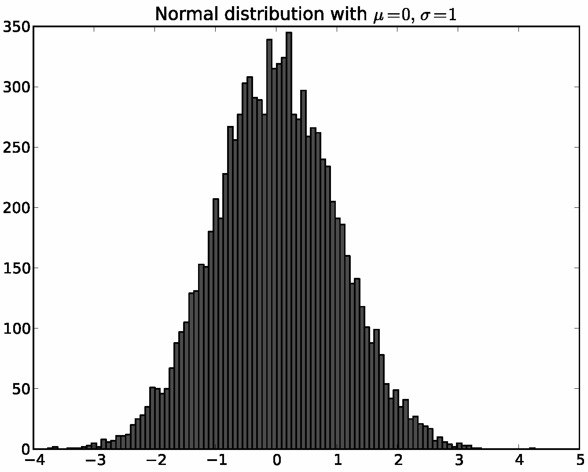

## 前言
在之前的时间里，我学习过matplotlib这个python包，了解了一些画图的技巧，但是在那时便有一些疑惑无法解答，比如为什么画出同一幅图的操作途径有好几种，这些困惑一直都在，以及为什么在matplotlib这个包下属的方法里，到底有几个方法，这些方法间又是什么关系。因为这些疑惑都无从求解，所以对matplotlib的理解也只是皮毛而已，因此为了更加通透的理解matplotlib，我特地查询了matplotlib的软件架构。
<!--more-->
## 1.matplotlib概述
matplotlib是基于Python的绘图库，广泛用于Python科学计算界。它完整支持二维绘图以及部分支持三维绘图。该绘图库致力于能适应广泛的用户需求。它可以根据所选的用户接口工具来嵌入绘图算法。与此同时，对于使用GTK+、Qt、Tk、FLTK、wxWidgets与Cocoa的所有主要桌面操作系统，matplotlib能支持交互式绘图。在Python的交互式shell中，我们可以使用简单的、过程式的命令交互式地调用matplotlib来生成图形，与使用Mathematica、IDL或者MATLAB绘图非常相似。matplotlib也可以嵌入到无报文头的Web服务器中，以提供基于光栅（如PNG格式）与向量（如Postscript、PDF以及纸面效果很好的SVG格式）这两种格式的图形硬拷贝。

顶层的matplotlib对象名为Figure，它包含与管理某个图形的所有元素。matplotlib必须完成的一个核心架构性任务是实现Figure的绘制与操作框架，并且做到该框架与Figure到用户视窗接口或硬拷贝渲染行为是分离的。这使得我们可以为Figure添加越来越复杂的特性与逻辑，同时保持“后端”或输出设备的相对简化。matplotlib不仅封装了用于向多种设备渲染的绘图接口，还封装了基本事件处理以及多数流行的用户界面工具的视窗功能。因此，用户可以创建相当丰富的交互式图形算法与用户界面工具（用到可能存在的鼠标与键盘），而又不必修改matplotlib已经支持的6种界面工具。

matplotlib的架构可以自下而上分为“后端——美工——脚本”，上一层可以调用下一层完成功能，对下一层而言，上一层是透明的。这三层的层次差别明显，能够完成的任务也有所不同，在我们最常见的使用场景中，我们使用的是脚本层，这个层会对基本的绘图进行封装，我们直接调用接口使用即可，因此使用的门槛低，比较易学。但是要想完全掌控整个画板，就不得不了解matplotlib更加底层的东西。

>补充：matplotlib可以进行作图，seaborn也可以进行作图，其中seaborn是基于matplotlib进行更高程度的封装而来的，相当于更加的简单易用，但是可定制化的程度降低了。除了使用编程进行绘图，还可以使用PS、AI、PPT、EXCEL、oringin等软件进行绘图，不要局限了绘图的思维，要灵活使用软件进行绘图，还可以灵活组合，搭配不同软件完成绘图工作，不一定非要完全采用编程完成。

## 2.matplotlib后端
matplotlib逻辑栈最底层是后端，它具体实现了下面的抽象接口类：
* FigureCanvas对绘图表面（如“绘图纸”）的概念进行封装。
* Renderer执行绘图动作（如“画笔”）。
* Event处理键盘与鼠标事件这样的用户输入。

**FigureCanvas中包含的具体实现可以完成三个任务：**将自身嵌入到原生的Qt视窗（QtGui.QMainWindow）中，能将matplotlib的Renderer命令转换到canvas上（QtGui.QPainter），以及将原生Qt事件转换到matplotlib的Event框架下（后者产生回调信号让上行监听者进行处理）。抽象基类定义在matplotlib.backend_bases中，且所有派生类都定义在如matplotlib.backends.backend_qt4agg这样的专用模块中。对于专门生成硬拷贝输出（如PDF、PNG、SVG或PS）的纯图像后端而言，FigureCanvas的实现可能只是简单地建立一个类似文件的对象，其中定义默认的文件头、字体与宏函数，以及Renderer创建的个别对象（如直线、文本与矩形等）。

**Renderer的任务是提供底层的绘图接口**，即在画布上绘图的动作。上文已经提到，最初的matplotlib程序是一个基于GTK+的ECoG查看器，而且很多早期设计灵感都源自当时已有的GDK/GTK+的API。最初Renderer的API源自GDK的Drawable接口，后者实现了draw_point、draw_line、draw_rectangle、draw_image、draw_polygon以及draw_glyphs这样的基本方法。我们完成的每个不同后端——最早有PostScript与GD——都实现了GDK的Drawable，并将其转换为独立于后端的原生绘图命令。如上所述，这毫无必要地增加了后端的实现复杂度，原因是单独实现Drawable造成函数泛滥。此后，Renderer已经被极大的简化，将matplotlib移植到新的用户界面或文件格式已经是非常简单的过程。

一个对matplotlib有利的设计决定是支持使用C++模板库Anti-Grain Geometry（缩写为agg[She06]）的基于像素点的核心渲染器。这是一个高性能库，可以进行2D反锯齿渲染，生成的图像非常漂亮。matplotlib支持将agg后端渲染的像素缓存插入到每种支持的用户界面中，所以在不同的UI与操作系统下都能得到精确像素点的图形。因为matplotlib生成的PNG输出也使用agg渲染器，所以硬拷贝与屏幕显示完全相同，也就是说在不同的UI与操作系统下，PNG的输出所见即所得。

matplotlib的Event框架将key-press-event或mouse-motion-event这样的潜在UI事件映射到KeyEvent或MouseEvent类。用户可以连接到这些事件进行函数回调，以及图形与数据的交互，如要pick一个或一组数据点，或对图形或其元素的某方面性质进行操作。下面的示例代码演示了当用户键入‘t’时，对Axes窗口中的线段进行显示开关。

```
import numpy as np
import matplotlib.pyplot as plt
 
def on_press(event):
    if event.inaxes is None: return
    for line in event.inaxes.lines:
        if event.key=='t':
            visible = line.get_visible()
            line.set_visible(not visible)
    event.inaxes.figure.canvas.draw()
 
fig, ax = plt.subplots(1)
 
fig.canvas.mpl_connect('key_press_event', on_press)
 
ax.plot(np.random.rand(2, 20))
 
plt.show()
```

对底层UI事件框架的抽象使得matplotlib的开发者与最终用户都可以编写UI事件处理代码，而且“一次编写，随处运行”。譬如，在所有用户界面下都可以对matplotlib图像进行交互式平移与放缩，这种交互式操作就是在matplotlib的事件框架下实现的。

## 3.matplotlib Artis层
称之为“ 美工”其实是一个汉化的形象说法，因为“ 在哪里画，用什么画，画什么图？ ”这不正是美工的工作么？

Artist层次结构处于matplotlib的中间层，负责很大一部分繁重的计算任务。延续之前将后端的FigureCanvas看作画纸的比喻，Artis对象知道如何用Renderer（画笔）在画布上画出墨迹。matplotlib中的Figure就是一个Artist对象实例。标题、直线、刻度标记以及图像等等都对应某个Artist实例（如图11.3）。Artist的基类是matplotlib.artist.Artist，其中包含所有Artist的共享属性，包括从美工坐标系统到画布坐标系统的变换（后面将详细介绍）、可见性、定义用户可绘制区域的剪切板、标签，以及处理“选中”这样的用户交互动作的接口，即在美工层检测鼠标点击事件。

以下两幅图很好的展示了matplotlib绘图的层级：


注意观察两幅图中的层次关系，这对于我们理解matplotlib绘图并且更好使用具有很大帮助。

下面这个简单的Python脚本解释了以上架构。它定义了后端，将Figure链接至该后端，然后使用数组库numpy创建10,000个正太分布的随机数，最后绘制出它们的柱状图。

```
# Import the FigureCanvas from the backend of your choice
#  and attach the Figure artist to it.
from matplotlib.backends.backend_agg import FigureCanvasAgg as FigureCanvas
from matplotlib.figure import Figure
fig = Figure()
canvas = FigureCanvas(fig)
 
# Import the numpy library to generate the random numbers.
import numpy as np
x = np.random.randn(10000)
 
# Now use a figure method to create an Axes artist; the Axes artist is
#  added automatically to the figure container fig.axes.
# Here "111" is from the MATLAB convention: create a grid with 1 row and 1
#  column, and use the first cell in that grid for the location of the new
#  Axes.
ax = fig.add_subplot(111)
 
# Call the Axes method hist to generate the histogram; hist creates a
#  sequence of Rectangle artists for each histogram bar and adds them
#  to the Axes container.  Here "100" means create 100 bins.
ax.hist(x, 100)
 
# Decorate the figure with a title and save it.
ax.set_title('Normal distribution with $\mu=0, \sigma=1$')
fig.savefig('matplotlib_histogram.png')
```

### 4.matplotlib脚本层（pyplot）
使用以上API的脚本效果很好，尤其是对于程序员而言，并且在编写Web应用服务器、UI应用程序或者是与其他开发人员共享的脚本时，这通常是比较合适的编程范式。对于日常用途，尤其对于非专业程序员而要完成一些交互式的研究工作的实验科学家而言，以上API的语法可能有些难以掌握。大多数用于数据分析与可视化的专用语言都会提供轻量级的脚本接口来简化一些常见任务。matplotlib在其matplotlib.pyplot接口中便实现了这一点。以上代码改用pyplot之后如下所示。

```
import matplotlib.pyplot as plt
import numpy as np
 
x = np.random.randn(10000)
plt.hist(x, 100)
plt.title(r'Normal distribution with $\mu=0, \sigma=1$')
plt.savefig('matplotlib_histogram.png')
plt.show()
```

显而易见，这一份代码要比上一份代码简易多了，更加利于掌握和使用。



pyplot是一个状态化接口，大部分工作是处理样本文件的图形与坐标的生成，以及与所选后端的连接。它还维护了模块级的内部数据结构。这些数据结构表示了直接接收绘图命令的当前图形与坐标

下面仔细分析示例脚本中比较重要的几行，观察其内部状态的管理方式。
* import matplotlib.pyplot as plt：当pyplot模块被加载时，它分析本地配置文件。配置文件除了完成一些其他工作外，主要声明了默认的后端。可能是类似QtAgg的用户接口后端，于是上面的脚本将导入GUI框架并启动嵌入了图形的Qt窗口；或者可以是一个类似Agg的纯图像后端，这样脚本会生成硬拷贝输出然后退出。
* plt.hist(x, 100)：这是脚本中第一个绘图命令。pyplot会检测其内部数据结构已查看是否存在当前Figure实例。如果存在，则提取当前Axes，并将绘图行为导向Axes.hist的API调用。在该脚本中不存在Figure实例，所以会生成一个FIgure与Axes，并将它们设为当前值，然后将绘图行为导向Axes.hist。

## 总结
1. matplotlib是一个非常庞大的系统，而且从诞生到现在繁荣发展经历了几十年的时间，里面所涉及到的软件架构很是复杂。

2. matplotlib的使用可以从三个层面上去入手，即“后端——美工——脚本”。

* （1）后端：我们当然可以从最底层的后端搭建一个图形，负责软件与绘图硬件的交互，图形的各种渲染等等，这异常困难，而且对于程序员的开发效率来说，十分缓慢，因为绘图的框架整个都要自己去搭建，很麻烦。

* （2）美工：这是在后端的基础之上的进一步封装，有一点类似于GDI+绘图方式，我们只关心“ 在哪里画 、用什么笔、 画什么图 ”，所用的笔，所用的颜料，画的图形类型（折线图，条形图，散点图等等）这些已经封装好了，封装是通过一系列的类去完成的。

* （3）脚本：脚本是matplotlib的更高层封装，也就是我们平时所用的pyplot模块的高级封装，使用脚本，我们再也不用关心这个图形到底是怎么画的了，我们只需要关心画图的效果即可。适用“ 后端 ”、“ 美工 ”、要很多代码才能完成的事，使用脚本一句话就可以实现，如：
* `plt.plot(x,y,color='red',linewidth=3,linestyle='--')`就是这么简单的一句话，如果要自己从头搭建，是一件很困难的事情。

## 参考资料
1. matplotlib教程——matplotlib的软件架构 作者LoveMIss-Y [CSDN博客](https://blog.csdn.net/qq_27825451/article/details/81481534)