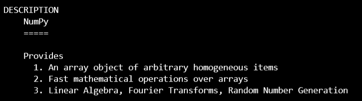
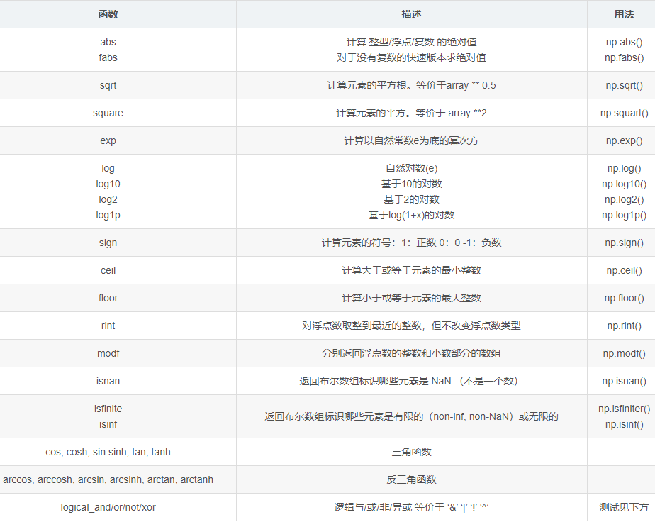
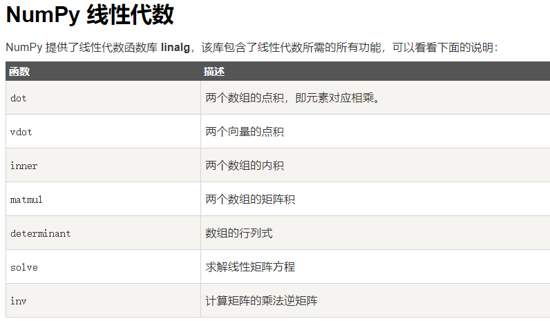

## 1. 前言
Numpy和pandas是python当中两个非常重要的库，用于配合科学运算和矩阵处理。程序是算法与数据的结合，二者缺一不可，而numpy和pandas就是python中用于处理数据的利器，因此学习这两个package的使用非常重要。在使用matplotlib和seaborn进行数据可视化的时候，就会发现，所有作图的关键在于数据格式的把控，这两个package所提供的API就像是图表的模具，而整理好相应格式的数据就是原料，numpy和pandas就是整理数据的工具。接下来让我们开始学习这两个package吧。在这一篇博客中我们先学习numpy。

>
*这是一幅python_package的总览图，由此我们可以大概了解，有哪些很值得我们学习的package。*
<!--more-->
## 2. Numpy学习
1. 理解
Numpy是一个科学运算包，里面包含了最重要的的内容就是一个ndarray（N dimension array）模型，即n维数组模型，如果学习过线性代数的数值运算，我们就会知道矩阵运算对于计算机而言有多重要，那我们就会知道ndarray模型对于python来说有多重要，可以说，正是因为这个模型，python才被赋予了科学运算的能力。除了ndarray模型的属性及其相关方法，在numpy包里面还包括了大量的数学函数、统计函数、字符串函数、随机函数等这些可以表达数学语言的内容，为我们构建复杂的数学算法奠定了基础，其中很多函数对于我们进行科学运算尤为重要。接下来我们先学习第一部分内容，ndarray的属性及其方法。
>

2. ndarray的属性

```
In [1]: import numpy as np

In [2]: a = np.arange(15)

In [3]: a
Out[3]: array([ 0,  1,  2,  3,  4,  5,  6,  7,  8,  9, 10, 11, 12, 13, 14])

In [4]: print(a.shape)
(15,)

In [5]: print(a.ndim)
1

In [6]: b = a.reshape(3, 5)

In [8]: print(b.ndim)
2

In [9]: print(b)
[[ 0  1  2  3  4]
 [ 5  6  7  8  9]
 [10 11 12 13 14]]

In [10]: print(a.flags)
  C_CONTIGUOUS : True
  F_CONTIGUOUS : True
  OWNDATA : True
  WRITEABLE : True
  ALIGNED : True
  WRITEBACKIFCOPY : False
  UPDATEIFCOPY : False

In [11]: print(a.itemsize)
4

In [12]: y = np.array(a, dtype=np.float64)

In [13]: print(y.itemsize)
8
```
3. ndarray操作方法

* 创建数组
>创建有5种方式，其中包括0矩阵，单位矩阵，内容随机矩阵以及自定义的矩阵，还有arange方法，可以便捷的创建一维矩阵。
```
In [14]: x = np.empty([3,2], dtype=int)

In [15]: x
Out[15]:
array([[ 2063158980,       32765],
       [ -536194544,         632],
       [          0, -2147483648]])

In [16]: y = np.zeros([3,2], dtype=float)

In [17]: y
Out[17]:
array([[0., 0.],
       [0., 0.],
       [0., 0.]])

In [18]: z = np.ones([3,2], dtype=int)

In [19]: z
Out[19]:
array([[1, 1],
       [1, 1],
       [1, 1]])

In [23]: m = np.arange(15)

In [24]: m
Out[24]: array([ 0,  1,  2,  3,  4,  5,  6,  7,  8,  9, 10, 11, 12, 13, 14])

In [25]: a = np.array([1,2,3,4,5,6])

In [26]: a
Out[26]: array([1, 2, 3, 4, 5, 6])
```

4. np常用数学函数



5. np线性代数运算



6. np random函数

|function|introduction|理解|
|:----:|:----|:----|
|randn(d1, d2)|返回一个符合标准正太分布的随机数据，array对象|重点在于符合标准正太分布|
|randint(low, high, size)|返回size个[low, high)范围内的随机整数，array对象|生成整数时使用，与random_integers相似|
|random_integers(low, high, size)|返回size个在[low, high]闭区间内的随机整数，array对象|生成整数，但是不建议使用这个方法，直接使用randint即可|
|rand(d1, d2)|返回[0.0,1.0)范围内的随机数，array对象|产生大于等于0并小于1的随机浮点数|
|random_sample([size])|返回size个在[0.0, 1.0)之间的随机浮点数，array对象|产生大于等于0并小于1的随机浮点数|
|random([size])|返回size个[0.0, 1.0)范围内的随机浮点数，array对象|产生大于等于0并小于1的随机浮点数|
|ranf(size)|返回size个[0.0, 1.0)范围内的随机浮点数，array对象|产生大于等于0并小于1的随机浮点数|
|sample(size)|返回size个[0.0, 1.0)范围内的随机浮点数，array对象|产生大于等于0并小于1的随机浮点数|
|seed([seed])|在生成随机数的算法中设定初始值，保证每次random函数生成同一批随机数|设定随机数种子，每批随机数一样，在生成数据样本时用得上|

```
In [119]: np.random.rand(2,3)
Out[119]:
array([[0.05794981, 0.25660757, 0.51033178],
       [0.99525878, 0.14651568, 0.44951478]])

In [120]: np.random.random(size=(2,3))
Out[120]:
array([[0.60144038, 0.09727249, 0.28873488],
       [0.7207999 , 0.55080606, 0.83857702]])

In [121]: np.random.ranf((2,3))
Out[121]:
array([[0.58033135, 0.18457174, 0.61550212],
       [0.88695509, 0.51678928, 0.62614367]])

In [122]: np.random.sample((2,3))
Out[122]:
array([[0.50505912, 0.90966258, 0.41330466],
       [0.53546872, 0.34264313, 0.12957678]])

In [123]: np.random.random_sample((2,3))
Out[123]:
array([[0.66282175, 0.93567   , 0.61272918],
       [0.8427385 , 0.21790844, 0.90317174]])

In [124]: np.random.randn(2,3)
Out[124]:
array([[ 0.16390425,  0.82951248,  0.75529996],
       [ 0.87948569, -0.2399563 , -0.69505665]])

In [125]: np.random.randint(1,10,size=(2,3))
Out[125]:
array([[3, 4, 5],
       [7, 5, 3]])

In [126]: np.random.random_integers(1,9,size=(2,3))
C:\Users\13560\Anaconda\Scripts\ipython:1: DeprecationWarning: This function is deprecated. Please call randint(1, 9 + 1) instead
Out[126]:
array([[7, 9, 9],
       [5, 5, 8]])
```

## 总结
