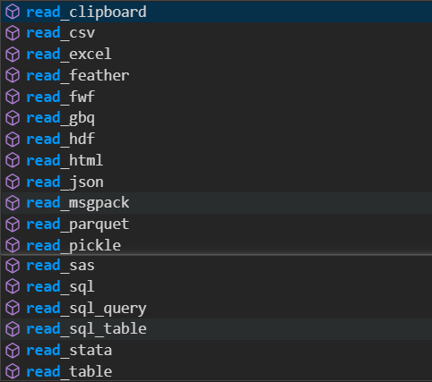
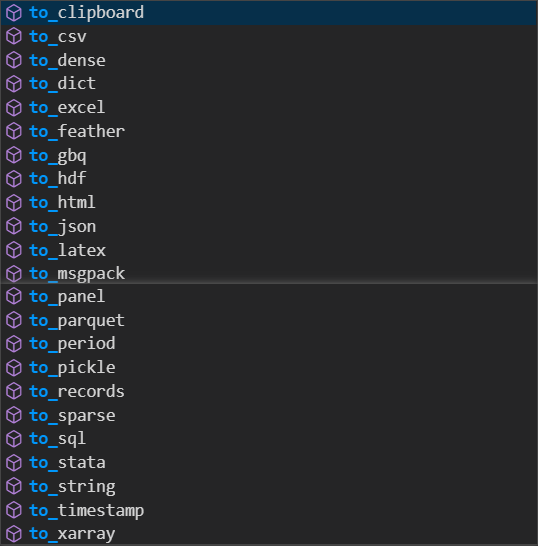

## 1. 前言
Numpy和pandas是python当中两个非常重要的库，用于配合科学运算和矩阵处理。程序是算法与数据的结合，二者缺一不可，而numpy和pandas就是python中用于处理数据的利器，因此学习这两个package的使用非常重要。在使用matplotlib和seaborn进行数据可视化的时候，就会发现，所有作图的关键在于数据格式的把控，这两个package所提供的API就像是图表的模具，而整理好相应格式的数据就是原料，numpy和pandas就是整理数据的工具。接下来让我们开始学习这两个package吧。在这上一篇博客中我们学习了numpy，这一篇博客中我们来学习pandas。

>
*这是一幅python_package的总览图，由此我们可以大概了解，有哪些很值得我们学习的package。*
<!--more-->

## 2. Pandas学习
### 2.1 理解

* Pandas是一个基于numpy构建的库，有这个库可以方便我们操作处理大型的数据文件，包括文件内容的增删改查等，这也是用python从事数据科学工作的基础。pandas中有一个dataframe数据对象，与numpy中的array类似，不过dataframe是二维的情况，这个对象对于我们处理数据、清洗数据非常有用，除此之外，pandas还能够非常好的支持时序数据的处理。
* pandas是python的一个数据分析包，是基于NumPy的一种工具，该工具是为了解决数据分析任务而创建的。pandas纳入了大量库和一些标准的数据模型，提供了高效地操作大型数据集所需的工具。pandas提供了大量能使我们快速便捷地处理数据的函数和方法。

### 2.2 features


>补充：pandas发展史
* pandas最初被作为金融数据分析工具而开发出来，因此，pandas为时间序列分析提供了很好的支持。 Pandas的名称来自于面板数据（panel data）和python数据分析（data analysis）。panel data是经济学中关于多维数据集的一个术语，在Pandas中也提供了panel的数据类型。

### 2.3 数据结构
* pandas中主要有两种数据结构，分别是series和dataframe。series专注于一维数组的处理，dataframe专注于二维数组，在这两个数据结构的基础上，pandas包提供了很多方便我们处理一维数组和二维数组的方法，接下来我们详细的了解一下这些方法。

## 3. series结构

### 3.1 创建series

Series()是一维数组，可以通过数组和列表来创建，也可以通过字典来创建，如下示例：
```
In [4]: pd.Series(np.random.randn(7))
Out[4]:
0   -0.213914
1   -0.518866
2   -0.218765
3    0.941537
4    1.218188
5    1.644523
6    0.527248
dtype: float64

In [5]: index = ['周一', '周二', '周三', '周四', '周五', '周六', '周日']

In [6]: pd.Series(np.random.randn(7), index=index)
Out[6]:
周一    0.252932
周二    0.019784
周三    1.738989
周四    0.918056
周五    0.221937
周六   -0.007848
周日    1.168715
dtype: float64

In [7]: dic = {'周一': 13, '周二': 15, '周三': 18, '周四':19, '周五':33, '周
   ...: 六': 12, '周日': 11}

In [8]: pd.Series(dic)
Out[8]:
周一    13
周二    15
周三    18
周四    19
周五    33
周六    12
周日    11
dtype: int64

In [9]: pd.Series(index)
Out[9]:
0    周一
1    周二
2    周三
3    周四
4    周五
5    周六
6    周日
dtype: object

In [12]: tu = (1,3,4,3,5,3,5,353,53,53)

In [13]: pd.Series(tu, name='apple')
Out[13]:
0      1
1      3
2      4
3      3
4      5
5      3
6      5
7    353
8     53
9     53
Name: apple, dtype: int64
```
Series支持的参数：

* class Series(data=None, index=None, dtype=None, name=None, copy=False, fastpath=False)

* data就是传入的数据，可以是array-like的数据，包括array/tuple/list，也可以是dict，其中如果传入的是dictionary，那dict的key值就会变成index索引，value就是默认的值。

### 3.2 Series操作
我们从Series数据结构中取值，可以利用自定义的索引标签，也可以利用默认的位置索引。
```
In [17]: dic = {'周一': 13, '周二': 15, '周三': 18, '周四':19, '周五':33, '
    ...: 周六': 12, '周日': 11}

In [18]: dic_series = pd.Series(dic)

In [19]: dic_series['周二']
Out[19]: 15

In [20]: dic_series[2]
Out[20]: 18

In [21]: dic_series[1]
Out[21]: 15
```
* 我们可以通过索引或者默认的序号进行读取值。Series有很多其他实用的操作方法，在这就不一一展示了，在下面学习dataframe的时候，其中很多方法也同样适用于Series。

## 4. dataframe结构
### 4.1 dataframe创建
dataframe是pandas中非常重要的一类二维的数表形式的数据结构，这在我们处理数据的时候非常常用。dataframe的创建方法是通过pd.Dataframe()结合传入的数据完成的的。

Examples:
```
In [23]: pd.DataFrame(np.random.randn(5,5))
Out[23]:
          0         1         2         3         4
0 -0.336786 -0.364133 -0.529895  0.604086 -0.005213
1 -0.405479 -1.774013 -0.390448  0.503312 -1.134515
2  0.191531 -0.299245 -0.965893  1.605850  0.997985
3 -0.746576  1.980630 -0.203215  1.806443  0.438769
4 -0.313353  0.742876  0.344750 -0.422681  0.741933

In [24]: li_data = [[1,2,3,3], [2,3,45,3], [4,5,2,15]]

In [25]: pd.DataFrame(li_data)
Out[25]:
   0  1   2   3
0  1  2   3   3
1  2  3  45   3
2  4  5   2  15

In [30]: dic_data ={'A':[1,2,3,4], 'B':[2,3,4,5], 'C':[3,21,42,5], 'D':[3,3,
    ...: 3,2]}

In [31]: pd.DataFrame(dic_data)
Out[31]:
   A  B   C  D
0  1  2   3  3
1  2  3  21  3
2  3  4  42  3
3  4  5   5  2

In [32]: pd.DataFrame(np.random.randn(5,5), index=['a','b','c','d','e'], col
    ...: umns=['A','B','C','D','E'])
Out[32]:
          A         B         C         D         E
a  1.626478 -0.532220  0.070663 -0.525011  0.172189
b  0.823984  0.524810  1.843861  0.705791  1.185754
c -0.054392 -2.268764 -0.539865 -0.775574  0.125962
d -3.127147 -1.948969 -1.025611 -0.547833 -1.346364
e  0.784173 -1.027632 -0.320775 -1.707289  1.388755
```

```
In [26]: tu_data = ((1,2,3,3), (2,3,45,3), (4,5,2,15))

In [27]: pd.DataFrame(tu_data)
---------------------------------------------------------------------------
ValueError                                Traceback (most recent call last)
ValueError: DataFrame constructor not properly called!

In [28]: tu_data
Out[28]: ((1, 2, 3, 3), (2, 3, 45, 3), (4, 5, 2, 15))

In [29]: pd.Series(tu_data)
Out[29]:
0     (1, 2, 3, 3)
1    (2, 3, 45, 3)
2    (4, 5, 2, 15)
dtype: object
```
**通过上面的例子我们可以看出，dataframe接受的数据包括array/list/dict，但是不包含tuple类型，但是pd.Series()支持，所以要注意区分。另外，在创建的时候可以指定index和columns，也就是数据表的行索引和列索引。**

### 4.2 DataFrame的操作方法
dataframe是非常重要的一种二维数据结构，是pandas的精华，必须牢牢掌握。
* 基本属性——".index/.columns/.values/.describe()"
```
import pandas as pd 
import numpy as np 


data3 = np.random.randn(4,5)

index = ['q1', 'q2', 'q3', 'q4']
columns = ['A', 'B', 'C', 'D', 'E']

da_frame = pd.DataFrame(data3, index=index, columns=columns)

print(da_frame)
print('-'*50)
print(da_frame.index)
print(da_frame.columns)
print('-'*50)
print(da_frame.values)
print('-'*50)
print(da_frame.describe())
print('-'*50)
```
results: 
```
           A         B         C         D         E
q1 -0.412286 -0.821873 -1.748176  0.469806 -0.205702
q2 -0.405459 -0.836046  0.712505 -0.076337 -2.325968
q3  0.050220 -0.478746  1.684107 -0.550641  1.240566
q4  1.563217  1.044990  0.609966 -0.820632 -0.267008
--------------------------------------------------
Index(['q1', 'q2', 'q3', 'q4'], dtype='object')
Index(['A', 'B', 'C', 'D', 'E'], dtype='object')
--------------------------------------------------
[[-0.41228585 -0.82187332 -1.74817556  0.46980637 -0.20570188]
 [-0.405459   -0.83604631  0.71250499 -0.07633717 -2.32596807]
 [ 0.05021952 -0.47874572  1.6841073  -0.550641    1.24056574]
 [ 1.56321731  1.04498969  0.60996593 -0.82063159 -0.26700756]]
--------------------------------------------------
              A         B         C         D         E
count  4.000000  4.000000  4.000000  4.000000  4.000000
mean   0.198923 -0.272919  0.314601 -0.244451 -0.389528
std    0.934927  0.894001  1.457871  0.566910  1.466948
min   -0.412286 -0.836046 -1.748176 -0.820632 -2.325968
25%   -0.407166 -0.825417  0.020431 -0.618139 -0.781748
50%   -0.177620 -0.650310  0.661235 -0.313489 -0.236355
75%    0.428469 -0.097812  0.955406  0.060199  0.155865
max    1.563217  1.044990  1.684107  0.469806  1.240566
--------------------------------------------------
```
**通过df.describe()获取的数据描述信息，包含了每一列数据的总个数count、每一列平均值mean、每一列标准差std、每一列最小值min、每一列最大值max等信息。**

* 排序——".sorted_index(axis=0/1,by='index_name', ascending=True/False)"
*axis表示选择行还是列，行索引是0，列索引是1；ascending表示降序还是升序*
```
In [34]: print(data_frame.sort_index(axis=0, ascending=False)) #表示按行索引
    ...: 垂直降序排序
            A         B         C         D
9月   0.449812 -0.527682 -0.761678  0.202413
8月  -2.048352  0.107163 -2.185515 -0.106979
7月  -0.747604 -0.209058  1.402563  0.525463
6月   0.584561 -0.707748  0.513108  0.936999
5月   0.574763  0.123533  0.684210 -0.846441
4月  -0.340184 -2.080648  0.312747 -0.522235
3月  -0.935644  1.343663  0.617676 -0.946823
2月   0.203031 -0.157956 -1.911171  0.875480
1月   0.722934  0.111053  0.489415 -0.189960
12月 -0.851821  0.830529 -0.854471  0.919389
11月 -0.357822 -1.809013 -0.462926 -0.017325
10月  0.025842  1.338289 -0.007398  0.392586

In [35]: print(data_frame)
            A         B         C         D
1月   0.722934  0.111053  0.489415 -0.189960
2月   0.203031 -0.157956 -1.911171  0.875480
3月  -0.935644  1.343663  0.617676 -0.946823
4月  -0.340184 -2.080648  0.312747 -0.522235
5月   0.574763  0.123533  0.684210 -0.846441
6月   0.584561 -0.707748  0.513108  0.936999
7月  -0.747604 -0.209058  1.402563  0.525463
8月  -2.048352  0.107163 -2.185515 -0.106979
9月   0.449812 -0.527682 -0.761678  0.202413
10月  0.025842  1.338289 -0.007398  0.392586
11月 -0.357822 -1.809013 -0.462926 -0.017325
12月 -0.851821  0.830529 -0.854471  0.919389

In [36]: print(data_frame.sort_index(axis=1, ascending=False)) #表示按列索引
    ...: 水平降序排序
            D         C         B         A
1月  -0.189960  0.489415  0.111053  0.722934
2月   0.875480 -1.911171 -0.157956  0.203031
3月  -0.946823  0.617676  1.343663 -0.935644
4月  -0.522235  0.312747 -2.080648 -0.340184
5月  -0.846441  0.684210  0.123533  0.574763
6月   0.936999  0.513108 -0.707748  0.584561
7月   0.525463  1.402563 -0.209058 -0.747604
8月  -0.106979 -2.185515  0.107163 -2.048352
9月   0.202413 -0.761678 -0.527682  0.449812
10月  0.392586 -0.007398  1.338289  0.025842
11月 -0.017325 -0.462926 -1.809013 -0.357822
12月  0.919389 -0.854471  0.830529 -0.851821

In [39]: print(data_frame.sort_index(axis=0, by='A', ascending=False)) #表示
    ...: 按行索引降序排序
C:\Users\13560\Anaconda\Scripts\ipython:1: FutureWarning: by argument to sort_index is deprecated, please use .sort_values(by=...)
            A         B         C         D
1月   0.722934  0.111053  0.489415 -0.189960
6月   0.584561 -0.707748  0.513108  0.936999
5月   0.574763  0.123533  0.684210 -0.846441
9月   0.449812 -0.527682 -0.761678  0.202413
2月   0.203031 -0.157956 -1.911171  0.875480
10月  0.025842  1.338289 -0.007398  0.392586
4月  -0.340184 -2.080648  0.312747 -0.522235
11月 -0.357822 -1.809013 -0.462926 -0.017325
7月  -0.747604 -0.209058  1.402563  0.525463
12月 -0.851821  0.830529 -0.854471  0.919389
3月  -0.935644  1.343663  0.617676 -0.946823
8月  -2.048352  0.107163 -2.185515 -0.106979
```
**由上面的结果可以清晰的看到排序的返回结果，加上by=参数，可以按照某一列或行结果排序，排序完成的很好。排序是一步很重要的数据处理的工作。**

### 4.3 选择数据
DataFrame选择数据可以通过行、列标签名df.loc[标签名]，也可以通过索引df.iloc[索引值或切片]，也可混合上面两种取值df.ix[标签名, 索引值或切片]

* .loc[]演示（通过标签取值）

```
In [46]: data_frame.loc['1月': '5月']
Out[46]:
           A         B         C         D
1月  0.722934  0.111053  0.489415 -0.189960
2月  0.203031 -0.157956 -1.911171  0.875480
3月 -0.935644  1.343663  0.617676 -0.946823
4月 -0.340184 -2.080648  0.312747 -0.522235
5月  0.574763  0.123533  0.684210 -0.846441

In [47]: data_frame.loc['1月': '5月', 'A']
Out[47]:
1月    0.722934
2月    0.203031
3月   -0.935644
4月   -0.340184
5月    0.574763
Name: A, dtype: float64

In [48]: data_frame.loc['1月': '5月', 'A':'C']
Out[48]:
           A         B         C
1月  0.722934  0.111053  0.489415
2月  0.203031 -0.157956 -1.911171
3月 -0.935644  1.343663  0.617676
4月 -0.340184 -2.080648  0.312747
5月  0.574763  0.123533  0.684210

In [49]: data_frame.loc[,'A':'C']
  File "<ipython-input-49-a821fd8f12f8>", line 1
    data_frame.loc[,'A':'C']
                   ^
SyntaxError: invalid syntax


In [50]: data_frame.loc[:,'A':'C']
Out[50]:
            A         B         C
1月   0.722934  0.111053  0.489415
2月   0.203031 -0.157956 -1.911171
3月  -0.935644  1.343663  0.617676
4月  -0.340184 -2.080648  0.312747
5月   0.574763  0.123533  0.684210
6月   0.584561 -0.707748  0.513108
7月  -0.747604 -0.209058  1.402563
8月  -2.048352  0.107163 -2.185515
9月   0.449812 -0.527682 -0.761678
10月  0.025842  1.338289 -0.007398
11月 -0.357822 -1.809013 -0.462926
12月 -0.851821  0.830529 -0.854471
```
**最直接的是通过.loc[行标签]直接取行，也可以取列，.loc[:, 列标签]，不过这里美中不足的一点是没办法取得两个不相邻的列，相邻的列可以通过切片完成。**

* .iloc[]通过数字索引取值
```
In [55]: data_frame
Out[55]:
            A         B         C         D
1月   0.722934  0.111053  0.489415 -0.189960
2月   0.203031 -0.157956 -1.911171  0.875480
3月  -0.935644  1.343663  0.617676 -0.946823
4月  -0.340184 -2.080648  0.312747 -0.522235
5月   0.574763  0.123533  0.684210 -0.846441
6月   0.584561 -0.707748  0.513108  0.936999
7月  -0.747604 -0.209058  1.402563  0.525463
8月  -2.048352  0.107163 -2.185515 -0.106979
9月   0.449812 -0.527682 -0.761678  0.202413
10月  0.025842  1.338289 -0.007398  0.392586
11月 -0.357822 -1.809013 -0.462926 -0.017325
12月 -0.851821  0.830529 -0.854471  0.919389

In [56]: data_frame.iloc[0]
Out[56]:
A    0.722934
B    0.111053
C    0.489415
D   -0.189960
Name: 1月, dtype: float64

In [57]: data_frame.iloc[0:3]
Out[57]:
           A         B         C         D
1月  0.722934  0.111053  0.489415 -0.189960
2月  0.203031 -0.157956 -1.911171  0.875480
3月 -0.935644  1.343663  0.617676 -0.946823

In [58]: data_frame.iloc[:, 0]
Out[58]:
1月     0.722934
2月     0.203031
3月    -0.935644
4月    -0.340184
5月     0.574763
6月     0.584561
7月    -0.747604
8月    -2.048352
9月     0.449812
10月    0.025842
11月   -0.357822
12月   -0.851821
Name: A, dtype: float64

In [59]: data_frame.iloc[:, 0:2]
Out[59]:
            A         B
1月   0.722934  0.111053
2月   0.203031 -0.157956
3月  -0.935644  1.343663
4月  -0.340184 -2.080648
5月   0.574763  0.123533
6月   0.584561 -0.707748
7月  -0.747604 -0.209058
8月  -2.048352  0.107163
9月   0.449812 -0.527682
10月  0.025842  1.338289
11月 -0.357822 -1.809013
12月 -0.851821  0.830529

In [60]: data_frame.iloc[0:3, 0:2]
Out[60]:
           A         B
1月  0.722934  0.111053
2月  0.203031 -0.157956
3月 -0.935644  1.343663
```
**通过这种方式取值可以不用管标签是什么，直接能够按照行号与列号取出数据，但是美中不足的一点也是么有办法同时取出不相邻的两列**

* .ix[]通过标签与索引混合取值
```
In [61]: data_frame
Out[61]:
            A         B         C         D
1月   0.722934  0.111053  0.489415 -0.189960
2月   0.203031 -0.157956 -1.911171  0.875480
3月  -0.935644  1.343663  0.617676 -0.946823
4月  -0.340184 -2.080648  0.312747 -0.522235
5月   0.574763  0.123533  0.684210 -0.846441
6月   0.584561 -0.707748  0.513108  0.936999
7月  -0.747604 -0.209058  1.402563  0.525463
8月  -2.048352  0.107163 -2.185515 -0.106979
9月   0.449812 -0.527682 -0.761678  0.202413
10月  0.025842  1.338289 -0.007398  0.392586
11月 -0.357822 -1.809013 -0.462926 -0.017325
12月 -0.851821  0.830529 -0.854471  0.919389

In [62]: data_frame.ix[0]
C:\Users\13560\Anaconda\Scripts\ipython:1: DeprecationWarning:
.ix is deprecated. Please use
.loc for label based indexing or
.iloc for positional indexing
Out[62]:
A    0.722934
B    0.111053
C    0.489415
D   -0.189960
Name: 1月, dtype: float64

In [63]: data_frame.ix['1月']
C:\Users\13560\Anaconda\Scripts\ipython:1: DeprecationWarning:
.ix is deprecated. Please use
.loc for label based indexing or
.iloc for positional indexing
Out[63]:
A    0.722934
B    0.111053
C    0.489415
D   -0.189960
Name: 1月, dtype: float64

In [64]: data_frame.ix['1月':'3月',0:3]
C:\Users\13560\Anaconda\Scripts\ipython:1: DeprecationWarning:
.ix is deprecated. Please use
.loc for label based indexing or
.iloc for positional indexing
Out[64]:
           A         B         C
1月  0.722934  0.111053  0.489415
2月  0.203031 -0.157956 -1.911171
3月 -0.935644  1.343663  0.617676
```
**这个方法倒是还能用，但是官方已经不提倡这么使用了，希望大家能够用.loc和.iloc取值就好了，所以这个可记可不记。**

### 4.4 空数据处理

### 4.5 数据合并

## 5. 数据导入或导出

### 5.1 数据导入
pandas可以读取多种文件，返回dataframe类型。
* read_csv()
* read_excel()
* read_txt()



### 5.2 数据导出
pandas可以将dataframe数据等array数据写出成各种格式，比如：
* to_csv()
* to_excel()
* to_json()



## 6. 总结
手握numpy和pandas两个强大的package，处理数据便可游刃有余、得心应手。这是数据科学的基础能力，同时也是现在基于大数据的机器学习算法的学习基础。
