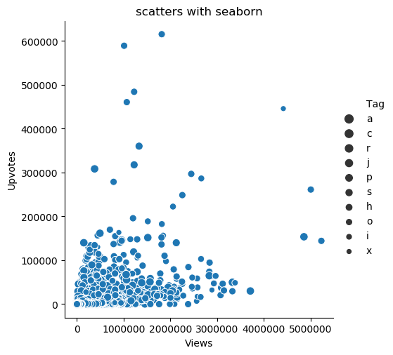
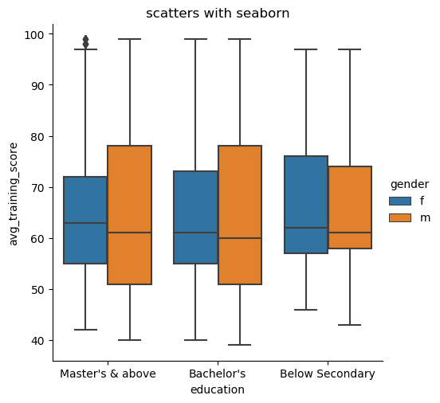

>New package for data visualization. This package is base on the matplotlib, numpy, scipy , and pandas. The shining point is that this package is easier for people to create a beautiful picture for your dataset, this is essential for the data science. So let's get it. This is the official URL: http://seaborn.pydata.org/ <br>You can turn to there for help. 

## 目录
* ### 可视化统计关系
* ### 绘制分类数据
* ### 数据分布
* ### 双变量分布
----

## Step0：什么是seaborn
>* Seaborn是基于matplotlib的图形可视化python包。它提供了一种高度交互式界面，便于用户能够做出各种有吸引力的统计图表。
>* Seaborn是在matplotlib的基础上进行了更高级的API封装，从而使得作图更加容易，在大多数情况下使用seaborn能做出很具有吸引力的图，而使用matplotlib就能制作具有更多特色的图。**应该把Seaborn视为matplotlib的补充**，而不是替代物。同时它能高度兼容numpy与pandas数据结构以及scipy与statsmodels等统计模式。
>* seaborn 有五种风格，分别为"darkgrid", “whitegrid”, “dark”, “white”, "ticks"
<!--more-->

## Step1: 数据来源
>https://datahack.analyticsvidhya.com/contest/wns-analytics-hackathon-2018-1/<br>https://datahack.analyticsvidhya.com/contest/enigma-codefest-machine-learning-1/


>这是从相关的数据科学竞赛网站上下载的数据，需要先注册并且参加竞赛才能下载数据。

## Step2: 准备工作
```
### 导入package和依赖包
import numpy as np
import matplotlib.pyplot as plt
import seaborn as sns
import pandas as pd
from scipy import stats


# 导入数据，探索数据，了解数据
data1 = pd.read_csv(r'./data/hr.csv')
# data1.head()
# data1.describe()
# data1.columns
"""
da.columns
Out[6]: 
Index(['employee_id', 'department', 'region', 'education', 'gender',
       'recruitment_channel', 'no_of_trainings', 'age', 'previous_year_rating',
       'length_of_service', 'KPIs_met >80%', 'awards_won?',
       'avg_training_score', 'is_promoted'],
      dtype='object')
"""


# seaborn使用测试
test = sns.relplot(x="Views", y="Upvotes", data = data2)  # sns.relplot()作图

test.savefig('test.png')  # 保存图片，通用操作
plt.show()  # 展示图片
```
## 1. 可视化统计关系
>包括以下内容：
>* Scatter plot (散点图)
>* SNS.relplot
>* Hue plot (Hue图)

数据：

1.  散点图
```
# 开始使用seaborn
scatters = sns.relplot(x='Views', y='Upvotes', data=data2)

plt.title('scatters with seaborn')
scatters.savefig('scatters.png')
plt.show()
```
图片输出：


relplot的参数：
* relplot(x=None, y=None, hue=None, size=None, style=None, data=None, row=None, col=None, col_wrap=None, row_order=None, col_order=None, palette=None, hue_order=None, hue_norm=None, sizes=None, size_order=None, size_norm=None, markers=None, dashes=None, style_order=None, legend='brief', kind='scatter', height=5, aspect=1, facet_kws=None, **kwargs)

>SNS.relplot是来自SNS类的relplot函数，SNS类是我们在上面与其他依赖项一起导入的一个seaborn类。
>这里，参数是x、y，数据有在X,Y轴上表示的变量和我们要分别画出来的数据点，通过图片，我们发现了views和upvotes之间的关系。

2. 展示标签
```
scatters = sns.relplot(x='Views', y='Upvotes', hue='Tag', data=data2)
# 增加hue（色调），可以展示标签
```
图片输出：


3. Hue图
>我们可以在色调(Hue)的帮助下在我们的图片中添加另一个维度，即在二维的基础上通过颜色来添加其他信息，通过为点赋予颜色来实现，每种颜色都有一些附加的意义。
```
scatters = sns.relplot(x='Views', y='Upvotes', hue='Answers', data=data2)
```
图片输出：


4. size标签
```
scatters = sns.relplot(x='Views', y='Upvotes', hue='Answers', data=data2)
```
图片输出：



## 2. 绘制分类数据
>包括以下内容：
>* 抖动图
>* Hue图
>* 箱线图
>* 小提琴图
>* Pointplot

数据：


1. 抖动图
```
shake = sns.catplot(x="education", y="avg_training_score", jitter = True,  data=df2)
```
图片输出：


改动jitter参数为False，可见下图：


2. hue引入另一个维度
```
shake = sns.catplot(x="education", y="avg_training_score", hue='gender',  data=df2)
```
>引入了性别参数，可以看出数据中的性别差异

图片输出：


可以引入kind中的swarm参数，展示效果如下：


3. 箱线图
```
shake = sns.catplot(x="education", y="avg_training_score", hue='gender', kind='box', data=df2)
```
图片输出：


>箱线图（Boxplot）也称箱须图（Box-whisker Plot），是利用数据中的五个统计量：**最小值、第一四分位数、中位数、第三四分位数与最大值**来描述数据的一种方法，它也可以粗略地看出数据是否具有有对称性，分布的分散程度等信息，特别可以用于对几个样本的比较。

3. 小提琴图
```
shake = sns.catplot(x="education", y="avg_training_score", hue='gender', kind='violin', data=df2)
```
图片输出：


>小提琴图结合了**箱线图和核密度估计程序**，以提供更丰富的值分布描述。四分位数值显示在小提琴内部。当色调语义参数是二值时，我们还可以拆分小提琴，这也可能有助于节省绘图空间。

增加划分功能
```
shake = sns.catplot(x="education", y="avg_training_score", hue='gender', kind='violin',split = True, data=data1)
```
图片输出：


4. bar 结合 box
```
shake = sns.catplot(x="education", y="avg_training_score", hue='gender', kind='bar', data=data1)
```
图片输出：


5. point图
```
shake = sns.catplot(x="education", y="avg_training_score", hue='gender', kind='point', data=data1)
```
图片输出：


## 3. 数据分布
1. 数据分布图
```
tr = sns.distplot(data1.length_of_service)
# tr = sns.distplot(data1.age)
```
>通过displot()方法可以了解数据集的分布情况，也是一个不错的工具。

图片输出：


2. 数据直方图
```
tr = sns.distplot(data1.length_of_service, kde=False, rug = True)
```
图片输出：


下面展示的转录组数据的分布

>由此可以看出绝大部分的转录本都分布在1000bp左右，超过10000bp的转录本只有几个。

## 4. 双变量分布
包括以下内容：
* Hex图
* KDE 图
* Boxen 图
* Ridge 图 (Joy图)

1. joinplot()默认为scatter
```
sns.jointplot(x="avg_training_score", y="age", data=data1, color='r', alpha = 0.2, kind='hex')
```
图片输出：


>如果有时候要展示两个变量之间的关系，同时又想展示单个变量的分布时，可以用这种展示方法

2. 直方图hex
```
sns.jointplot(x="age", kind='hex', y="avg_training_score", data=data1, color='b')
```
图片输出：


3. KDE
```
sns.jointplot(x="age", kind='kde', y="avg_training_score", data=data1, color='b')
```
图片输出：


4. heatmap()
```
corrmat = data1.corr()
f, ax = plt.subplots(figsize=(9, 6))  # figsize参数可以指定图片大小比例

sns.heatmap(corrmat, vmax=.8, square=True)

plt.savefig('./img/heatmap.png', dpi=1080)  # dpi参数能够指定图片质量（像素）
```
## dpi参数能够指定图片质量（像素） figsize参数可以指定图片大小比例

图片输出：


>heatmap中，每一个变量都是一种颜色，方便区分。

5. boxen图 catplot()
```
sns.catplot(x="age", y="avg_training_score", data=data1, kind="boxen",height=4, aspect=2.7, hue = "is_promoted")
```
图片输出：


## 结语
这一篇博客介绍了很多seaborn画图的图标，接下来需要做的就是在实际工作生活中应用这些画图的方式，并且可以尝试着更多的其他类型的图片，充分展示数据。继续学习！！！
