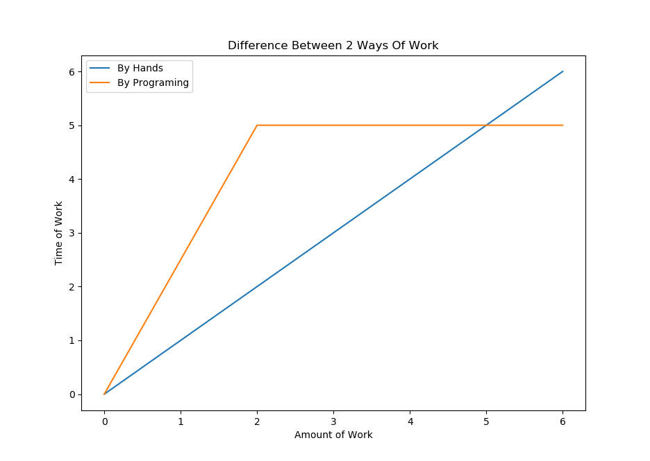

## 前言
什么是爬虫？爬虫有什么作用？在哪有爬虫？对于数据分析师而言并不陌生，但是对于毫无编程经验的人来说，这可能就是一个很迷惑的名词了。其实“爬虫”指的是在互联网中的自动下载器，因为这个自动下载的过程就像是虫子在互联网的大网上爬动寻找到的，所以生动形象的称为“爬虫”，如百度、Google等搜索引擎的网页索引，都是通过对全网的数据进行爬取下载后建立的，所以其实爬虫和我们的生活非常密切，毕竟每个互联网民在网上获取信息时都会使用搜索引擎，甚至我们每天都需要使用这些服务，与我们的生活和工作都分不开，而搜索引擎的服务就是建立在爬虫获取全网信息的基础上的。那我们能不能也利用爬虫来帮自己获取信息呢？当然可以。所以接下来我们先系统了解一下爬虫。

<!--more-->

## 1. 爬虫的工作原理
我们可以把互联网比作一张大网，而爬虫就是熟练爬走在网上的蜘蛛，把网的结点比作一个个网页，每当爬虫爬到一个节点上时，就相当于访问了这个网页，获取了这个网页的信息。网页与网页之间的链接就是结点之间连起来的线，通过这些线，我们可以从一个结点爬到另外一个结点。

我们用直白的语言来说，爬虫的工作可以分为三部分，如下：

|部分|功能描述|
|:----|:----|
|1. 获取网页|爬虫的首要工作就是先把网页的源代码下载下来备用|
|2. 提取信息|这个爬虫的核心操作，把所需信息从源代码中下载下来|
|3. 保存数据|收尾工作，把提取的信息以方便的形式保存下来，方便使用|

爬虫说到底是自动化下载程序，所以爬虫做的工作是我们可以手动完成的工作，在工作量比较小的时候我们确实可以手动完成，但是当我们需要处理比较大的量而且需要比较多的重复时，那么自动化下载程序的优势就体现出来了。

## 2. 获取网页
当我们向网页发送一个请求的时候，服务器的响应返回就是网页的源代码，一般情况，这是浏览器自动完成的，所以我们不需要手动操作，但是现在我们需要自己编程获取网页，所以这个工作需要我们自己完成，但是难道要我们自己手动一个个网页源代码的去下载？当然不用。

python提供了许多的package来帮我们解决这个问题，如urllib、requests等。我们可以使用这些库来我们实现HTTP请求，然后获取网页源码，得到网页响应之后我们只需要结构数据中的Body即可。这就是我们通过库来获取网页的源代码的过程了。

因此我们需要学习python的urllib和requests库，两个库各有优缺点，其实我们只需要学会一种即可，另一种可以但当涉猎。

## 3. 提取信息
获取到网页的源代码之后，接下来就是分析这些源代码，从中找到我们需要的信息，这个信息可以是网页中的文字信息，也可以是视频、图片、音乐等。最通用的提取方式是采用正则表达式进行匹配获取，只要正则学得好，可以编写出任何匹配的规则匹配你要的任何信息，但是问题就在于正则表达式很难学，而且写的时候还容易出错，所以对于新手并不友好。不过python依然提供了一些友好的方式供我们使用。因为网页的源代码是HTML语言，所以都有一定的结构性，因此我们可以根据网页的一些节点属性、CSS选择器或Xpath来获取信息，支持这些操作的package有Beautiful Soup、lxml等。有这些库，我们可以高效的完成提取信息的操作。

提取信息是爬虫非常重要的组成部分，它可以使杂乱的数据变得条理清晰，以便我们后续处理和分析数据。

## 4. 保存数据
获取到信息之后，我们一般会进行保存，方便后续的使用。所以保存数据也很重要。对于一般使用而言，我们只需要保存成文件即可，比如txt文件和csv文件，当然，如果需要，我们也可以保存到数据可中，不过我们普通的使用，没有必要费工夫去学数据库操作。

要完成这个工作主要就是学会文件操作和numpy、pandas库。

## 结语
爬虫是在数据分析工作中的上游（收集数据）这一步中，对于我们平常的数据分析工作而言非常重要，因此很有必要好好学习一下。收集保存好了数据，我们就可以进行数据的清洗、数据的探索、数据的建模、数据的可视化工作了。

另外，我们也可以利用爬虫来完成一些有趣的小功能，比如爬取豆瓣的书单、批量下载图片等等。只要有一颗爱折腾的心，自然会发现新的乐趣。
