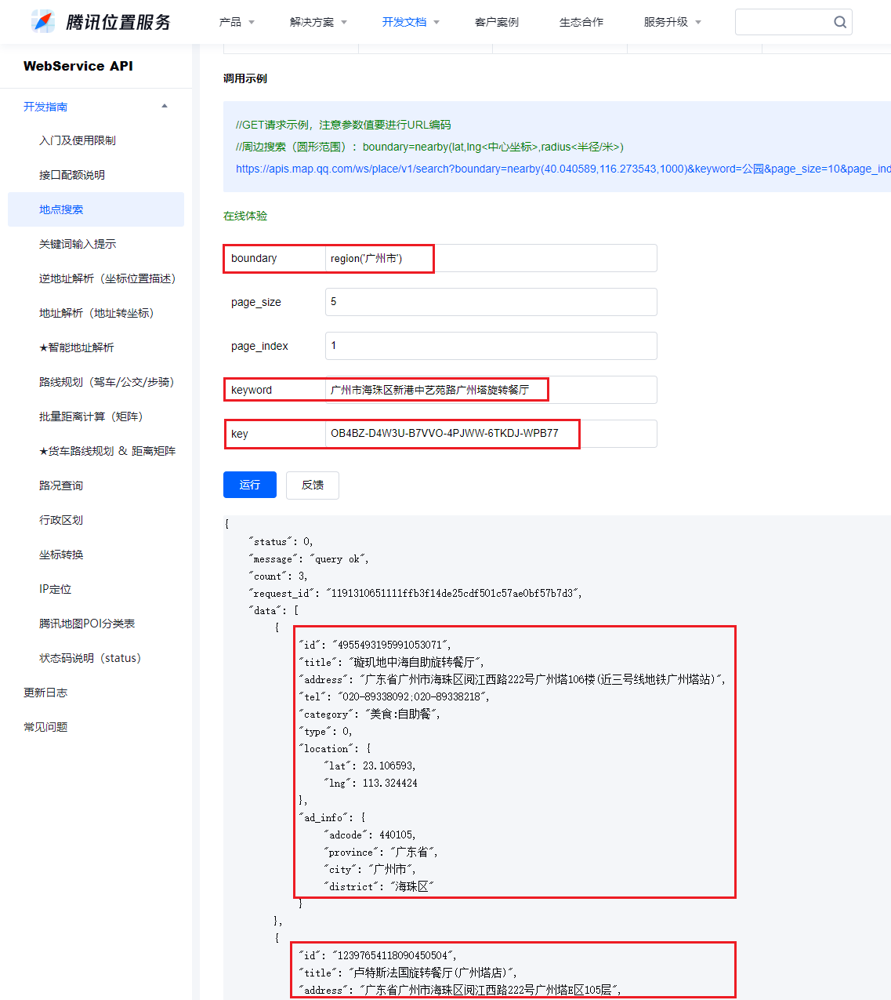

### 前言

因为工作原因，需要在通过地图接口下载数据，于是尝试了一下通过腾讯地图的接口进行下载，下载效果还不错，所以在此记录一下过程。

### 腾讯地图接口

由下图可知，腾讯地图的位置服务提供了对应的开发者接口，通过调用这些接口，我们可以获取对应的一些数据，比如城市的位置/名称/经纬度等等信息，当我们需要批量采集数据的时候，用起来效果还不多。如下图，这就是开发者文档，根据文档进行操作，我们就可以流畅的使用接口下载数据了。[学习文档链接](https://lbs.qq.com/service/webService/webServiceGuide/webServiceOverview)


<!--more-->

### 接口使用

使用接口的第一步当然是进行注册了，需要先拥有腾讯地图的对应的用户账号，才能够使用这个账号进行数据申请，也是进入腾讯地图位置服务官网进行注册就可以了，具体注册完毕之后，还需要添加个人密匙用于数据请求，具体的操作[可以看这](https://blog.csdn.net/chenwen112/article/details/102910337)。

在注册完毕后，我们拥有了对应的密匙，接下来就是阅读文档的使用方法了，比如我这次使用的是地点搜索功能，因此我阅读了对应的文档内容，[地点搜索文档](https://lbs.qq.com/service/webService/webServiceGuide/webServiceSearch)。在阅读文档的时候要特别注意接口使用的输入内容和输出内容，关注输入内容是为了方便我们调整数据格式，输入正确的数据内容，使得接口正常运作；关注输出内容是为了方便我们使用返回的结果，只用清晰知道返回的结果的结构，我们才能够有条不紊的处理数据，并且最终得到我们想要的结果。


### 使用案例

文档中还提供了使用案例用于参考学习，我们也可以关注一下，这样可以给我们省很多力气。



根据这个案例，我们就可以很好的进行对应的使用了。


### 代码展示

根据文档，我们最终可以编写并且调试出我们的代码，如下

```
# import packages
import pandas as pd 
import requests


# function tencent_map
def tencent_map(city, addr):
    url = "https://apis.map.qq.com/ws/place/v1/search"   #腾讯地图API接口
    para = {
        "boundary": f"region({city})",
        "keyword": addr,
        "key": "PFLBZ-XXKCX-HDW4D-TFV54-KJI67-XOF2H", #即腾讯地图API的key
        "page_size": 1,
        "page_index": 1,
    }
    req = requests.get(url, para) #请求数据
    req = req.json() #转为json格式
    #print(req.keys())
    return req

# function func
def func():
    data = pd.read_excel('./test.xlsx') # 读取文件，文件包含两列，第一列为市区名，第二列为具体地点
    # print(data)
    result = open('test_result.xls', 'w')
    #result.write('city\ttitle\taddress\ttel\tlat\tlng\n')
    result.write('市区\t地点\t地址\t电话\t纬度\t经度\n')
    for name in zip(data['city'], data['destination']):
        #print(name[0], name[1])
        try:
            response = tencent_map(name[0], name[1])['data']
            for resp in response:
                #print(resp)
                #resp = resp['data']
                city = resp['ad_info']['city']
                title = resp['title']
                address = resp['address']
                tel = resp['tel']
                lat = resp['location']['lat']
                lng = resp['location']['lng']
                #print(city + '\t' + title + '\t' + address + '\t' + tel + '\t' + str(lat) + '\t' + str(lng))
                result.write(city + '\t' + title + '\t' + address + '\t' + tel + '\t' + str(lat) + '\t' + str(lng) + '\n')
        except KeyError:
            result.write(name[0] + '\t' + name[1] + '\tNotFound\tNotFound\tNotFound\tNotFound\n')
    result.close()
    
# run script
if __name__ == '__main__':
    print('Start working...')
    func()
    print('All jobs have finished.')
```

### 结果

运行脚本后，我们可以得到我们最终的结果，并且保存到文件里，示例结果如下：


在这一次的实践中，最大的收获是学习了如何使用这些接口，这个过程还是我的第一次尝试，所以还挺有成就感。因为是互联网的数据接口，所以理所当然，我们使用了request进行数据的get请求，请求不同的接口可以得到不同的数据，要根据自己的需求进行请求。其次，在请求的时候，需要把个人密匙传递进构造的请求中，这样才能顺利访问数据。

