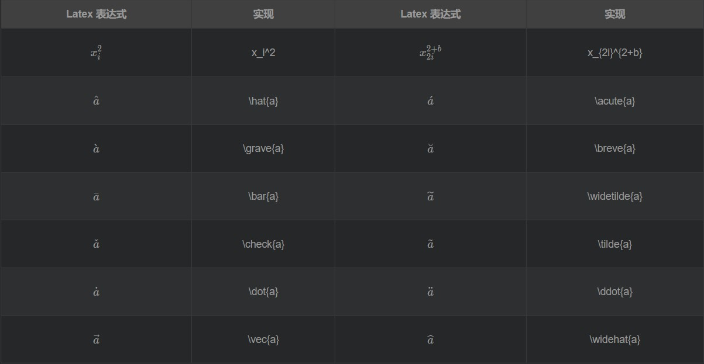
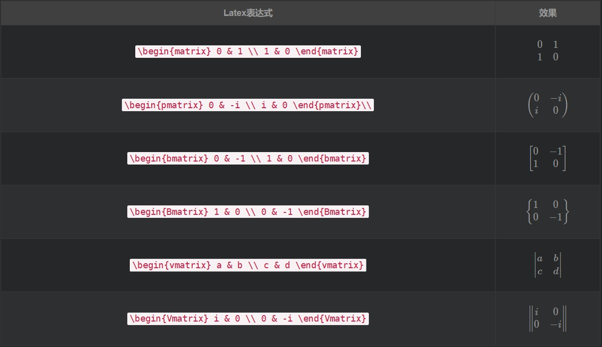
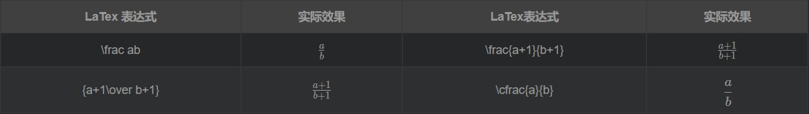
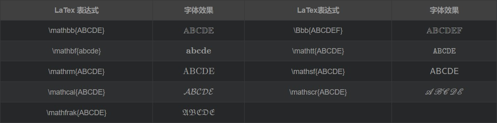

**前言**：LaTeX在表达数学公式方面有着得天独厚的优势，表达简便，渲染效果良好，是用来展示数学公式的最佳工具。当然，LaTeX本身是一个非常好的排版工具，在发表文章时一般可以采用LaTeX进行排版，美观专业。
<!--more-->
>接下来我将学习一下LaTeX关于数学公式方面的内容。

### 嵌入方法：
* 行内嵌入：'\$..\$'

例如：$\sum_i^nx_i$

* 单独成行：'\$\$..\$\$'

例如：
$$y_i=\sum_i^nx_i$$

### 1. The Greek alphabet
>希腊字母是数学表达式中常用的符号，几乎所有数学公式包含着希腊字母，希腊字母的在数学中的地位举足轻重。


示例：```$\alpha\beta,\delta,\zeta,\eta,\theta,\Pi,\Delta,\rho$```<br>
效果：$\alpha\beta,\delta,\zeta,\eta,\theta,\Pi,\Delta,\rho$

### 2. 上下标
>在数学表达式中，经常会有上下标，不管是指数还是表示平均数、向量、积分上下限等等，这类都需要上下标的形式展现。在LaTeX中以`_`为下标，`^`为上标，其他效果见下图。



示例：```$x_i^2,\hat{x},\bar{y},\vec{a},\dot{n},\widehat{x},\ddot{a}$```<br>
效果：$x_i^2,x_{i=1}^{n+2},\hat{x},\bar{y},\vec{a},\dot{n},\ddot{a}$

### 补充：
* 在LaTeX中的log函数表示`$\log_2 x$`，效果：$\log_2 x$，$\log_{10} y$
* 在LaTeX中的空格为`$\quad$`，效果：$ab,\qquad a\quad b$

### 3. 括号
>在数学表达式中，一般会存在嵌套关系，也就是不能用简单的一次线性关系表示完整，所以需要额外的符号进行辅助，也就是需要括号帮忙了，具体见下图：


示例：
```
$$f(x)=\begin{cases} x = \cos(t) \\y=\sin(t) \\z=\frac xy \end{cases}$$
```
效果：
$$f(x)=\begin{cases} x = \cos(t) \\y=\sin(t) \\z=\frac xy \end{cases}$$

### 4. 矩阵
>矩阵，一般很难渲染得好看，让我们来看看LaTeX的本领



示例：```$\begin{bmatrix} 0 & -1 \\ 1 & 0 \end{bmatrix}$```<br>
效果：
$$A=\begin{bmatrix} 0 & -1 \\ 1 & 0 \end{bmatrix}$$
$$B=\begin{matrix} 0 & -1 \\ 1 & 0 \end{matrix}$$

### 5. 求和、积分、开方、分数
>这些也是数学表达式中很常见的符号和表达方式了，需要掌握。


示例：```$\sum,\int_\infty^\infty xdx$```<br>
效果：$y_i=\sum_{i=1}^nx_i,F(x)=\int_{-\infty}^\infty xdx$


示例：```$\sqrt{x^3},\sqrt[3]{x^4-2},\sqrt[4]{\frac xy}$```<br>
效果：$\sqrt{x^3},\sqrt[3]{x^4-2},\sqrt[4]{\frac xy}$


示例：```$\frac {a-1}{b-2}={a-1\over b-2}$```<br>
效果：$\frac {a-1}{b-2}={a-1\over b-2}$

### 6. 特殊符号
>见下图


示例：```$\sin {x^2} + \cos {x^2}=1$```<br>
效果：
$$\sin {x^2} + \cos {x^2}=1,\quad\lim_{x\to\infty}{1\over x}=0$$


示例：```$\times,\quad \div,\quad \pm,\quad \lt,\quad \gt,\quad \simeq$```<br>
效果：$\times,\quad \div,\quad \pm,\quad \lt,\quad \gt,\quad \simeq$


### 7. 换字体
>这个不是很care了，随便看看。



示例：```$\mathbb{ABCDE},\mathrm{ABCED},\mathcal{ABCDE},\mathscr{ABCDE},\mathfrak{ABCED},\mathsf{ABCDE}$```<br>
效果：$\mathbb{ABCDE},\mathrm{ABCED},\mathcal{ABCDE},\mathscr{ABCDE},\mathfrak{ABCED},\mathsf{ABCDE}$

## 总结
LaTeX确实是论文排版非常重要的一个工具，在表示数学表达式的时候尤为重要，为了能够更好的排版，让论文更加专业，LaTeX很值得一学。并且，LaTeX的语法也并不复杂，对于数学表达式，有很多都是可以笔下代码脑中图像，非常流畅。LaTeX语法就是每当有特殊标记的时候就会使用`\`来标记，如`\lim`等等，每个符号后面一般默认作用为一个字符，当需要作用到字符串上时，采用`{}`框住表达式即可,
>举个栗子：`$\sum_x-y$`：$\sum_x-y$中`-y`不会被包括近下标中；`$\sum_{x-y}$`：$\sum_{x-y}$，当用`{}`框住后就会包括进下标中。