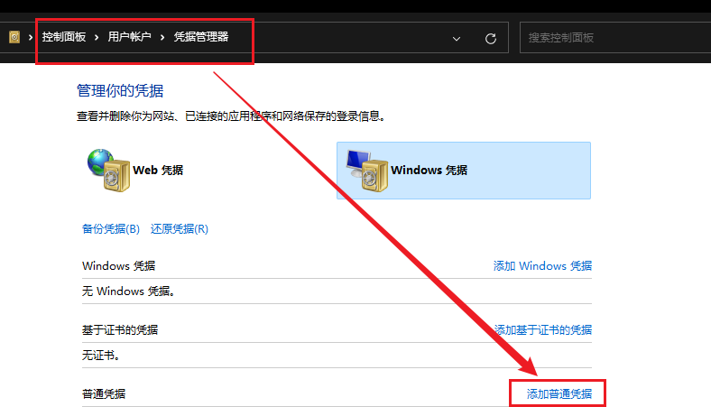

### 杂谈
最近GitHub更换了push的验证方式，原来的密码登陆方式被舍弃了，因此现在需要替换成使用token进行登录。token的使用方式差不多，原来该输入用户名和密码的地方改成输入用户名和token，而这个token是定期换的，所以算是比较安全。

<!--more-->
在Windows上如果每一次都需要这么手动输入用户名和密码进行推送也是比较麻烦的，因此，需要找个新方法。在Windows里可以设置Windows凭证，这个凭证可以自动的帮我们完成这个登录的输入验证工作，我们只要添加一个新凭证，然后凭证内容里填写对应的用户名和token即可。

填写完毕后即可进行测试，本篇博客日志便是主要用于测试用途，在原博客目录下使用git bash打开，输入 `hexo clean && hexo g && hexo d`，进行推送测试。