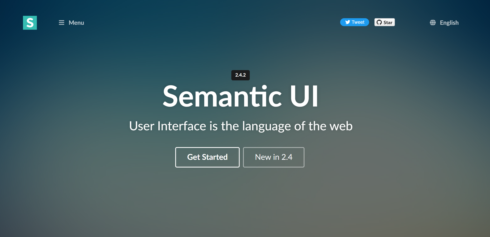

## 0. 前言
最近在开发全栈个人博客的前端，使用的UI工具是SemanticUI，因为构建的页面还挺多，所以用得多一些。以前也写过页面，但是使用的是传统的方式构建，用HTML一点点自己搭建，这种过程效率很低，而且也难以做出风格统一精美的网页，因此，还是使用现有的轮子会好一些。

SemanticUI也是第一次接触，不过到目前位置使用体验还是非常不错的，在构建页面的过程中，常用元素都有，进行页面总体布局的时候也能够非常方便且精准的布局，开发效率很高。现在要学会进行总结，梳理使用技巧，从而提高使用效率。

<!-- more -->

## 1. 介绍
学习组件框架的第一步就是阅读官方文档，[点击这里](https://semantic-ui.com/introduction/getting-started.html)前往官方文档。

semanti-ui是一款语义化的前段开发框架，通俗的说就是很多标签通过class的名字我们就可以很快的知道它的用处。代码可读性与可理解性很强，界面简洁美观，与bootstrap风格接近，基于jquery，适用响应式布局，提供一些基本模板，兼容Firefox、Chrome、safari,IE 10+等浏览器。

## 2. 基本操作
1. 按钮，图标，标签

按钮可设置大小、颜色、形状等；
图标有多种分类，按正常英文都能搜到对应icon;
标签 可设置颜色、形状、固定位置等;

2. list,item,card(image,content,header,description,meta,extra )

列表类：list中的item默认为垂直排列（vertical），可水平（horizontal），可带无序圆点（bulleted）,可带有序序数(ordered)；list可嵌套、可带分割线，item可带图标，item内容可左右浮动；
卡片相关：可成组嵌套在 cards中，content包含header、meta、description;可增加extra content、 bottom attached buttons等；

3. grid与table

semantic默认网格数为16，可直接嵌入column，也可中间嵌入row;column可按比例拆分；
值得注意的一点是 semantic的grid自带-14的margin值,写css踩过的坑...
table  包含thead,tbody,tfoot支持各种样式（celled 、stripped、warning、active、single line、selectable），th/td可像网格那样按比例分配；

4. 表单相关input,filed

calss为form的元素 的子元素 fields可包含field，可按网格比例分配，支持行间样式 inline class；input有多种类型，支持搜索、下拉选项、可自带标签等，可通过class设置大小；另外semantic的 form表单还支持各种类型的单选按钮、复选框、开关等，使用时添加对应class并调用相关js即可；

5. 模态框，下拉菜单，tab切换与手风琴效果

modal框:结构分为header、content、actions(底部，一般放操作按钮) 部分， 调用方法不能直接用show()或hide()，semantic的调用方式为 $('.ui.modal').modal('show') / $('.ui.modal').modal('show');
下拉菜单：有文本下拉菜单（dropdown -> menu -> item）和输入框下拉菜单（option），可带搜索，选项内容方向自适应，内容可多选（multiple）可单选；
tab切换：tab项一般为menu中的item，data-tab属性与对应 tab内容中的data-tab属性要一致；tab可多级嵌套，多层tab调用时需指明context属性,data-tab属性值也需与多层结构一致；
手风琴：list的一种，结构包含title和content,点击title时content会展开或者收缩；可多层嵌套；调用：$('.ui.accordion')  .accordion();

## 3. 结束
业精于勤荒于戏，学成于思毁于随！
