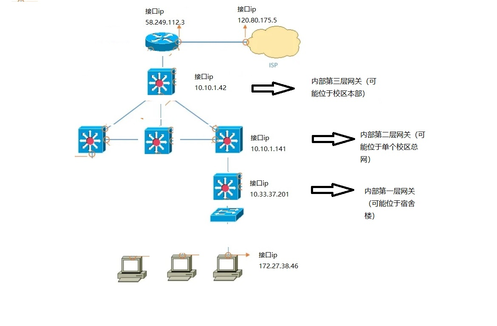
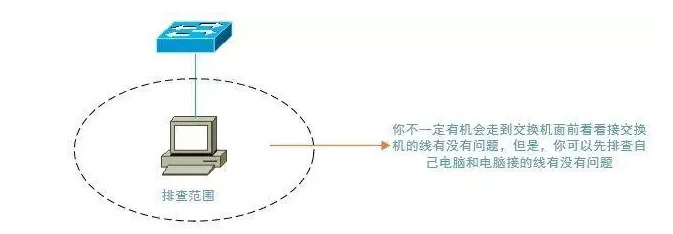
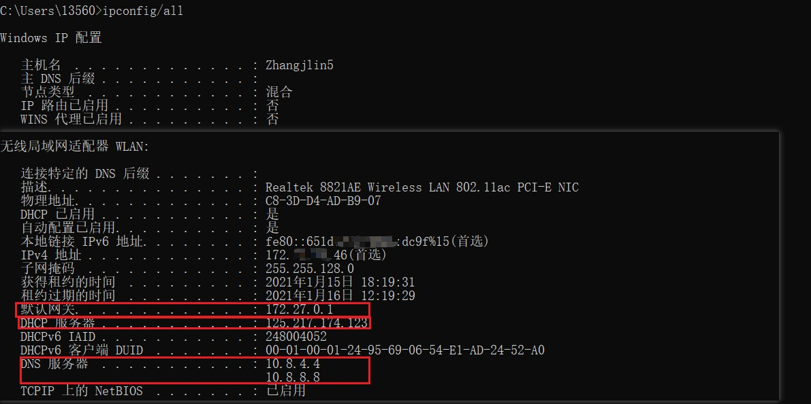
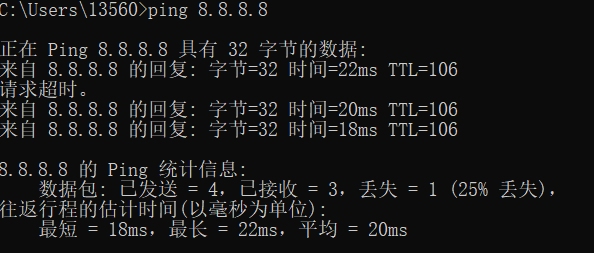

## 前言
>这几天看到了一个有意思的文章，介绍了网络故障排查的思路，这和计算机网络的知识有比较大的关联，是一个很好的网络知识应用的实践，值得一学。所以接下来我就来进行一下操作实践。
<!--more-->

## 1. 必备知识储备
>在进行系统性故障排查之前，需要有一定的相关知识储备，不然检修排查无从谈起，所以需要以下的三方面基本知识。（熟悉计算机网络框架OSI和TCP/IP、了解基本的通信基础设备、了解中小型企业网络的基本架构）

### 1.1 计算机网络框架（OSI框架和TCP/IP协议栈）
OSI框架把计算机网络划分为七层，自底向上依次是物理层、数据链路层、网络层、传输层、会话层、表示层和应用层，TCP/IP协议栈把网络分为四层，自底向上依次是数据接口层、网络层、传输层、应用层，这两种框架都是为了把网络架构分层表示，把网络的架构清晰的表示出来，便于网络的构建与维护，这两种框架有一定的历史渊源，但是都可以用于指导实践，在我们的一般学习或应用中，会常常用两个框架相结合形成的五层理论。五层理论把网络自底向上依次分为物理层、数据链路层、网络层、传输层和应用层，比OSI简单，比TCP/IP清晰，所以是一个比较适合用于学习的分层方式。其中物、链、网三层称为通信子层，因为这都是计算机网络通信的基础，而上面的几层称为资源子层，是建立在通信子层基础上的虚拟空间层。物理层设备有中继器和集线器，数据链数层有网桥和交换机，网络层有路由器，除了这三层的设备外，常见的网络设备还有光猫、节点交换机等，也是常见的物理基础。

这些知识基本知识，实际的需求应该要掌握的更加详细一些，特别是TCP/IP协议栈和OSI框架，每一层的具体知识都是需要去了解和掌握的。

### 1.2 了解网络通信的基础设备
像交换机、三层交换机、路由器、防火墙这些最基本的网络设备应该要有些了解，尤其是它们对应的OSI层次以及作用，比如普通的二层交换机对应OSI七层模型中的数据链路层，它可以隔绝冲突域，同时可以通过虚拟局域网技术（VLAN）来隔绝广播域，二层交换机通过二层地址即MAC地址来实现数据帧的转发；再比如路由器，它对应网络层，可以提供路由寻址的功能等等。这些就是各个设备的基本功能，另外这些设备的实现原理也是很有意思并且值得了解的知识。

### 1.3 一般的中小型企业网络基本架构

如上图的展示，这就是常见的一般架构了，总的来说都是从用户PC接入开始，经过层层的交换机和路由器的转接，最终从公司的与外部网络连接的路由器出去这样整个过程构建的框架，所以抓住这条数据流动的主线，这些架构就很容易理解了。在这幅图里面展示的就是基本的4层网络，分别是用户层、接入交换机层、核心交换机层、路由层，在实际的网络架构中还包含着无线网络的接入，以及不同的规模需求，网络的架构会更加复杂一些，但都是建立在这些基本的框架的基础上的，所以都可以从这个模型出发开始去分析。

### 1.4 常用网络排错命令
我们一般使用的是Windows操作系统，所以这里只列举了在Windows操作系统中的排错命令，实际上在linux或者Macos中都有相应的命令，这个需要自己去了解。

|命令|功能|
|:----:|:----:|
|ipconfig|查看计算机的IP地址、子网掩码和网关|
|ipconfig/all|查看计算机的IP地址、子网掩码、网关和DNS地址|
|ping|测试网络之间的网络连通性|
|tracert -d|路由追踪，可以用-h参数查看使用方法，-d表示不做反向解析|
|arp -a|查看计算机是否取得了网关的MAC地址，-h可以查看使用方法|
|nslookup|请求域名对应的IP地址，并以此来测试DNS地址是否可用|

这几个就是Windows上常用的网络排错指令，接下来就要实际应用一下。

## 2. 排错思路

基本思路如下，这跟网上的大多数人写的应该是差不多的。
* 1. 检查物理链路是否有问题
* 2. 查看本机IP地址、路由、DNS的设置是否有问题
* 3. 测试网关或路由器的通畅情况。先测网关然后再测路由器，一级一级地测试
* 4. 测试ping公网ip的通畅情况（平时要记几个外部IP）
* 5. 测试DNS的通畅情况，可以直接ping网站地址

## 3. 具体操作步骤
因为现在呆在学校，所以我就用校园网来进行一次操作实践。首先要明白校园网的基本网络架构，如下图示意图。（这是一个粗略的示意图，实际情况可能有些偏差）

下面，我们就以这个网络来进行实践。

### 3.1 检查物理链路是否有问题
这是基本思路，首先确保物理链路正常。我们可以检查的一般是本电脑的网卡是否正常，网线连接是否正常，网线有无缺损，路由器是否正常通电等。我们不一定有机会检查交换机，但是首先要确保我们能够接触到的设备的物理连接正常。

在这一步，下面几点是需要注意排查的：

1. 确认电脑本身的网卡有没有问题

2. 确认接的网线有没有问题

3. 本机所连接的交换机（如果可以去机房查看的话）

如果上面这几点排查都没有问题了，那么就是该网络环境中的其他设备问题了。这一范围的排查相对比较简单，因为只涉及到物理链路的连接问题。

对于这种测试，可以考虑使用测线器，但个人的建议是，拿一台配置正确的笔记本来做测试也未尝不可。

### 3.2 查看本机IP地址、路由、DNS的设置是否有问题
通过上面一步的排查后，我们可以确认的是物理链路应该是正常的，也就是说网络接入后，电脑有反应，但是网络不通，到这一步后，我们就可以把注意力放到电脑的设置了。

1. ip地址的设置
ip地址的设置有静态ip和动态ip之分，一般采用动态ip的协议DHCP获取动态ip接入，如果是静态ip，一般由网络管理员提供ip，如果设置了静态ip就要确认ip填写是否正确，ip是否改变更新了，但是我们通常使用动态ip，所以不用设置这些内容，动态ip只要确认DHCP服务正常开启了即可。

2. 路由设置
对于服务器、PC，一般是指默认网关的设置了；对于路由器本身或三层交换机，那就是静态路由或动态路由的设置问题了。

3. DNS设置
这里主要确认我们设置的DNS服务器是否正常，如果DNS服务器故障的话，我们一般获取不到与我们要访问的域名对应的IP地址，所以我们无法访问对应的域名，但是在这一步，我们可以直接使用IP地址来访问，这里需要记一些简单的IP地址，如果直接访问IP地址正常，但是访问域名不正常，那么即可以推断出事DNS服务器服务故障，这个时候可以考试更换DNS服务器，常用的DNS服务器有8.8.8.8和114.114.114.114，可以选择设置这些DNS服务器。

### 3.3 测试网关或路由器的通畅情况。先测网关然后再测路由器，一级一级地测试

在上面的网络环境中，在网络通的情况下，我们可以在Windows电脑中cmd程序中使用命令tracert -d命令，查看路由踪迹，如下

内部网关除外，我们可以使用ping命令一级一级的进行网络定点通路测试，也就看看到底是哪一级有问题。

通过tracert的路由追踪，我们可以清晰的得知访问互联网时的数据走向。

结合这个数据走向图，我们可以得到一个重要的思路，就是根据这个走向来进行确定，分别定点测试这些网络网关，就可以得知这些段是否正常。

一般这样的判断方法是比较快的，但有时候，无论怎样ping都不能，那么则可能有以下的几种情况：

a. 网关设备做了禁止ping的设置

b. 网关接口或网关设备出现故障

对于a，一般很少会在这些设备在做ping的限制操作，实在是没有太大的必要这样做，当然，网络安全等要求十分严格的除外。ping通192.168.2.254网关后，再ping一下172.16.13.1以确认电脑到整个网关设备都没有问题。

对于ping不通的时候，我个人还建议在电脑上执行如下操作：

通过这个指令可以检查，从ip到Mac地址的映射是否正常，也就是网关当中是否获取了对应Mac地址，因为在局域网中，实际上是采用Mac进行通信的。只有在网络层当中，也就是需要跨局域网的情况下才采用ip通信。

显然，如果没有网关的MAC地址，那也是不可能ping通网关的，在排除了前面电脑设置的问题后，你可以猜测是网关设备出了问题，这时就可以联系网络工程师对网关设备进行测试了。

上面的步骤完成了，假设你的出口路由器设置是没有问题的，比如NAT与默认路由等的设置，那么我们大致可以知道，内网的一个基本通信是正常的（至少你的电脑和出口路由器的通信没问题），我们就要看看电脑到底能不能访问互联网了

### 3.4 测试ping公网ip的通畅情况（平时要记几个外部IP）

来到这一步的时候，就说明前面三步是没有问题的，也就是说，本地局域网络的通信是正常的，这时要做的就是判断本地局域网络与外网（公网）之间的通信有没有问题了：

这里采取的是直接ping公网地址的方法，是为了排除DNS的影响（万一你的DNS设置又有问题），至于要ping什么样的公网地址，个人建议是，可以ping一些没有禁止ping的公共DNS服务器地址，比如114.114.114.114和8.8.8.8的：

这样之后，基本上就可以确定网络是没有问题的了。当然，这里并没有提到出口放置防火墙的情况，实际上，思路是一致的，但是，你需要考虑的是，你的访问数据有没有被防火墙给过滤掉，是数据出去的时候过滤了，还是数据回来的时候过滤了？由于还要涉及到防火墙的设置，这里就不再提及了，只是仍要注意这一点就是了。

### 3.5 测试DNS的通畅情况，可以直接ping网站地址
如题，可以直接ping网站地址，看有没有回显IP地址，至于通不通是另外一回事，只要可以回显IP地址，那么DNS就没有问题了，不过这里仍然要说一下nslookup这个命令，这是一个非常好用的命令，我平常自己在网络排错时，基本上都会用到：

使用nslookup命令，作用有二：

1.帮你测试你设置的DNS服务器有没有问题

2.在不考虑DNS服务器是否智能的前提下，你可以根据回显IP地址速度的快慢来大致判断DNS服务器的优劣情况

所以可以充分利用nslookup命令了。

## 4. 重要说明

其实基本上，一个相对完整的网络排错过程就应该如上面所说的了，不过，是基本上的，因为上面的讲解，都几乎是假定你是没有权限进入机房查看网络设备的情况的。

事实上，你是根本不需要照搬来进行上面的全部步骤的，在实际排错的过程中，可能你用到的只是其中的一小部分而已，毕竟，如果每次都这样下来，没有谁是不会疯掉的，因为一些很简单的问题也要这样折腾，那就是太浪费时间了！但是，上面的方法，只是提出一种网络排错的思路，希望按照这个思路可以判断出网络的问题出现在哪里，至于如何去解决，这中间真的又涉及到太多太多的经验问题。其实整个下来，个人觉得，最重要的仍然不是技术本身，而是在网络排错过程当中的一个思路，思路决定出路，这可以让自己在网络排错的过程中时刻保持清醒的头脑，这一点很重要。